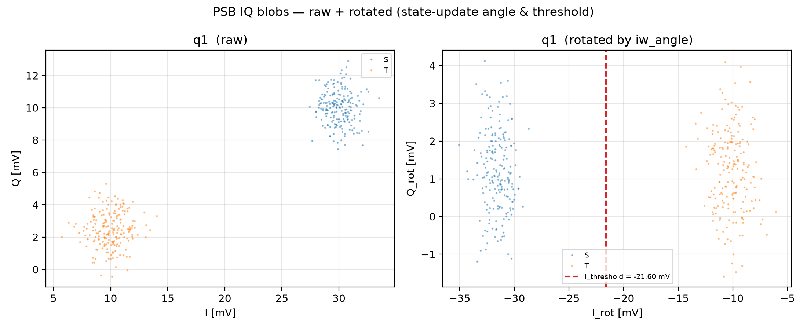
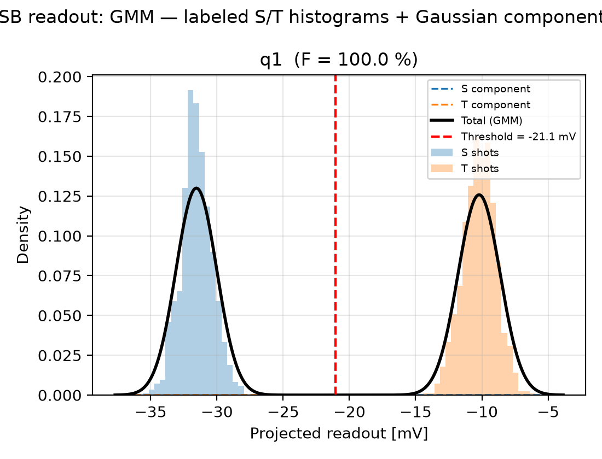

# 06d_PSB_search_opx_fixed_detuning

## Description

PAULI SPIN BLOCKADE SEARCH - Fixed detuning, labeled two-state readout (OPX)

This node acquires labeled shot-by-shot IQ data at a fixed PSB measurement point for each
selected qubit. Each shot is measured twice: first without a pi pulse and then with an
``x180`` pulse, so the two arms prepare complementary spin states according to
``init_state_label``.

The resulting labeled IQ data can be analyzed with either the physics-based Barthel 1D
readout model or a two-component Gaussian mixture model. Qubit/readout dot pairs are
resolved automatically from ``qubit.preferred_readout_quantum_dot``.

Prerequisites
-------------
- QUAM configured and loaded (``quam_config/populate_quam_state_*.py``).
- Sensor-dot readout calibrated (resonator calibration nodes completed).
- ``x180`` pulse calibrated on each selected qubit.
- Fixed readout point defined on the corresponding dot pair; this node can optionally
  override the measure-point detuning temporarily via ``parameters.detuning``.

Datasets
--------
- ``ds_raw``: shot-level ``I_no_pi``, ``Q_no_pi``, ``I_pi``, ``Q_pi`` (dims: ``qubit``, ``n_runs``).
- ``ds_processed``: labeled ``Ig``, ``Qg``, ``Ie``, ``Qe`` used by the analysis/plotting pipeline.
- ``ds_fit``: model-specific fitted dataset returned by the selected Barthel or GMM analysis.
- ``fit_results``: per-qubit scalar results (serialized dataclass) for logging and state updates.

Results
-------
For each qubit, the node extracts the readout-axis rotation and discrimination threshold
used for PSB state discrimination at the fixed measurement point.

Figures
-------
- Raw IQ and rotated IQ with the state-update threshold
- Labeled S/T histograms with either the Barthel analytic fit or GMM Gaussian components

State update
------------
Reverts any temporary detuning override, then (if the fit succeeded) updates the
integration-weights angle and discrimination threshold on the corresponding sensor dot.

## Parameters

| Parameter | Value |
|-----------|-------|
| `analysis_model` | `gmm` |
| `detuning` | `None` |
| `init_state_label` | `no_decay` |
| `load_data_id` | `None` |
| `max_loops` | `100` |
| `multiplexed` | `False` |
| `num_shots` | `1000` |
| `qubits` | `['q1']` |
| `reset_type` | `thermal` |
| `return_n_loops` | `False` |
| `simulate` | `False` |
| `simulation_duration_ns` | `50000` |
| `target_state` | `None` |
| `timeout` | `120` |
| `use_simulated_data` | `False` |
| `use_state_discrimination` | `False` |
| `use_waveform_report` | `True` |

## Fit Results

| qubit | I_threshold | iw_angle | F (%) | success |
|-------|-------------|----------|-------|---------|
| q1 | -0.02106 | -2.789 | 100.0 | True |

## Figures

