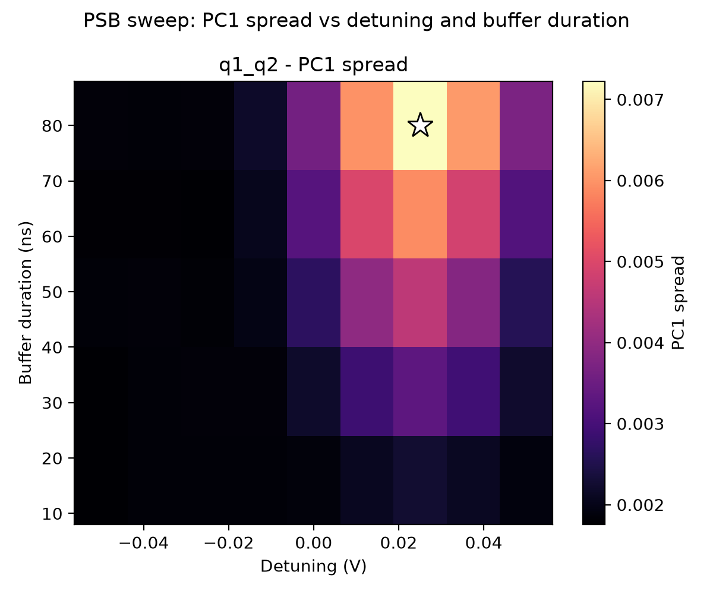

# 06e_PSB_search_opx_sweep_detuning_vs_buffer

## Description

PAULI SPIN BLOCKADE SEARCH — Sweep detuning vs buffer duration (OPX)

This node sweeps the PSB measure-point detuning and the pre-readout buffer duration
to map where the readout contrast is strongest. Each sweep point prepares the chosen
state, ramps to the target detuning together with a barrier-gate offset, waits for
the swept buffer duration, and then performs sensor readout.

Prerequisites
-------------
- QUAM configured and loaded (``quam_config/populate_quam_state_*.py``).
- Sensor-dot readout calibrated (resonator calibration nodes completed).
- Empty / initialize / measure macros defined on the dot pair.

Datasets
--------
- ``ds_raw``: shot-level ``I`` and ``Q`` vs ``detuning`` and ``buffer_duration``
  (dims: ``qubit_pair``, ``n_runs``, ``detuning``, ``buffer_duration``).
- ``ds_processed``: processed copy of ``ds_raw`` used by the analysis/plotting pipeline.
- ``ds_fit``: 2D PCA-derived contrast maps (currently ``pc1_std`` and ``iq_trace``).
- ``fit_results``: per-pair scalar results (serialized dataclass) for logging.

Results
-------
For each qubit pair, the node selects the detuning / buffer-duration point that maximizes
the chosen exploratory contrast metric.

Figures
-------
- 2D heatmap of the selected PCA-derived metric vs detuning and buffer duration

State update
------------
Updates the measure-point detuning and persists the optimal ``buffer_duration`` on
the pair ``measure`` macro when supported.

## Parameters

| Parameter | Value |
|-----------|-------|
| `barrier_gate_voltage` | `0.0` |
| `buffer_duration_max` | `96` |
| `buffer_duration_min` | `16` |
| `buffer_duration_step` | `16` |
| `detuning_max` | `0.05` |
| `detuning_min` | `-0.05` |
| `detuning_points` | `9` |
| `initialization_macro` | `empty` |
| `labeled_states` | `False` |
| `load_data_id` | `None` |
| `multiplexed` | `False` |
| `num_shots` | `1500` |
| `operation` | `readout` |
| `optimization_metric` | `fidelity` |
| `pca_metric` | `pc1_std` |
| `plot_kde` | `True` |
| `qubit_pair_to_initialize` | `None` |
| `qubit_pairs` | `['q1_q2']` |
| `qubit_to_pulse` | `None` |
| `ramp_duration` | `40` |
| `reset_type` | `thermal` |
| `simulate` | `False` |
| `simulation_duration_ns` | `50000` |
| `sweep_name` | `detuning` |
| `timeout` | `120` |
| `use_simulated_data` | `False` |
| `use_state_discrimination` | `False` |
| `use_waveform_report` | `True` |

## Fit Results

| qubit_pair | optimal_detuning | optimal_buffer_duration | metric_name | max_metric_value | success |
|------------|------------------|-------------------------|-------------|------------------|---------|
| q1_q2 | 0.025 | 80 | pc1_std | 0.007225 | True |

## Figures

