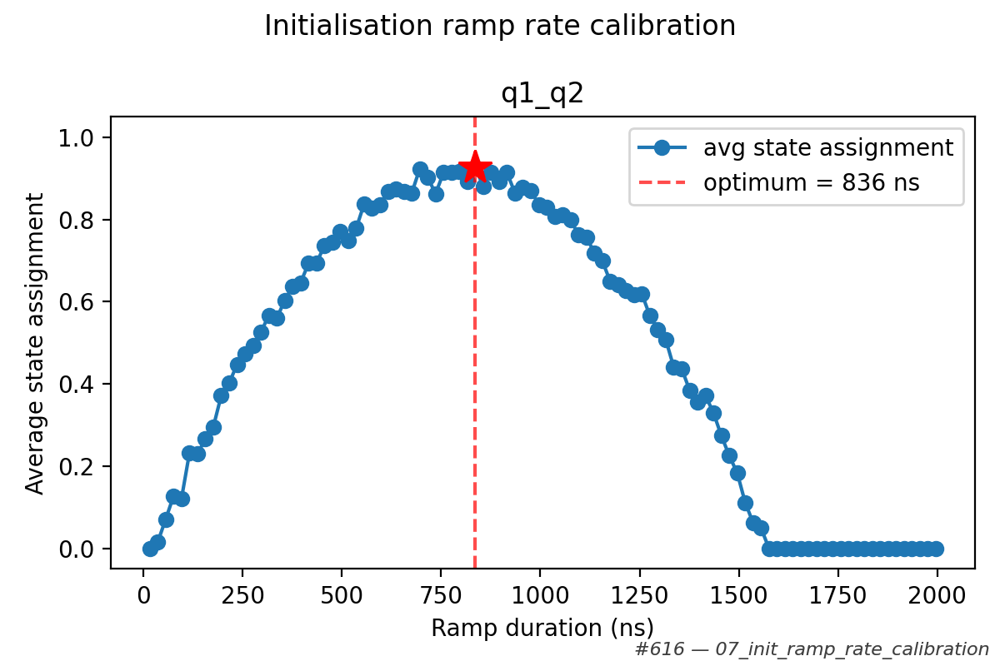
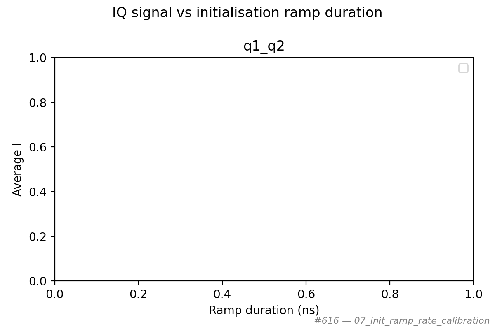
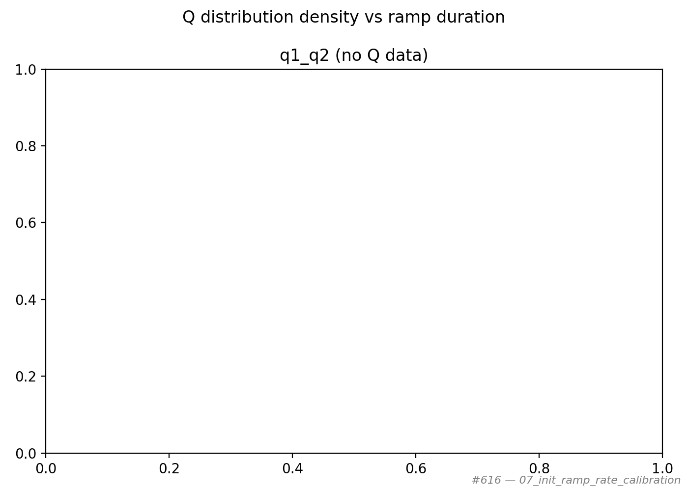
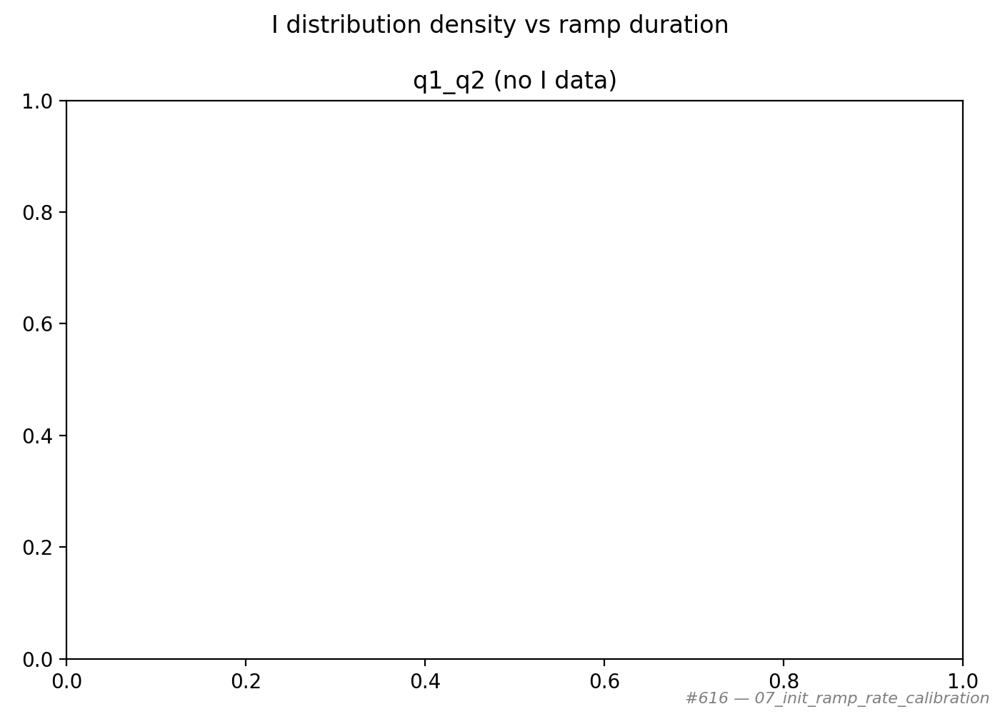

# 07_init_ramp_rate_calibration

## Description

INITIALISATION RAMP RATE CALIBRATION
This sequence calibrates the ramp duration of the initialisation macro by sweeping the ramp rate
and measuring how mixed the resultant state is.

For each ramp duration the sequence empties the dots, initialises with the given ramp duration,
then performs a state measurement using the balanced measurement macro.  The boolean state
assignment (0 or 1) is averaged over many shots to produce the mean state occupation for each
ramp duration.

The analysis identifies the ramp duration that yields the minimum (or maximum, controlled by the
``find_minimum`` parameter) average state assignment, corresponding to the purest initialisation.

Prerequisites:
    - Having initialised the Quam.
    - Having calibrated the PSB measurement point (06a-06c).
    - Having the balanced measurement macro configured with a valid threshold.

State update:
    - The initialisation macro ``ramp_duration`` on each qubit pair.

## Parameters

| Parameter | Value |
|-----------|-------|
| `find_minimum` | `False` |
| `load_data_id` | `None` |
| `multiplexed` | `False` |
| `num_shots` | `100` |
| `qubit_pairs` | `['q1_q2']` |
| `ramp_duration_max` | `2000` |
| `ramp_duration_min` | `16` |
| `ramp_duration_step` | `20` |
| `ramp_log_scale` | `False` |
| `reset_wait_time` | `5000` |
| `simulate` | `False` |
| `simulation_duration_ns` | `50000` |
| `timeout` | `120` |
| `use_state_discrimination` | `False` |
| `use_waveform_report` | `True` |

## Fit Results

| qubit_pair | optimal_ramp_duration (ns) | optimal_avg_state | find_minimum | success |
|------------|---------------------------|-------------------|--------------|---------|
| q1_q2 | 836 | 0.9275 | False | True |

## Analysis Output

## Figures

