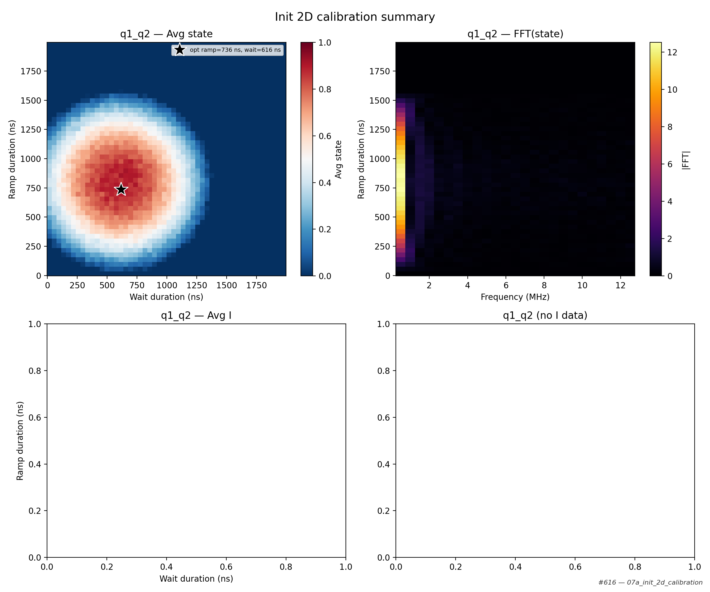

# 07a_init_2d_calibration

## Description

INITIALISATION 2D CALIBRATION (RAMP DURATION × WAIT DURATION)
This sequence extends the ramp-rate calibration by adding a second sweep axis: the wait
duration between the initialisation ramp and the state measurement.

For each (ramp_duration, wait_duration) point the sequence empties the dots, initialises
with the given ramp duration, waits for the specified duration, then performs a state
measurement using the balanced measurement macro.  The boolean state assignment (0 or 1) is
averaged over many shots to produce a 2D map of mean state occupation.

The analysis identifies the (ramp_duration, wait_duration) pair that yields the minimum
(or maximum, controlled by the ``find_minimum`` parameter) average state assignment.

Prerequisites:
    - Having initialised the Quam.
    - Having calibrated the PSB measurement point (06a-06c).
    - Having the balanced measurement macro configured with a valid threshold.

State update:
    - The initialisation macro ``ramp_duration`` on each qubit pair.

## Parameters

| Parameter | Value |
|-----------|-------|
| `find_minimum` | `False` |
| `load_data_id` | `None` |
| `multiplexed` | `False` |
| `num_shots` | `100` |
| `qubit_pairs` | `['q1_q2']` |
| `ramp_duration_max` | `2000` |
| `ramp_duration_min` | `16` |
| `ramp_duration_step` | `40` |
| `reset_wait_time` | `5000` |
| `simulate` | `False` |
| `simulation_duration_ns` | `50000` |
| `timeout` | `120` |
| `use_state_discrimination` | `False` |
| `use_waveform_report` | `True` |
| `wait_duration_max` | `2000` |
| `wait_duration_min` | `16` |
| `wait_duration_step` | `40` |

## Fit Results

| qubit_pair | optimal_ramp (ns) | optimal_wait (ns) | optimal_avg_state | find_minimum | success |
|------------|-------------------|-------------------|-------------------|--------------|---------|
| q1_q2 | 736 | 616 | 0.9156 | False | True |

## Analysis Output

## Figures

