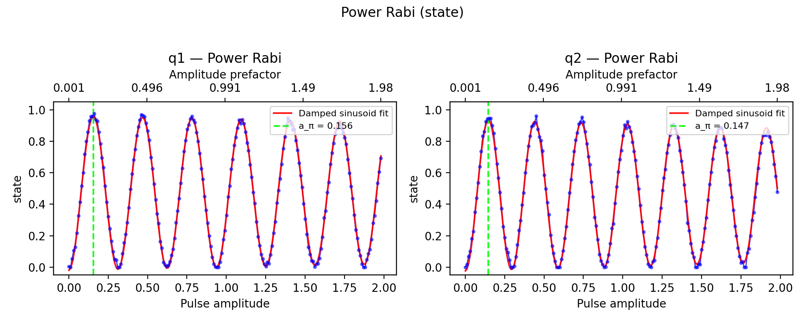
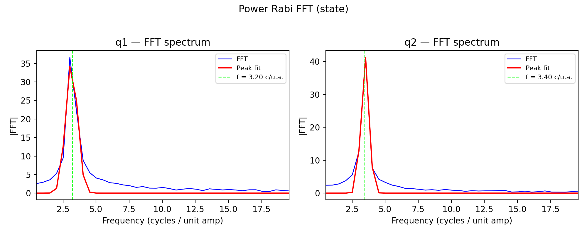

# 09a_power_rabi

## Description

        POWER RABI
After initialization to the target spin state, this sequence applies an x180 gate whose amplitude
prefactor is swept and measures the spin state with thresholded PSB readout. Averaged state probabilities versus
amplitude prefactor are fitted to extract the π-pulse amplitude.

Prerequisites:
    - Having calibrated the resonators coupled to the sensor dots.
    - Having calibrated the voltage points (empty, initialization, measurement).
    - Having calibrated the qubit frequency.
    - Having set the qubit gate duration.

Datasets:
    - ``ds_raw``: untouched ``state`` stream fetched from the OPX (never modified after acquisition).
    - ``ds_fit``: processed sweeps plus analysis outputs (fitted traces). Used by ``plot_data``.
    - ``fit_results``: compact per-qubit calibration dict (``FitParameters`` serialized with ``asdict``). Used by
      logging, ``node.outcomes``, and ``update_state``.

Results (``node.results["fit_results"][qubit]``):
    - ``success``: whether the fit passed sanity checks and the state update is applied.
    - ``opt_amp``: amplitude prefactor for a π rotation at the selected gate duration.
    - ``rabi_frequency`` [rad / unit amplitude]: fitted Rabi frequency in the amplitude domain.
    - ``decay_rate`` [1 / unit amplitude]: fitted decay envelope versus amplitude prefactor.

Figures (``node.results["figures"]``):
    - ``"rabi"``: state vs pulse amplitude with damped-sinusoid fit overlay.
    - ``"fft"``: FFT magnitude spectrum with peak fit per qubit.

State update:
    - The amplitude prefactor of the x180 gate.
    - The x90 gate is also updated to half the x180 prefactor.

## Parameters

| Parameter | Value | Description |
|-----------|-------|-------------|
| `multiplexed` | `False` | Whether to play control pulses, readout pulses and active/thermal reset at the same time for all qubits (True)
or to play the experiment sequentially for each qubit (False). Default is False. |
| `use_state_discrimination` | `False` | Whether to use on-the-fly state discrimination and return the qubit 'state', or simply return the demodulated
quadratures 'I' and 'Q'. Default is False. |
| `reset_type` | `thermal` | The qubit reset method to use. Must be implemented as a method of Quam.qubit. Can be "thermal", "active", or
"active_gef". Default is "thermal". |
| `qubits` | `['q1', 'q2']` | A list of qubit names which should participate in the execution of the node. Default is None. |
| `target_state` | `None` | The state you want to initialize into for heralded initialization. |
| `max_loops` | `100` | Maximum number of initialization loops for heralded initialization. |
| `return_n_loops` | `False` | Whether to return the number of times it has looped over the initialise sequence to achieve the desired result. |
| `num_shots` | `8` | Number of averages to perform. Default is 100. |
| `min_amp_factor` | `0.001` | Minimum amplitude factor for the x180 operation. Default is 0.001. |
| `max_amp_factor` | `1.99` | Maximum amplitude factor for the x180 operation. Default is 1.99. |
| `amp_factor_step` | `0.01` | Step size for the amplitude factor. Default is 0.01. |
| `use_simulated_data` | `False` | Whether to generate simulated data instead of measuring via the OPX. Default False. |
| `simulate` | `False` | Simulate the waveforms on the OPX instead of executing the program. Default is False. |
| `simulation_duration_ns` | `50000` | Duration over which the simulation will collect samples (in nanoseconds). Default is 50_000 ns. |
| `use_waveform_report` | `True` | Whether to use the interactive waveform report in simulation. Default is True. |
| `timeout` | `120` | Waiting time for the OPX resources to become available before giving up (in seconds). Default is 120 s. |
| `load_data_id` | `None` | Optional QUAlibrate node run index for loading historical data. Default is None. |

## Fit Results

| Qubit | f_res (GHz) | t_pi (ns) | Omega_R (rad/ns) | gamma (1/ns) | T2* (ns) | success |
|-------|-------------|----------|--------------|----------|----------|--------|
| q1 | 0.0000 | nan | 20.095538 | 0.04136 | 24 | True |
| q2 | 0.0000 | nan | 21.360208 | 0.06084 | 16 | True |

## Updated State

| Qubit | intermediate_frequency (Hz) | xy.operations.x180.length (ns) |
|-------|-----------------------------|-----------------------------------------|
| q1 | 0 | nan |
| q2 | 0 | nan |

## Analysis Output

---
*Generated by analysis test infrastructure (virtual_qpu)*
