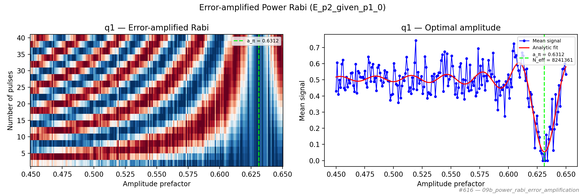

# 09b_power_rabi_error_amplification

## Description

        Power Rabi with Error Amplification
This sequence is a power Rabi sequence augmented with error-amplification. It involves parking the qubit at the
manipulation bias point, playing a pulse sequence with N pulses, and measuring the state of the resonator across
different qubit pulse amplitudes, showing Rabi oscillations. With error amplification, small amplitude errors accumulate
rapidly, allowing for a more precise calibration of the pulse amplitude. The results are then analyzed to determine the
qubit pulse amplitude suitable for the selected gate duration.

Prerequisites:
    - Having calibrated the relevant voltage points.
    - Having calibrated the qubit frequency.
    - Having set the qubit gate duration.

State update:
    - The qubit pulse amplitude corresponding to the specified operation (x180, x90...).

## Parameters

| Parameter | Value | Description |
|-----------|-------|-------------|
| `analysis_signal` | `E_p2_given_p1_0` | Which conditional expectation to use for fitting.
E_p2_given_p1_0: P(second=1 | first=0) — post-select on empty dot.
E_p2_given_p1_1: P(second=1 | first=1) — post-select on loaded dot. |
| `parity_pre_measurement` | `False` | Whether to use parity pre measurement. Default is False. |
| `multiplexed` | `False` | Whether to play control pulses, readout pulses and active/thermal reset at the same time for all qubits (True)
or to play the experiment sequentially for each qubit (False). Default is False. |
| `use_state_discrimination` | `False` | Whether to use on-the-fly state discrimination and return the qubit 'state', or simply return the demodulated
quadratures 'I' and 'Q'. Default is False. |
| `reset_type` | `thermal` | The qubit reset method to use. Must be implemented as a method of Quam.qubit. Can be "thermal", "active", or
"active_gef". Default is "thermal". |
| `qubits` | `['q1']` | A list of qubit names which should participate in the execution of the node. Default is None. |
| `num_shots` | `4` | Number of averages to perform. Default is 100. |
| `min_amp_factor` | `0.45` | Minimum amplitude factor for the operation. Default is 0.001. |
| `max_amp_factor` | `0.65` | Maximum amplitude factor for the operation. Default is 1.99. |
| `amp_factor_step` | `0.001` | Step size for the amplitude factor. Default is 0.005. |
| `max_n_pulses` | `42` | Number of pulses in the error-amplified power Rabi pulse sequence. |
| `simulate` | `False` | Simulate the waveforms on the OPX instead of executing the program. Default is False. |
| `simulation_duration_ns` | `50000` | Duration over which the simulation will collect samples (in nanoseconds). Default is 50_000 ns. |
| `use_waveform_report` | `True` | Whether to use the interactive waveform report in simulation. Default is True. |
| `timeout` | `120` | Waiting time for the OPX resources to become available before giving up (in seconds). Default is 120 s. |
| `load_data_id` | `None` | Optional QUAlibrate node run index for loading historical data. Default is None. |

## Fit Results

| Qubit | f_res (GHz) | t_pi (ns) | Omega_R (rad/ns) | gamma (1/ns) | T2* (ns) | success |
|-------|-------------|----------|--------------|----------|----------|--------|
| q1 | 0.0000 | nan | 4.958846 | 0.00000 | 55090110961153 | True |

## Updated State

| Qubit | intermediate_frequency (Hz) | xy.operations.x180.length (ns) |
|-------|-----------------------------|-----------------------------------------|
| q1 | 0 | nan |

## Analysis Output

---
*Generated by analysis test infrastructure (virtual_qpu)*
