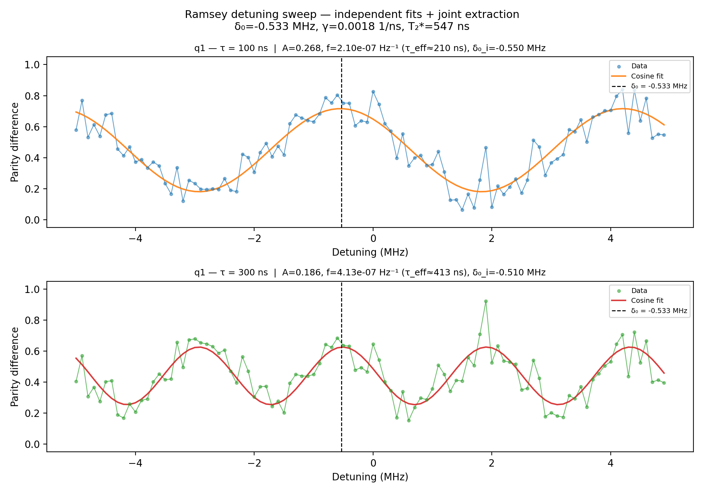

# 10b_ramsey_detuning_parity_diff

## Description

RAMSEY DETUNING PARITY DIFFERENCE (TWO-τ)

Sweeps the drive-frequency detuning at two fixed idle times (τ_short
and τ_long) and measures the parity difference after a π/2 – idle – π/2
sequence at each.

The two traces act as a Vernier: wide fringes (short τ) localise the
resonance coarsely, narrow fringes (long τ) sharpen the estimate.  The
amplitude ratio between traces gives the exponential decay rate (T₂*).
A joint differential-evolution fit with shared (bg, A₀, δ₀, γ) across
both traces extracts the resonance detuning and T₂*.

Prerequisites:
    - Calibrated resonators and voltage points (empty - init - measure).
    - Calibrated X90 pulse amplitude and frequency.

State update:
    - qubit.xy.intermediate_frequency

## Parameters

| Parameter | Value | Description |
|-----------|-------|-------------|
| `detuning_span_in_mhz` | `10.0` | Frequency detuning span. Default 5MHz. |
| `detuning_step_in_mhz` | `0.1` | Frequency detuning step. Default 0.1MHz |
| `gap_wait_time_in_ns` | `128` | Wait time between initialization and qubit pulse in nanoseconds. Default is 128 ns. |
| `idle_time_long_ns` | `300` | Long idle time in ns (gives narrow fringes for precision + T2* via amplitude ratio). |
| `idle_time_ns` | `100` | Short idle time in ns (gives wide fringes for coarse localisation). |
| `load_data_id` | `None` | Optional QUAlibrate node run index for loading historical data. Default is None. |
| `model_computed_fields` | `{}` |  |
| `model_config` | `{'extra': 'forbid', 'use_attribute_docstrings': True}` |  |
| `model_extra` | `None` |  |
| `model_fields` | `{'multiplexed': FieldInfo(annotation=bool, required=False, default=False, description='Whether to play control pulses, readout pulses and active/thermal reset at the same time for all qubits (True)\nor to play the experiment sequentially for each qubit (False). Default is False.'), 'use_state_discrimination': FieldInfo(annotation=bool, required=False, default=False, description="Whether to use on-the-fly state discrimination and return the qubit 'state', or simply return the demodulated\nquadratures 'I' and 'Q'. Default is False."), 'reset_type': FieldInfo(annotation=Literal['thermal', 'active', 'active_gef'], required=False, default='thermal', description='The qubit reset method to use. Must be implemented as a method of Quam.qubit. Can be "thermal", "active", or\n"active_gef". Default is "thermal".'), 'qubits': FieldInfo(annotation=Union[List[str], NoneType], required=False, default=None, description='A list of qubit names which should participate in the execution of the node. Default is None.'), 'num_shots': FieldInfo(annotation=int, required=False, default=100, description='Number of averages to perform. Default is 100.'), 'gap_wait_time_in_ns': FieldInfo(annotation=int, required=False, default=128, description='Wait time between initialization and qubit pulse in nanoseconds. Default is 128 ns.'), 'simulate': FieldInfo(annotation=bool, required=False, default=False, description='Simulate the waveforms on the OPX instead of executing the program. Default is False.'), 'simulation_duration_ns': FieldInfo(annotation=int, required=False, default=50000, description='Duration over which the simulation will collect samples (in nanoseconds). Default is 50_000 ns.'), 'use_waveform_report': FieldInfo(annotation=bool, required=False, default=True, description='Whether to use the interactive waveform report in simulation. Default is True.'), 'timeout': FieldInfo(annotation=int, required=False, default=120, description='Waiting time for the OPX resources to become available before giving up (in seconds). Default is 120 s.'), 'load_data_id': FieldInfo(annotation=Union[int, NoneType], required=False, default=None, description='Optional QUAlibrate node run index for loading historical data. Default is None.'), 'detuning_span_in_mhz': FieldInfo(annotation=float, required=False, default=5.0, description='Frequency detuning span. Default 5MHz.'), 'detuning_step_in_mhz': FieldInfo(annotation=float, required=False, default=0.1, description='Frequency detuning step. Default 0.1MHz'), 'idle_time_ns': FieldInfo(annotation=int, required=False, default=100, description='Short idle time in ns (gives wide fringes for coarse localisation).'), 'idle_time_long_ns': FieldInfo(annotation=int, required=False, default=400, description='Long idle time in ns (gives narrow fringes for precision + T2* via amplitude ratio).')}` |  |
| `model_fields_set` | `{'idle_time_ns', 'detuning_span_in_mhz', 'num_shots', 'simulate', 'qubits', 'detuning_step_in_mhz', 'idle_time_long_ns'}` |  |
| `multiplexed` | `False` | Whether to play control pulses, readout pulses and active/thermal reset at the same time for all qubits (True)
or to play the experiment sequentially for each qubit (False). Default is False. |
| `num_shots` | `4` | Number of averages to perform. Default is 100. |
| `qubits` | `['Q1']` | A list of qubit names which should participate in the execution of the node. Default is None. |
| `reset_type` | `thermal` | The qubit reset method to use. Must be implemented as a method of Quam.qubit. Can be "thermal", "active", or
"active_gef". Default is "thermal". |
| `simulate` | `False` | Simulate the waveforms on the OPX instead of executing the program. Default is False. |
| `simulation_duration_ns` | `50000` | Duration over which the simulation will collect samples (in nanoseconds). Default is 50_000 ns. |
| `targets` | `['Q1']` |  |
| `targets_name` | `qubits` |  |
| `timeout` | `120` | Waiting time for the OPX resources to become available before giving up (in seconds). Default is 120 s. |
| `use_state_discrimination` | `False` | Whether to use on-the-fly state discrimination and return the qubit 'state', or simply return the demodulated
quadratures 'I' and 'Q'. Default is False. |
| `use_waveform_report` | `True` | Whether to use the interactive waveform report in simulation. Default is True. |

## Fit Results

| Qubit | f_res (GHz) | t_π (ns) | Ω_R (rad/ns) | γ (1/ns) | T₂* (ns) | success |
|-------|-------------|----------|--------------|----------|----------|--------|
| Q1 | 0.0000 | nan | nan | 0.03333 | 30 | True |

## Updated State

| Qubit | intermediate_frequency (Hz) | xy.operations.x180.length (ns) |
|-------|-----------------------------|-----------------------------------------|
| Q1 | 0 | nan |

## Analysis Output

---
*Generated by analysis test infrastructure (virtual_qpu)*
