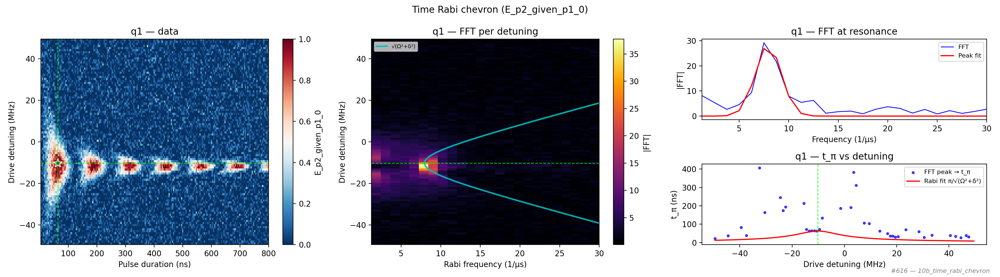

# 10b_time_rabi_chevron

## Description

        TIME RABI CHEVRON PARITY DIFFERENCE
This sequence performs a 2D chevron measurement with parity difference to characterize qubit coherence and
coupling as a function of both pulse duration and frequency detuning. The measurement involves sweeping both
the duration of a qubit control pulse (typically an X180 pulse) and the frequency detuning while measuring
the parity state before and after the pulse using charge sensing via RF reflectometry or DC current sensing.

The sequence uses voltage gate sequences to navigate through a triangle in voltage space (empty -
initialization - measurement) using OPX channels on the fast lines of the bias-tees. At each combination
of pulse duration and frequency detuning, the parity is measured before and after the manipulation pulse;
joint-outcome streams are averaged and reduced to conditional expectations for analysis.

The 2D chevron pattern in the analysis signal reveals the qubit coupling strength as a function
of both time and frequency, creating a characteristic chevron shape. This measurement is particularly useful
for characterizing two-qubit gates, understanding the dynamics of coupled quantum dots, and identifying
optimal operating points for qubit control.

Prerequisites:
    - Having calibrated the resonators coupled to the SensorDot components.
    - Having calibrated the voltage points (empty - initialization - measurement), including sensor the dot bias.
    - Rough guess of the qubit pulse calibration (X180 pulse amplitude and frequency).

State update:
    - The qubit x180 operation duration and frequency.

## Parameters

| Parameter | Value | Description |
|-----------|-------|-------------|
| `analysis_signal` | `E_p2_given_p1_0` | Which conditional expectation to use for fitting.
E_p2_given_p1_0: P(second=1 | first=0) — post-select on empty dot.
E_p2_given_p1_1: P(second=1 | first=1) — post-select on loaded dot. |
| `parity_pre_measurement` | `False` | Whether to use parity pre measurement. Default is False. |
| `multiplexed` | `False` | Whether to play control pulses, readout pulses and active/thermal reset at the same time for all qubits (True)
or to play the experiment sequentially for each qubit (False). Default is False. |
| `use_state_discrimination` | `False` | Whether to use on-the-fly state discrimination and return the qubit 'state', or simply return the demodulated
quadratures 'I' and 'Q'. Default is False. |
| `reset_wait_time` | `5000` | The wait time for qubit reset. |
| `qubits` | `['q1']` | A list of qubit names which should participate in the execution of the node. Default is None. |
| `num_shots` | `4` | Number of averages to perform. Default is 100. |
| `min_wait_time_in_ns` | `4` | Minimum pulse duration in nanoseconds. Must be larger than 4 clock cycles. Default is 16 ns. |
| `max_wait_time_in_ns` | `800` | Maximum pulse duration in nanoseconds. Default is 10000 ns (10 us). |
| `time_step_in_ns` | `4` | Step size for the pulse duration sweep in nanoseconds. Default is 52 ns. |
| `frequency_span_in_mhz` | `100.0` | Span of frequencies to sweep in MHz. Default is 2 MHz. |
| `frequency_step_in_mhz` | `1.0` | Step size for the frequency detuning sweep in MHz. Default is 0.025 MHz. |
| `operation` | `x180` | Name of the qubit operation to perform. Default is 'x180'. |
| `simulate` | `False` | Simulate the waveforms on the OPX instead of executing the program. Default is False. |
| `simulation_duration_ns` | `50000` | Duration over which the simulation will collect samples (in nanoseconds). Default is 50_000 ns. |
| `use_waveform_report` | `True` | Whether to use the interactive waveform report in simulation. Default is True. |
| `timeout` | `120` | Waiting time for the OPX resources to become available before giving up (in seconds). Default is 120 s. |
| `load_data_id` | `None` | Optional QUAlibrate node run index for loading historical data. Default is None. |

## Fit Results

| Qubit | f_res (GHz) | t_pi (ns) | Omega_R (rad/ns) | gamma (1/ns) | T2* (ns) | success |
|-------|-------------|----------|--------------|----------|----------|--------|
| q1 | 5.0018 | 62.9 | 0.049922 | 0.00839 | 119 | True |

## Updated State

| Qubit | intermediate_frequency (Hz) | xy.operations.x180.length (ns) |
|-------|-----------------------------|-----------------------------------------|
| q1 | 5001799151 | 62.9 |

## Analysis Output

---
*Generated by analysis test infrastructure (virtual_qpu)*
