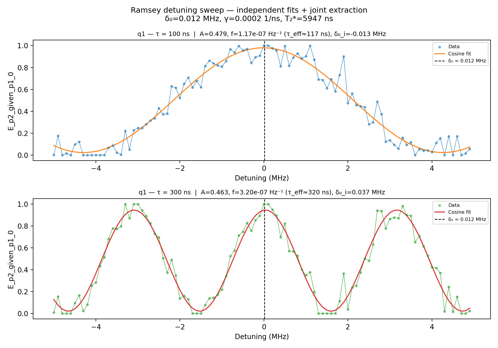

# 11b_ramsey_detuning

## Description

RAMSEY DETUNING PARITY DIFFERENCE (TWO-τ)

Sweeps the drive-frequency detuning at two fixed idle times (τ_short
and τ_long) and measures pre/post parity via joint-outcome streams;
analysis uses the selected conditional expectation (default: P(second=1|first=0)).

The two traces act as a Vernier: wide fringes (short τ) localise the
resonance coarsely, narrow fringes (long τ) sharpen the estimate.  Each
trace is fitted independently with a profiled differential-evolution
search over the oscillation frequency (linear parameters solved by
least-squares).  The resonance detuning δ₀ is the amplitude-weighted
mean of the per-trace estimates.  The amplitude ratio between traces
gives the exponential decay rate γ and dephasing time T₂*.

Prerequisites:
    - Calibrated resonators and voltage points (empty - init - measure).
    - Calibrated X90 pulse amplitude and frequency.

State update:
    - qubit.xy.intermediate_frequency

## Parameters

| Parameter | Value | Description |
|-----------|-------|-------------|
| `analysis_signal` | `E_p2_given_p1_0` | Which conditional expectation to use for fitting.
E_p2_given_p1_0: P(second=1 | first=0) — post-select on empty dot.
E_p2_given_p1_1: P(second=1 | first=1) — post-select on loaded dot. |
| `parity_pre_measurement` | `True` | Whether to use parity pre measurement. Default is False. |
| `multiplexed` | `False` | Whether to play control pulses, readout pulses and active/thermal reset at the same time for all qubits (True)
or to play the experiment sequentially for each qubit (False). Default is False. |
| `use_state_discrimination` | `False` | Whether to use on-the-fly state discrimination and return the qubit 'state', or simply return the demodulated
quadratures 'I' and 'Q'. Default is False. |
| `reset_type` | `thermal` | The qubit reset method to use. Must be implemented as a method of Quam.qubit. Can be "thermal", "active", or
"active_gef". Default is "thermal". |
| `qubits` | `['q1']` | A list of qubit names which should participate in the execution of the node. Default is None. |
| `num_shots` | `4` | Number of averages to perform. Default is 100. |
| `simulate` | `False` | Simulate the waveforms on the OPX instead of executing the program. Default is False. |
| `simulation_duration_ns` | `50000` | Duration over which the simulation will collect samples (in nanoseconds). Default is 50_000 ns. |
| `use_waveform_report` | `True` | Whether to use the interactive waveform report in simulation. Default is True. |
| `timeout` | `120` | Waiting time for the OPX resources to become available before giving up (in seconds). Default is 120 s. |
| `load_data_id` | `None` | Optional QUAlibrate node run index for loading historical data. Default is None. |
| `detuning_span_in_mhz` | `10.0` | Frequency detuning span. Default 5MHz. |
| `detuning_step_in_mhz` | `0.1` | Frequency detuning step. Default 0.1MHz |
| `idle_time_ns` | `100` | Short idle time in ns (gives wide fringes for coarse localisation). |
| `idle_time_long_ns` | `300` | Long idle time in ns (gives narrow fringes for precision + T2* via amplitude ratio). |

## Fit Results

| Qubit | f_res (GHz) | t_pi (ns) | Omega_R (rad/ns) | gamma (1/ns) | T2* (ns) | success |
|-------|-------------|----------|--------------|----------|----------|--------|
| q1 | 0.0000 | nan | nan | 0.00017 | 5947 | True |

## Updated State

| Qubit | intermediate_frequency (Hz) | xy.operations.x180.length (ns) |
|-------|-----------------------------|-----------------------------------------|
| q1 | 0 | nan |

## Analysis Output

---
*Generated by analysis test infrastructure (virtual_qpu)*
