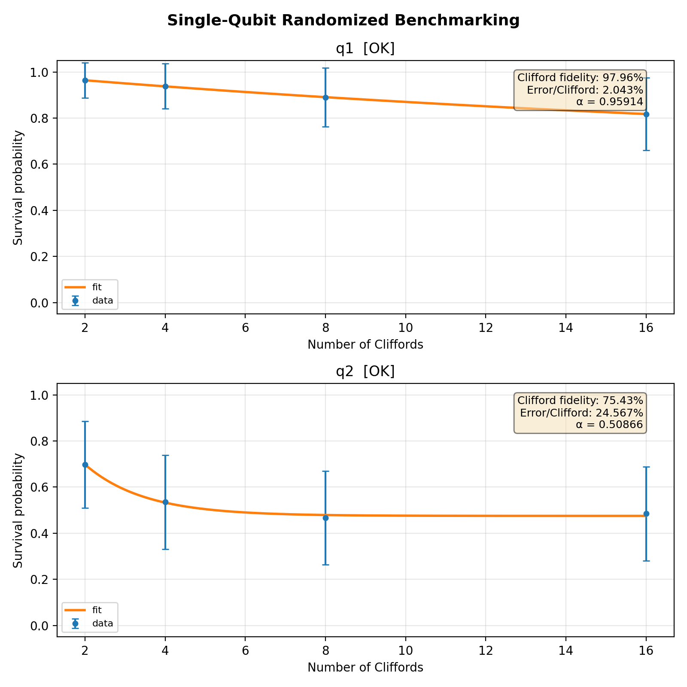

# 14_single_qubit_randomized_benchmarking

## Description

SINGLE QUBIT RANDOMIZED BENCHMARKING (PPU-optimized)

This node estimates the average single-qubit Clifford fidelity by playing random
Clifford sequences and measuring the survival probability after the recovery
operation. The 24 single-qubit Cliffords are decomposed into the native gate set
`{x90, x180, -x90, y90, y180, -y90}` plus virtual Z rotations.

The PPU generates random Clifford circuits on-chip:
  1. PPU PHASE: For each circuit, random Cliffords are generated incrementally
     across depth checkpoints using preloaded composition and inverse tables.
  2. EXPERIMENT PHASE: For each (depth, shot), the pre-computed gate sequences
     are played back from arrays — no RNG or composition in the hot path.

Depth convention: depth d = d-1 random Cliffords + 1 recovery (inverse) = d total.
A single random circuit of max length is generated per circuit_idx; shorter depths
are truncations of the same circuit (standard RB truncation approach).

The survival probability vs circuit depth is fit to F(m) = A·α^m + B. The average
error per Clifford is epc = (1 − α)·(d − 1)/d with d = 2, giving the average
Clifford gate fidelity F_avg = 1 − epc.

Prerequisites:
    - Having calibrated the sensor dots and resonators (nodes 2a, b, 3).
    - Having calibrated initialization, operation and PSB measurement points (nodes 4, 5).
    - Having calibrated π and π/2 pulse parameters (nodes 09a, 09b, 11a).
    - Native gate operations (x90, x180, -x90, y90, y180, -y90) defined on the qubit XY channel.

Datasets:
    - `ds_raw`: Averaged survival probability versus circuit depth for each qubit and random circuit.
    - `ds_fit`: Fitted RB decay traces and derived analysis variables used for plotting.
    - `fit_results`: Per-qubit scalar fit summary, including fit success and native gate fidelity.

Results:
    - Per-qubit fitted RB decay parameters and the extracted average native gate fidelity.

Figures:
    - Raw RB survival data with fitted decay curves for each selected qubit.
    - Simulated waveform report and sample plot when `simulate=True`.

State update:
    - The averaged single qubit gate fidelity: qubit.gate_fidelity["averaged"].

## Parameters

| Parameter | Value | Description |
|-----------|-------|-------------|
| `multiplexed` | `False` | Whether to play control pulses, readout pulses and active/thermal reset at the same time for all qubits (True)
or to play the experiment sequentially for each qubit (False). Default is False. |
| `use_state_discrimination` | `False` | Whether to use on-the-fly state discrimination and return the qubit 'state', or simply return the demodulated
quadratures 'I' and 'Q'. Default is False. |
| `reset_type` | `thermal` | The qubit reset method to use. Must be implemented as a method of Quam.qubit. Can be "thermal", "active", or
"active_gef". Default is "thermal". |
| `qubits` | `['q1', 'q2']` | A list of qubit names which should participate in the execution of the node. Default is None. |
| `target_state` | `None` | The state you want to initialize into for heralded initialization. |
| `max_loops` | `100` | Maximum number of initialization loops for heralded initialization. |
| `return_n_loops` | `False` | Whether to return the number of times it has looped over the initialise sequence to achieve the desired result. |
| `num_circuits_per_length` | `20` | Number of random circuits per depth. Default is 50. |
| `num_shots` | `500` | Number of repetitions (shots) per circuit. Default is 400. |
| `max_circuit_depth` | `56` | Maximum circuit depth (total Clifford count). Default is 256. |
| `delta_clifford` | `20` | Step between depths in linear scale mode. Default is 20. |
| `log_scale` | `True` | If True, use log-scale depths: 2, 4, 8, 16, ... up to max_circuit_depth. Default is True. |
| `seed` | `None` | Seed for the QUA pseudo-random number generator. Default is None (random). |
| `simulate` | `False` | Simulate the waveforms on the OPX instead of executing the program. Default is False. |
| `simulation_duration_ns` | `50000` | Duration over which the simulation will collect samples (in nanoseconds). Default is 50_000 ns. |
| `use_waveform_report` | `True` | Whether to use the interactive waveform report in simulation. Default is True. |
| `timeout` | `120` | Waiting time for the OPX resources to become available before giving up (in seconds). Default is 120 s. |
| `load_data_id` | `None` | Optional QUAlibrate node run index for loading historical data. Default is None. |

## Analysis Output

---
*Generated by analysis test infrastructure (virtual_qpu)*
