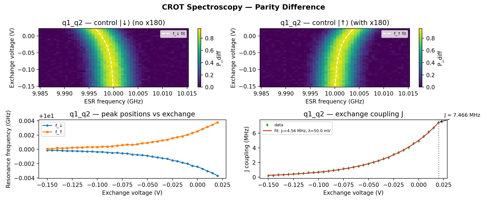

# 14a_crot_spectroscopy_parity_diff

## Description

        CROT (CONTROLLED-ROTATION) SPECTROSCOPY - using standard QUA (pulse > 16ns and 4ns granularity)
The goal of this script is to measure the exchange coupling J between two spin qubits and identify
the conditional resonance frequencies required for implementing a CROT (controlled-rotation) gate.

In exchange-coupled spin qubits, the resonance frequency of a target qubit depends on the spin state
of a control qubit. When the control qubit is in |↓⟩ vs |↑⟩, the target qubit's resonance frequency
shifts by the exchange coupling strength J. This state-dependent frequency shift enables conditional
quantum operations - the foundation of two-qubit gates in the Loss-DiVincenzo architecture.

This measurement performs a 2D sweep of drive frequency vs virtual barrier gate (or virtual exchange voltage)
to map out the exchange coupling as a function of the inter-dot tunnel coupling.

The QUA program sequence:
    1) Start at the initialization point.
    2) Step to the two-qubit exchange point using sticky elements (virtual barrier/exchange voltage).
    3) Apply the RF drive pulse to the target qubit while sweeping the drive frequency.
    4) Step to the initialization (operation) point.
    5) Step to the measurement point and read out the two-qubit state via parity readout.

The CROT spectroscopy works by:
    - At each virtual barrier/exchange voltage, the exchange coupling J varies.
    - The target qubit resonance splits into two frequencies (f_↓ and f_↑) separated by J.
    - Sweeping frequency vs barrier voltage produces a chevron-like pattern showing J(V_barrier).
    - The optimal exchange point and CROT drive frequencies can be extracted from this 2D map.

The CROT gate is equivalent to a CNOT gate up to single-qubit rotations. For high-fidelity CROT gates,
the Zeeman energy difference between qubits must be much larger than the exchange coupling J, ensuring
addressability and avoiding off-resonant rotations.

Prerequisites:
    - Having calibrated single-qubit gates (π and π/2 pulses) for both qubits.
    - Having calibrated the readout for the qubit pair (parity readout).
    - Having set the appropriate flux/gate voltages to enable exchange coupling between the qubits.

Before proceeding to the next node:
    - Extract the exchange coupling J from the frequency shift between the two resonance peaks.
    - Identify the conditional resonance frequencies f_↓ and f_↑ for CROT gate implementation.
    - Verify that J is sufficiently large for the desired gate speed but small enough for addressability.

State update:
    - exchange_coupling_J
    - crot_frequency_down
    - crot_frequency_up

## Parameters

| Parameter | Value | Description |
|-----------|-------|-------------|
| `duration` | `200` | CROT drive pulse duration in nanoseconds. Default is 1000 ns. |
| `esr_frequency_max` | `15000000.0` | Maximum ESR drive frequency offset (Hz). Default is 50 MHz. |
| `esr_frequency_min` | `-15000000.0` | Minimum ESR drive frequency offset (Hz). Default is -50 MHz. |
| `esr_frequency_points` | `51` | Number of points in the ESR frequency sweep. Default is 100. |
| `exchange_max` | `0.02` | Maximum virtual barrier / exchange voltage (V). Default is 0.5. |
| `exchange_min` | `-0.15` | Minimum virtual barrier / exchange voltage (V). Default is 0.0. |
| `exchange_points` | `35` | Number of points in the exchange voltage sweep. Default is 50. |
| `hold_duration` | `100` | Hold duration at exchange point before measurement (ns). Default is 100 ns. |
| `load_data_id` | `None` | Optional QUAlibrate node run index for loading historical data. Default is None. |
| `model_computed_fields` | `{}` |  |
| `model_config` | `{'extra': 'forbid', 'use_attribute_docstrings': True}` |  |
| `model_extra` | `None` |  |
| `model_fields` | `{'multiplexed': FieldInfo(annotation=bool, required=False, default=False, description='Whether to play control pulses, readout pulses and active/thermal reset at the same time for all qubits (True)\nor to play the experiment sequentially for each qubit (False). Default is False.'), 'use_state_discrimination': FieldInfo(annotation=bool, required=False, default=False, description="Whether to use on-the-fly state discrimination and return the qubit 'state', or simply return the demodulated\nquadratures 'I' and 'Q'. Default is False."), 'reset_wait_time': FieldInfo(annotation=int, required=False, default=5000, description='The wait time for qubit reset.'), 'qubit_pairs': FieldInfo(annotation=Union[List[str], NoneType], required=False, default=None, description='A list of qubit pair names which should participate in the execution of the node. Default is None.'), 'num_shots': FieldInfo(annotation=int, required=False, default=100, description='Number of averages to perform. Default is 100.'), 'exchange_min': FieldInfo(annotation=float, required=False, default=0.0, description='Minimum virtual barrier / exchange voltage (V). Default is 0.0.'), 'exchange_max': FieldInfo(annotation=float, required=False, default=0.5, description='Maximum virtual barrier / exchange voltage (V). Default is 0.5.'), 'exchange_points': FieldInfo(annotation=int, required=False, default=50, description='Number of points in the exchange voltage sweep. Default is 50.'), 'esr_frequency_min': FieldInfo(annotation=float, required=False, default=-50000000.0, description='Minimum ESR drive frequency offset (Hz). Default is -50 MHz.'), 'esr_frequency_max': FieldInfo(annotation=float, required=False, default=50000000.0, description='Maximum ESR drive frequency offset (Hz). Default is 50 MHz.'), 'esr_frequency_points': FieldInfo(annotation=int, required=False, default=100, description='Number of points in the ESR frequency sweep. Default is 100.'), 'duration': FieldInfo(annotation=int, required=False, default=1000, description='CROT drive pulse duration in nanoseconds. Default is 1000 ns.'), 'hold_duration': FieldInfo(annotation=int, required=False, default=100, description='Hold duration at exchange point before measurement (ns). Default is 100 ns.'), 'simulate': FieldInfo(annotation=bool, required=False, default=False, description='Simulate the waveforms on the OPX instead of executing the program. Default is False.'), 'simulation_duration_ns': FieldInfo(annotation=int, required=False, default=50000, description='Duration over which the simulation will collect samples (in nanoseconds). Default is 50_000 ns.'), 'use_waveform_report': FieldInfo(annotation=bool, required=False, default=True, description='Whether to use the interactive waveform report in simulation. Default is True.'), 'timeout': FieldInfo(annotation=int, required=False, default=120, description='Waiting time for the OPX resources to become available before giving up (in seconds). Default is 120 s.'), 'load_data_id': FieldInfo(annotation=Union[int, NoneType], required=False, default=None, description='Optional QUAlibrate node run index for loading historical data. Default is None.')}` |  |
| `model_fields_set` | `{'esr_frequency_min', 'esr_frequency_points', 'duration', 'qubit_pairs', 'simulate', 'exchange_min', 'exchange_max', 'hold_duration', 'exchange_points', 'esr_frequency_max', 'num_shots'}` |  |
| `multiplexed` | `False` | Whether to play control pulses, readout pulses and active/thermal reset at the same time for all qubits (True)
or to play the experiment sequentially for each qubit (False). Default is False. |
| `num_shots` | `4` | Number of averages to perform. Default is 100. |
| `qubit_pairs` | `['q1_q2']` | A list of qubit pair names which should participate in the execution of the node. Default is None. |
| `reset_wait_time` | `5000` | The wait time for qubit reset. |
| `simulate` | `False` | Simulate the waveforms on the OPX instead of executing the program. Default is False. |
| `simulation_duration_ns` | `50000` | Duration over which the simulation will collect samples (in nanoseconds). Default is 50_000 ns. |
| `targets` | `None` |  |
| `targets_name` | `qubits` |  |
| `timeout` | `120` | Waiting time for the OPX resources to become available before giving up (in seconds). Default is 120 s. |
| `use_state_discrimination` | `False` | Whether to use on-the-fly state discrimination and return the qubit 'state', or simply return the demodulated
quadratures 'I' and 'Q'. Default is False. |
| `use_waveform_report` | `True` | Whether to use the interactive waveform report in simulation. Default is True. |

## Fit Results

| Qubit | f_res (GHz) | t_pi (ns) | Omega_R (rad/ns) | gamma (1/ns) | T2* (ns) | success |
|-------|-------------|----------|--------------|----------|----------|--------|
| q1_q2 | 0.0000 | nan | nan | nan | inf | True |

## Updated State

| Qubit | intermediate_frequency (Hz) | xy.operations.x180.length (ns) |
|-------|-----------------------------|-----------------------------------------|
| q1_q2 | 0 | nan |

## Analysis Output

---
*Generated by analysis test infrastructure (virtual_qpu)*
