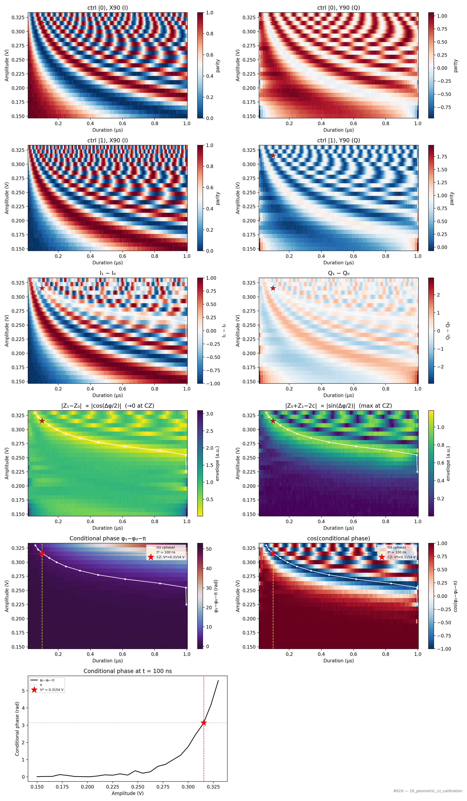

# 16_geometric_cz_calibration

## Description

        GEOMETRIC CZ GATE CALIBRATION - quadrature readout (I/Q)
This node calibrates a geometric controlled-Z (CZ) gate by sweeping exchange pulse amplitude and duration.
It runs the cphase Ramsey sequence with X90 and Y90 closing pulses for quadrature readout (I and Q),
for both control qubit states (|0> and |1>).

The analysis extracts the branch phases phi0, phi1 via arctan2(Q-c, I-c), then computes the
conditional phase phi1 - phi0 - pi.  The common-mode Stark shift from the barrier gate
cancels in the subtraction; the -pi removes the known parity-readout offset.  The CZ
operating point is where this quantity reaches pi at the user-specified target duration.

This measurement performs a 2D sweep of exchange pulse amplitude vs duration with four experiment types:
    control_state=0, analysis_axis=0 : target X90, exchange, closing X90 (I quadrature, ctrl ground)
    control_state=0, analysis_axis=1 : target X90, exchange, closing Y90 (Q quadrature, ctrl ground)
    control_state=1, analysis_axis=0 : ctrl X180 + target X90, exchange, closing X90 (I, ctrl excited)
    control_state=1, analysis_axis=1 : ctrl X180 + target X90, exchange, closing Y90 (Q, ctrl excited)

Prerequisites:
    - Having calibrated single-qubit gates (X90, X180) for both qubits.
    - Having calibrated the readout for the qubit pair (parity readout).
    - Having characterized the exchange coupling vs barrier voltage (from CROT spectroscopy).
    - Having set appropriate voltage points for initialization, operation, and exchange.

State update:
    - CZ voltage point on qubit pair (barrier gate voltage)
    - CZ macro duration

## Parameters

| Parameter | Value | Description |
|-----------|-------|-------------|
| `analysis_signal` | `E_p2_given_p1_0` | Which conditional expectation to use for fitting.
E_p2_given_p1_0: P(second=1 | first=0) — post-select on empty dot.
E_p2_given_p1_1: P(second=1 | first=1) — post-select on loaded dot. |
| `parity_pre_measurement` | `False` | Whether to use parity pre measurement. Default is False. |
| `multiplexed` | `False` | Whether to play control pulses, readout pulses and active/thermal reset at the same time for all qubits (True)
or to play the experiment sequentially for each qubit (False). Default is False. |
| `use_state_discrimination` | `False` | Whether to use on-the-fly state discrimination and return the qubit 'state', or simply return the demodulated
quadratures 'I' and 'Q'. Default is False. |
| `reset_wait_time` | `5000` | The wait time for qubit reset. |
| `qubit_pairs` | `['q1_q2']` | A list of qubit pair names which should participate in the execution of the node. Default is None. |
| `num_shots` | `4` | Number of averages to perform. Default is 100. |
| `target_duration_ns` | `100` | Target exchange pulse duration (ns, must be a multiple of 4).
The analysis finds the amplitude where the conditional phase reaches pi
at this duration. |
| `quadrature_signal_center` | `0.5` | Expected centre of the I/Q quadrature signal (parity expectation at
zero phase). Default is 0.5. |
| `min_exchange_duration_in_ns` | `16` | Minimum exchange pulse duration in nanoseconds. Must be >= 16 ns (4 clock cycles). Default is 16 ns. |
| `max_exchange_duration_in_ns` | `1001` | Maximum exchange pulse duration in nanoseconds. Default is 2000 ns. |
| `duration_step_in_ns` | `8` | Step size for the exchange pulse duration sweep in nanoseconds. Default is 20 ns. |
| `min_exchange_amplitude` | `0.15` | Minimum exchange pulse amplitude (virtual barrier gate voltage, V). Default is 0.0. |
| `max_exchange_amplitude` | `0.33` | Maximum exchange pulse amplitude (virtual barrier gate voltage, V). Default is 0.5. |
| `amplitude_step` | `0.007500000000000001` | Step size for the exchange pulse amplitude sweep in Volts. Default is 0.01. |
| `simulate` | `False` | Simulate the waveforms on the OPX instead of executing the program. Default is False. |
| `simulation_duration_ns` | `50000` | Duration over which the simulation will collect samples (in nanoseconds). Default is 50_000 ns. |
| `use_waveform_report` | `True` | Whether to use the interactive waveform report in simulation. Default is True. |
| `timeout` | `120` | Waiting time for the OPX resources to become available before giving up (in seconds). Default is 120 s. |
| `load_data_id` | `None` | Optional QUAlibrate node run index for loading historical data. Default is None. |

## Fit Results

| Qubit | f_res (GHz) | t_pi (ns) | Omega_R (rad/ns) | gamma (1/ns) | T2* (ns) | success |
|-------|-------------|----------|--------------|----------|----------|--------|
| q1_q2 | 0.0000 | 100.0 | nan | nan | inf | True |

## Updated State

| Qubit | intermediate_frequency (Hz) | xy.operations.x180.length (ns) |
|-------|-----------------------------|-----------------------------------------|
| q1_q2 | 0 | 100.0 |

## Analysis Output

---
*Generated by analysis test infrastructure (virtual_qpu)*
