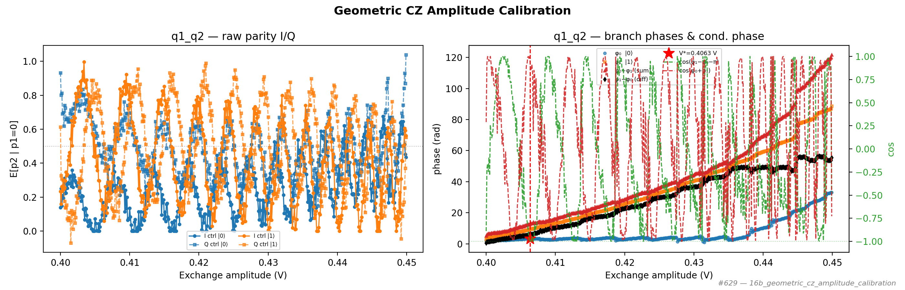

# 16b_geometric_cz_amplitude_calibration

## Description

        GEOMETRIC CZ AMPLITUDE CALIBRATION - fixed exchange duration
This node calibrates the exchange pulse amplitude for a geometric CZ gate at a fixed exchange duration.
It runs cphase Ramsey experiments for control in |0> and |1>, each with X90 and Y90 analysis quadratures.

The analysis extracts phases via arctan2(I, Q) and selects the amplitude where the conditional phase
φ₁ − φ₀ equals π (unwrapped along the amplitude sweep).

Prerequisites:
    - Having calibrated single-qubit gates (X90, X180) for both qubits.
    - Having calibrated the readout for the qubit pair (parity readout).
    - Having chosen a fixed exchange duration for the CZ gate (e.g. from node 16a).

State update:
    - CZ voltage point on qubit pair (barrier gate voltage)

## Parameters

| Parameter | Value | Description |
|-----------|-------|-------------|
| `analysis_signal` | `E_p2_given_p1_0` | Which conditional expectation to use for fitting.
E_p2_given_p1_0: P(second=1 | first=0) — post-select on empty dot.
E_p2_given_p1_1: P(second=1 | first=1) — post-select on loaded dot. |
| `parity_pre_measurement` | `False` | Whether to use parity pre measurement. Default is False. |
| `multiplexed` | `False` | Whether to play control pulses, readout pulses and active/thermal reset at the same time for all qubits (True)
or to play the experiment sequentially for each qubit (False). Default is False. |
| `use_state_discrimination` | `False` | Whether to use on-the-fly state discrimination and return the qubit 'state', or simply return the demodulated
quadratures 'I' and 'Q'. Default is False. |
| `reset_wait_time` | `5000` | The wait time for qubit reset. |
| `qubit_pairs` | `['q1_q2']` | A list of qubit pair names which should participate in the execution of the node. Default is None. |
| `num_shots` | `4` | Number of averages to perform. Default is 100. |
| `min_exchange_amplitude` | `0.4` | Minimum exchange pulse amplitude (virtual barrier gate voltage, V). Default is 0.1. |
| `max_exchange_amplitude` | `0.45` | Maximum exchange pulse amplitude (virtual barrier gate voltage, V). Default is 0.5. |
| `amplitude_step` | `0.0001` | Step size for the exchange pulse amplitude sweep in Volts. Default is 0.005. |
| `quadrature_signal_center` | `0.5` | Signal value corresponding to the center of the Ramsey I/Q circle. Default is 0.5. |
| `simulate` | `False` | Simulate the waveforms on the OPX instead of executing the program. Default is False. |
| `simulation_duration_ns` | `50000` | Duration over which the simulation will collect samples (in nanoseconds). Default is 50_000 ns. |
| `use_waveform_report` | `True` | Whether to use the interactive waveform report in simulation. Default is True. |
| `timeout` | `120` | Waiting time for the OPX resources to become available before giving up (in seconds). Default is 120 s. |
| `load_data_id` | `None` | Optional QUAlibrate node run index for loading historical data. Default is None. |

## Fit Results

| Qubit | f_res (GHz) | t_pi (ns) | Omega_R (rad/ns) | gamma (1/ns) | T2* (ns) | success |
|-------|-------------|----------|--------------|----------|----------|--------|
| q1_q2 | 0.0000 | nan | nan | nan | inf | True |

## Updated State

| Qubit | intermediate_frequency (Hz) | xy.operations.x180.length (ns) |
|-------|-----------------------------|-----------------------------------------|
| q1_q2 | 0 | nan |

## Analysis Output

---
*Generated by analysis test infrastructure (virtual_qpu)*
