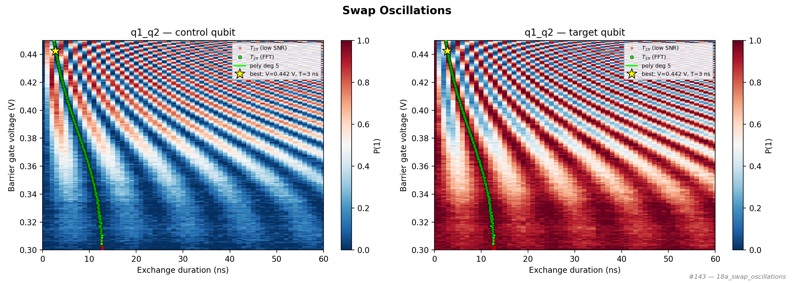

# 18a_swap_oscillations

## Description

        SWAP OSCILLATIONS - 2D amplitude/duration sweep
This node measures swap oscillations as a function of exchange pulse amplitude and
duration.  The experiment is run twice per qubit pair: once reading out the control
qubit and once reading out the target qubit.

Sequence (per measured qubit):
    initialize → CZ(amplitude, duration) → measure

The analysis extracts the 2π oscillation period at each amplitude via FFT,
discarding amplitudes where the oscillation has low SNR (white-noise regime).
The extracted (amplitude, T_2π) curve is overlaid on the 2D heatmaps and saved
as structured fit results.

A polynomial model T_2π(V) (up to degree 3) is fitted to the valid
(amplitude, T_2π) curve.  The model parameters are stored on the CZ macro
(``exchange_decay_model``), enabling downstream nodes to evaluate T_2π at
any amplitude via ``qubit_pair.macros["cz"].t_2pi(V)`` or get the CZ
half-period via ``qubit_pair.macros["cz"].t_cz(V)``.

Prerequisites:
    - Having calibrated single-qubit gates for both qubits.
    - Having calibrated readout for both individual qubits.
    - Having set appropriate voltage points for initialization and operation.

State update:
    - CZ voltage point (barrier gate) for the best operating amplitude.
    - CZ macro wait_duration = T_2π / 2 (half-period for CZ gate).
    - CZ macro exchange_decay_model = polynomial fit (coeffs, degree).

## Parameters

| Parameter | Value | Description |
|-----------|-------|-------------|
| `multiplexed` | `False` | Whether to play control pulses, readout pulses and active/thermal reset at the same time for all qubits (True)
or to play the experiment sequentially for each qubit (False). Default is False. |
| `use_state_discrimination` | `False` | Whether to use on-the-fly state discrimination and return the qubit 'state', or simply return the demodulated
quadratures 'I' and 'Q'. Default is False. |
| `reset_wait_time` | `5000` | The wait time for qubit reset. |
| `qubit_pairs` | `['q1_q2']` | A list of qubit pair names which should participate in the execution of the node. Default is None. |
| `target_state` | `None` | The state you want to initialize into for heralded initialization. |
| `max_loops` | `100` | Maximum number of initialization loops for heralded initialization. |
| `return_n_loops` | `False` | Whether to return the number of times it has looped over the initialise sequence to achieve the desired result. |
| `num_shots` | `4` | Number of averages to perform. Default is 100. |
| `min_exchange_amplitude` | `0.3` | Minimum exchange pulse amplitude (virtual barrier gate voltage, V). Default is 0.0. |
| `max_exchange_amplitude` | `0.45` | Maximum exchange pulse amplitude (virtual barrier gate voltage, V). Default is 0.5. |
| `amplitude_step` | `0.0007537688442211056` | Step size for the exchange pulse amplitude sweep in Volts. Default is 0.01. |
| `min_exchange_duration_in_ns` | `0` | Minimum exchange pulse duration in nanoseconds. Must be >= 16 ns (4 clock cycles). Default is 16 ns. |
| `max_exchange_duration_in_ns` | `61` | Maximum exchange pulse duration in nanoseconds. Default is 2000 ns. |
| `duration_step_in_ns` | `1` | Step size for the exchange pulse duration sweep in nanoseconds. Default is 20 ns. |
| `snr_threshold` | `100.0` | Minimum FFT peak-to-noise ratio for accepting a 2π oscillation period. Default is 20.0. |
| `analysis_role` | `best` | Which qubit signal to analyse: 'best' (highest SNR per amplitude), 'target', 'control', or 'difference'. Default is 'best'. |
| `simulate` | `False` | Simulate the waveforms on the OPX instead of executing the program. Default is False. |
| `simulation_duration_ns` | `50000` | Duration over which the simulation will collect samples (in nanoseconds). Default is 50_000 ns. |
| `use_waveform_report` | `True` | Whether to use the interactive waveform report in simulation. Default is True. |
| `timeout` | `120` | Waiting time for the OPX resources to become available before giving up (in seconds). Default is 120 s. |
| `load_data_id` | `None` | Optional QUAlibrate node run index for loading historical data. Default is None. |

## Fit Results

| Qubit | f_res (GHz) | t_pi (ns) | Omega_R (rad/ns) | gamma (1/ns) | T2* (ns) | success |
|-------|-------------|----------|--------------|----------|----------|--------|
| q1_q2 | 0.0000 | nan | nan | nan | inf | True |

## Updated State

| Qubit | intermediate_frequency (Hz) | xy.operations.x180.length (ns) |
|-------|-----------------------------|-----------------------------------------|
| q1_q2 | 0 | nan |

## Analysis Output

---
*Generated by analysis test infrastructure (virtual_qpu)*
