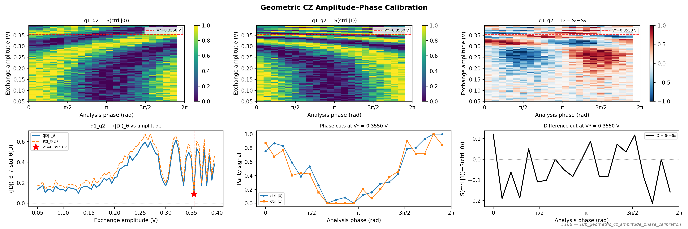

# 18b_geometric_cz_amplitude_phase_calibration

## Description

        GEOMETRIC CZ AMPLITUDE–PHASE CALIBRATION
This node calibrates the CZ exchange-pulse amplitude using a 2-D sweep:
  axis 1 (amplitude): exchange-pulse barrier-gate voltage, as in node 16b.
  axis 2 (phase):     phase θ of the second (closing) π/2 pulse on the target qubit,
                      swept uniformly over [0, 2π).

The experiment runs a cphase Ramsey sequence for both control-qubit states (|0⟩ and |1⟩):
  1. X90 on target  (+ X180 on control for the ctrl=|1⟩ branch)
  2. Exchange pulse at the swept amplitude
  3. Frame-rotation by θ followed by X90 on target (analysis phase sweep)
  4. Parity measurement

The parity difference D(V, θ) = S(ctrl=|1⟩, V, θ) − S(ctrl=|0⟩, V, θ) is computed
for every (amplitude, phase) point.  The mean absolute difference ⟨|D|⟩_θ is
minimised at the optimal CZ amplitude V*.

Two duration modes (controlled by ``use_t2pi_model``):
  - **Fixed** (default): uses the single ``wait_duration`` from the CZ macro.
  - **Model-based**: evaluates the T_2π(V) polynomial from ``exchange_decay_model``
    (fitted in 18a_swap_oscillations) to set a per-amplitude CZ duration
    (T_2π / 2, rounded to the nearest 4 ns).

Prerequisites:
    - Calibrated single-qubit gates (X90, X180) for both qubits.
    - Calibrated parity readout for the qubit pair.
    - Fixed mode: a known CZ exchange duration (e.g. from node 16 or 18a).
    - Model mode: ``exchange_decay_model`` on the CZ macro (from 18a).

State update:
    - CZ voltage point (barrier gate) for the optimal amplitude.
    - CZ macro ``wait_duration`` = exchange duration at V*.

## Parameters

| Parameter | Value | Description |
|-----------|-------|-------------|
| `analysis_signal` | `E_p2_given_p1_0` | Which conditional expectation to use for fitting.
E_p2_given_p1_0: P(second=1 | first=0) — post-select on empty dot.
E_p2_given_p1_1: P(second=1 | first=1) — post-select on loaded dot. |
| `parity_pre_measurement` | `False` | Whether to use parity pre measurement. Default is False. |
| `multiplexed` | `False` | Whether to play control pulses, readout pulses and active/thermal reset at the same time for all qubits (True)
or to play the experiment sequentially for each qubit (False). Default is False. |
| `use_state_discrimination` | `False` | Whether to use on-the-fly state discrimination and return the qubit 'state', or simply return the demodulated
quadratures 'I' and 'Q'. Default is False. |
| `reset_wait_time` | `5000` | The wait time for qubit reset. |
| `qubit_pairs` | `['q1_q2']` | A list of qubit pair names which should participate in the execution of the node. Default is None. |
| `target_state` | `None` | The state you want to initialize into for heralded initialization. |
| `max_loops` | `100` | Maximum number of initialization loops for heralded initialization. |
| `return_n_loops` | `False` | Whether to return the number of times it has looped over the initialise sequence to achieve the desired result. |
| `num_shots` | `4` | Number of averages per point. Default is 100. |
| `min_exchange_amplitude` | `0.05` | Minimum exchange pulse amplitude (virtual barrier gate voltage, V). |
| `max_exchange_amplitude` | `0.4` | Maximum exchange pulse amplitude (virtual barrier gate voltage, V). |
| `amplitude_step` | `0.005` | Step size for the exchange amplitude sweep (V). |
| `num_phases` | `21` | Number of analysis phase points uniformly distributed over [0, 2π). |
| `use_t2pi_model` | `False` | When True, use the T_2π(V) polynomial model from 18a_swap_oscillations
to set a per-amplitude exchange duration (T_2π/2, rounded to 4 ns).
Requires ``exchange_decay_model`` on the CZ macro.
When False (default), use the single fixed ``wait_duration`` from the macro. |
| `simulate` | `False` | Simulate the waveforms on the OPX instead of executing the program. Default is False. |
| `simulation_duration_ns` | `50000` | Duration over which the simulation will collect samples (in nanoseconds). Default is 50_000 ns. |
| `use_waveform_report` | `True` | Whether to use the interactive waveform report in simulation. Default is True. |
| `timeout` | `120` | Waiting time for the OPX resources to become available before giving up (in seconds). Default is 120 s. |
| `load_data_id` | `None` | Optional QUAlibrate node run index for loading historical data. Default is None. |

## Fit Results

| Qubit | f_res (GHz) | t_pi (ns) | Omega_R (rad/ns) | gamma (1/ns) | T2* (ns) | success |
|-------|-------------|----------|--------------|----------|----------|--------|
| q1_q2 | 0.0000 | 50.0 | nan | nan | inf | True |

## Updated State

| Qubit | intermediate_frequency (Hz) | xy.operations.x180.length (ns) |
|-------|-----------------------------|-----------------------------------------|
| q1_q2 | 0 | 50.0 |

## Analysis Output

---
*Generated by analysis test infrastructure (virtual_qpu)*
