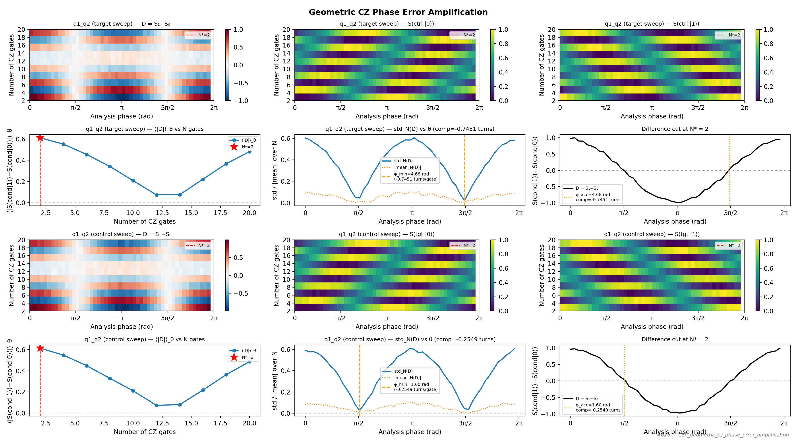

# 18c_geometric_cz_phase_error_amplification

## Description

        GEOMETRIC CZ PHASE ERROR AMPLIFICATION
This node diagnoses and corrects single-qubit phase errors accumulated
during the CZ exchange pulse.

Two independent Ramsey error-amplification sweeps are run at the saved
CZ amplitude:

  Sweep A — target qubit phase sweep
    axis 1: number of repeated CZ pulses (multiples of 2, up to max_num_cphase_gates)
    axis 2: analysis phase θ on the TARGET qubit's closing π/2 pulse
    conditional: control qubit prepared in |0⟩ or |1⟩

  Sweep B — control qubit phase sweep
    axis 1: same gate-count axis
    axis 2: analysis phase θ on the CONTROL qubit's closing π/2 pulse
    conditional: target qubit prepared in |0⟩ or |1⟩

Both differences D(N,θ) = S(cond=|1⟩) − S(cond=|0⟩) are fitted to
extract the per-gate phase offset φ accumulated by each qubit.

At the correct CZ operating point each even-N repetition produces the same
⟨|D(N,θ)|⟩_θ (flat curve). The phase of the sinusoidal cut at peak N gives
the single-axis phase error:

    phase_compensation = −φ_acc / (N* · 2π)   [turns, for frame_rotation_2pi]

State update:
    - Writes phase_shift_target  to qubit_pair.macros["cz"]
    - Writes phase_shift_control to qubit_pair.macros["cz"]

## Parameters

| Parameter | Value | Description |
|-----------|-------|-------------|
| `analysis_signal` | `E_p2_given_p1_0` | Which conditional expectation to use for fitting.
E_p2_given_p1_0: P(second=1 | first=0) — post-select on empty dot.
E_p2_given_p1_1: P(second=1 | first=1) — post-select on loaded dot. |
| `parity_pre_measurement` | `False` | Whether to use parity pre measurement. Default is False. |
| `multiplexed` | `False` | Whether to play control pulses, readout pulses and active/thermal reset at the same time for all qubits (True)
or to play the experiment sequentially for each qubit (False). Default is False. |
| `use_state_discrimination` | `False` | Whether to use on-the-fly state discrimination and return the qubit 'state', or simply return the demodulated
quadratures 'I' and 'Q'. Default is False. |
| `reset_wait_time` | `5000` | The wait time for qubit reset. |
| `qubit_pairs` | `['q1_q2']` | A list of qubit pair names which should participate in the execution of the node. Default is None. |
| `num_shots` | `4` | Number of averages per point. Default is 100. |
| `exchange_amplitude_center` | `0.3351654877654742` | Fixed CZ exchange amplitude (barrier gate voltage, V).
If None, the saved CZ voltage point for the first qubit pair is used. |
| `max_num_cphase_gates` | `20` | Maximum CPhase repetition count (positive even integer).
The sweep runs 2, 4, 6, …, max_num_cphase_gates. |
| `num_phases` | `51` | Number of analysis phase points uniformly distributed over [0, 2π). |
| `simulate` | `False` | Simulate the waveforms on the OPX instead of executing the program. Default is False. |
| `simulation_duration_ns` | `50000` | Duration over which the simulation will collect samples (in nanoseconds). Default is 50_000 ns. |
| `use_waveform_report` | `True` | Whether to use the interactive waveform report in simulation. Default is True. |
| `timeout` | `120` | Waiting time for the OPX resources to become available before giving up (in seconds). Default is 120 s. |
| `load_data_id` | `None` | Optional QUAlibrate node run index for loading historical data. Default is None. |

## Fit Results

| Qubit | f_res (GHz) | t_pi (ns) | Omega_R (rad/ns) | gamma (1/ns) | T2* (ns) | success |
|-------|-------------|----------|--------------|----------|----------|--------|
| q1_q2 | 0.0000 | nan | nan | nan | inf | True |

## Updated State

| Qubit | intermediate_frequency (Hz) | xy.operations.x180.length (ns) |
|-------|-----------------------------|-----------------------------------------|
| q1_q2 | 0 | nan |

## Analysis Output

---
*Generated by analysis test infrastructure (virtual_qpu)*
