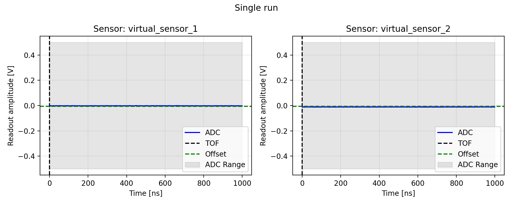
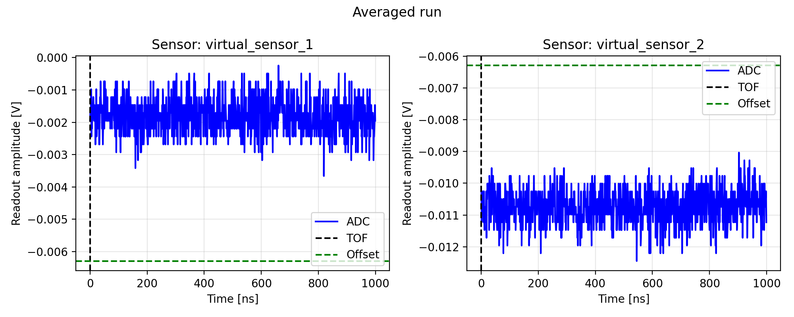

# 01a_time_of_flight

## Description

        TIME OF FLIGHT - OPX+ & LF-FEM
This sequence involves sending a readout pulse and capturing the raw ADC traces.
The data undergoes post-processing to calibrate three distinct parameters:
    - Time of Flight: This represents the internal processing time and the propagation
      delay of the readout pulse. This value is utilized to offset the acquisition window relative
      to when the readout pulse is dispatched.

    - Analog Inputs Offset: Due to minor impedance mismatches, the signals captured by
      the OPX might exhibit slight DC offsets.

    - Analog Inputs Gain: If a signal is constrained by digitization or if it saturates
      the ADC, the variable gain of the OPX analog input, ranging from -12 dB to 20 dB,
      can be modified to fit the signal within the ADC range of +/-0.5V.

Prerequisites:
    - Having initialized the Quam (quam_config/populate_quam_state_*.py).

State update:
    - The time of flight: sensor.readout_resonator.time_of_flight.
    - The analog input offsets: sensor.readout_resonator.opx_input.offset.

## Parameters

| Parameter | Value | Description |
|-----------|-------|-------------|
| `multiplexed` | `False` | Whether to play control pulses, readout pulses and active/thermal reset at the same time for all qubits (True)
or to play the experiment sequentially for each qubit (False). Default is False. |
| `use_state_discrimination` | `False` | Whether to use on-the-fly state discrimination and return the qubit 'state', or simply return the demodulated
quadratures 'I' and 'Q'. Default is False. |
| `reset_wait_time` | `5000` | The wait time for qubit reset. |
| `num_shots` | `10` | Number of averages to perform. Default is 100. |
| `time_of_flight_in_ns` | `28` | Time of flight in nanoseconds. Default is 28 ns. |
| `readout_amplitude_in_v` | `0.1` | Readout amplitude in volts. Default is 0.1 V. |
| `readout_length_in_ns` | `1000` | Readout length in nanoseconds. Default is 1µs. |
| `sensor_names` | `None` | List of sensor names. Default is None. |
| `use_simulated_data` | `False` | Whether to generate simulated data instead of measuring via the OPX. Default False. |
| `simulate` | `False` | Simulate the waveforms on the OPX instead of executing the program. Default is False. |
| `simulation_duration_ns` | `40000` | Duration over which the simulation will collect samples (in nanoseconds). Default is 50_000 ns. |
| `use_waveform_report` | `True` | Whether to use the interactive waveform report in simulation. Default is True. |
| `timeout` | `120` | Waiting time for the OPX resources to become available before giving up (in seconds). Default is 120 s. |
| `load_data_id` | `None` | Optional QUAlibrate node run index for loading historical data. Default is None. |

## Execution Output

## Fit Results

### virtual_sensor_1
| Parameter | Value |
|-----------|-------|
| `tof_to_add` | `0` |
| `offset_to_add` | `-0.00629168701171875` |
| `success` | `True` |

### virtual_sensor_2
| Parameter | Value |
|-----------|-------|
| `tof_to_add` | `0` |
| `offset_to_add` | `-0.00629168701171875` |
| `success` | `True` |

## State Updates

| Parameter | Before | After |
|-----------|--------|-------|
| `physical_channels.sensor_1.readout.time_of_flight` | `None` | `28` |
| `physical_channels.sensor_2.readout.time_of_flight` | `None` | `28` |
| `ports.analog_inputs.con1.6.1.offset` | `None` | `-0.00629168701171875` |

## Metadata

| Key | Value |
|-----|-------|
| Timestamp | 2026-04-29T00:43:16 UTC |
| Node | 01a_time_of_flight |
| Duration | 5.9s |
| Status | completed |

---
*Generated by execute test infrastructure*
