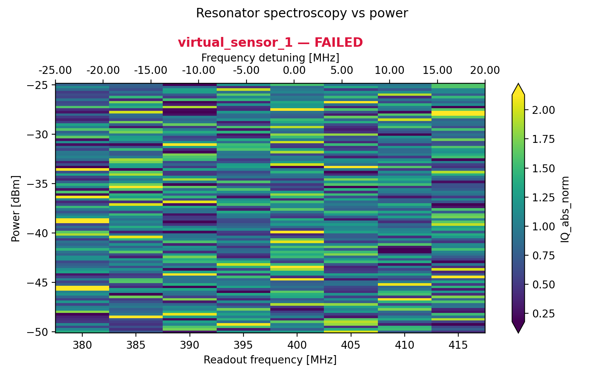

# 02b_resonator_spectroscopy_vs_power

## Description

        RESONATOR SPECTROSCOPY VERSUS READOUT POWER
This sequence involves measuring the resonator by sending a readout pulse and
demodulating the signals to extract the 'I' and 'Q' quadratures for all resonators
simultaneously. This is done across various readout frequencies and amplitudes.
Based on the results, one can then adjust the readout amplitude, choosing a
readout amplitude value just before the observed frequency splitting.

Prerequisites:
    - Having calibrated the resonator frequency (node 02a_resonator_spectroscopy.py).
    - Having instantiated a starting readout amplitude.

Datasets:
    - ``ds_raw``: untouched I/Q fetched from the OPX (never modified after acquisition).
    - ``ds_fit``: processed sweeps plus analysis outputs (derived fields and per-sensor summary
      coordinates). Used by ``plot_data``.
    - ``fit_results``: compact per-sensor calibration dict (``FitParameters`` serialized with
      ``asdict``). Used by logging, ``node.outcomes``, and ``update_state``.

Results (``node.results["fit_results"][<sensor>]``):
    - ``success``: whether the fit passed sanity checks and the state update is applied.
    - ``resonator_frequency`` [Hz]: absolute readout frequency at ``optimal_power``.
    - ``frequency_shift`` [Hz]: fitted readout frequency offset at ``optimal_power``.
    - ``optimal_power`` [dBm]: readout power just below the onset of frequency splitting.

Figures (``node.results["figures"]``):
    - ``"amplitude"``: normalized |I + iQ| heatmap vs readout frequency and power, with fit markers.

State update:
    - The readout power: sensor.readout_resonator.set_output_power()
    - The readout frequency for the optimal readout power.

## Parameters

| Parameter | Value | Description |
|-----------|-------|-------------|
| `multiplexed` | `False` | Whether to play control pulses, readout pulses and active/thermal reset at the same time for all qubits (True)
or to play the experiment sequentially for each qubit (False). Default is False. |
| `use_state_discrimination` | `False` | Whether to use on-the-fly state discrimination and return the qubit 'state', or simply return the demodulated
quadratures 'I' and 'Q'. Default is False. |
| `reset_type` | `thermal` | The qubit reset method to use. Must be implemented as a method of Quam.qubit. Can be "thermal", "active", or
"active_gef". Default is "thermal". |
| `sensor_names` | `None` | The list of sensor dot names to be included in the measurement. |
| `num_shots` | `1` | Number of averages to perform. Default is 100. |
| `frequency_span_in_mhz` | `40.0` | Span of frequencies to sweep in MHz. Default is 15 MHz. |
| `frequency_step_in_mhz` | `5.0` | Step size for frequency sweep in MHz. Default is 0.1 MHz. |
| `min_power_dbm` | `-50` | Minimum power level in dBm. Default is -50 dBm. |
| `max_power_dbm` | `-25` | Maximum power level in dBm. Default is -25 dBm. |
| `num_power_points` | `100` | Number of points of the readout power axis. Default is 100. |
| `max_amp` | `0.1` | Maximum readout amplitude for the experiment in V. Default is 0.1 V. |
| `derivative_crossing_threshold_in_hz_per_dbm` | `-50000` | Threshold for derivative crossing in Hz/dBm. Default is -50 000 Hz/dBm. |
| `derivative_smoothing_window_num_points` | `10` | Size of the window in number of points corresponding to the rolling average (number of points). Default is 10. |
| `moving_average_filter_window_num_points` | `10` | Size of the moving average filter window (number of points). Default is 10. |
| `buffer_from_crossing_threshold_in_dbm` | `1` | Buffer from the crossing threshold in dBm - the optimal readout power will be set to be this number in Db below
the threshold. Default is 1 dBm. |
| `use_simulated_data` | `False` | Whether to generate simulated data instead of measuring via the OPX. Default False. |
| `simulate` | `False` | Simulate the waveforms on the OPX instead of executing the program. Default is False. |
| `simulation_duration_ns` | `40000` | Duration over which the simulation will collect samples (in nanoseconds). Default is 50_000 ns. |
| `use_waveform_report` | `True` | Whether to use the interactive waveform report in simulation. Default is True. |
| `timeout` | `500` | Waiting time for the OPX resources to become available before giving up (in seconds). Default is 120 s. |
| `load_data_id` | `None` | Optional QUAlibrate node run index for loading historical data. Default is None. |

## Execution Output

## Fit Results

### virtual_sensor_1
| Parameter | Value |
|-----------|-------|
| `success` | `False` |
| `resonator_frequency` | `nan` |
| `frequency_shift` | `nan` |
| `optimal_power` | `nan` |
| `failure_reason` | `no resonator dip track vs power after smoothing (noise-only data?)` |

## Metadata

| Key | Value |
|-----|-------|
| Timestamp | 2026-07-31T16:32:41 UTC |
| Node | 02b_resonator_spectroscopy_vs_power |
| Duration | 6.2s |
| Status | completed |

---
*Generated by execute test infrastructure*
