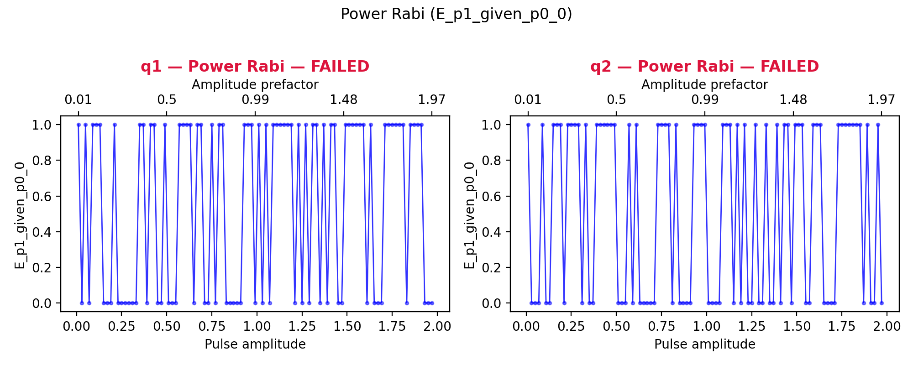
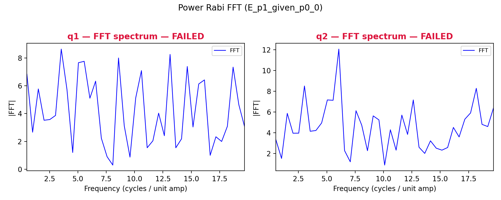

# 09a_power_rabi

## Description

        POWER RABI
This sequence parks the qubit at the manipulation bias point, plays the selected qubit operation (e.g. x180) at
different amplitude prefactors, and measures the spin state. Joint-outcome streams are averaged and reduced to
conditional expectations for analysis. Rabi oscillations in the analysis signal versus amplitude prefactor are
fitted to extract the π-pulse amplitude prefactor.

Prerequisites:
    - Having calibrated the relevant voltage points.
    - Having calibrated the qubit frequency.
    - Having set the qubit gate duration.

Datasets:
    - ``ds_raw``: untouched joint-outcome streams fetched from the OPX (never modified after acquisition).
    - ``ds_fit``: processed sweeps plus analysis outputs (conditional expectations and fitted traces). Used by
      ``plot_data``.
    - ``fit_results``: compact per-qubit calibration dict (``FitParameters`` serialized with ``asdict``). Used by
      logging, ``node.outcomes``, and ``update_state``.

Results (``node.results["fit_results"][qubit]``):
    - ``success``: whether the fit passed sanity checks and the state update is applied.
    - ``opt_amp``: amplitude prefactor for a π rotation at the selected gate duration.
    - ``rabi_frequency`` [rad / unit amplitude]: fitted Rabi frequency in the amplitude domain.
    - ``decay_rate`` [1 / unit amplitude]: fitted decay envelope versus amplitude prefactor.

Figures (``node.results["figures"]``):
    - ``"rabi"``: conditional expectation vs pulse amplitude with damped-sinusoid fit overlay.
    - ``"fft"``: FFT magnitude spectrum with peak fit per qubit.

State update:
    - The amplitude prefactor of the selected operation (``node.parameters.operation``).
    - When calibrating x180, x90 is also updated to half the x180 prefactor.

## Parameters

| Parameter | Value | Description |
|-----------|-------|-------------|
| `analysis_signal` | `E_p1_given_p0_0` | Which conditional expectation to use for fitting.
E_p1_given_p0_0: P(second=1 | first=0) — post-select on empty dot.
E_p1_given_p0_1: P(second=1 | first=1) — post-select on loaded dot. |
| `parity_measurement` | `False` | Whether or not to perform parity measurement. |
| `multiplexed` | `False` | Whether to play control pulses, readout pulses and active/thermal reset at the same time for all qubits (True)
or to play the experiment sequentially for each qubit (False). Default is False. |
| `use_state_discrimination` | `False` | Whether to use on-the-fly state discrimination and return the qubit 'state', or simply return the demodulated
quadratures 'I' and 'Q'. Default is False. |
| `reset_type` | `thermal` | The qubit reset method to use. Must be implemented as a method of Quam.qubit. Can be "thermal", "active", or
"active_gef". Default is "thermal". |
| `qubits` | `['q1', 'q2']` | A list of qubit names which should participate in the execution of the node. Default is None. |
| `target_state` | `None` | The state you want to initialize into for heralded initialization. |
| `max_loops` | `100` | Maximum number of initialization loops for heralded initialization. |
| `return_n_loops` | `False` | Whether to return the number of times it has looped over the initialise sequence to achieve the desired result. |
| `num_shots` | `1` | Number of averages to perform. Default is 100. |
| `min_amp_factor` | `0.01` | Minimum amplitude factor for the operation. Default is 0.001. |
| `max_amp_factor` | `1.99` | Maximum amplitude factor for the operation. Default is 1.99. |
| `amp_factor_step` | `0.02` | Step size for the amplitude factor. Default is 0.01. |
| `operation` | `x180` | The operation to perform to drive the qubit. |
| `use_simulated_data` | `False` | Whether to generate simulated data instead of measuring via the OPX. Default False. |
| `simulate` | `False` | Simulate the waveforms on the OPX instead of executing the program. Default is False. |
| `simulation_duration_ns` | `40000` | Duration over which the simulation will collect samples (in nanoseconds). Default is 50_000 ns. |
| `use_waveform_report` | `True` | Whether to use the interactive waveform report in simulation. Default is True. |
| `timeout` | `500` | Waiting time for the OPX resources to become available before giving up (in seconds). Default is 120 s. |
| `load_data_id` | `None` | Optional QUAlibrate node run index for loading historical data. Default is None. |
| `amp_default` | `1.0` |  |

## Execution Output

## Fit Results

### q1
| Parameter | Value |
|-----------|-------|
| `opt_amp` | `nan` |
| `rabi_frequency` | `nan` |
| `decay_rate` | `nan` |
| `success` | `False` |

### q2
| Parameter | Value |
|-----------|-------|
| `opt_amp` | `nan` |
| `rabi_frequency` | `nan` |
| `decay_rate` | `nan` |
| `success` | `False` |

## Metadata

| Key | Value |
|-----|-------|
| Timestamp | 2026-08-03T11:28:16 UTC |
| Node | 09a_power_rabi |
| Duration | 7.1s |
| Status | completed |

---
*Generated by execute test infrastructure*
