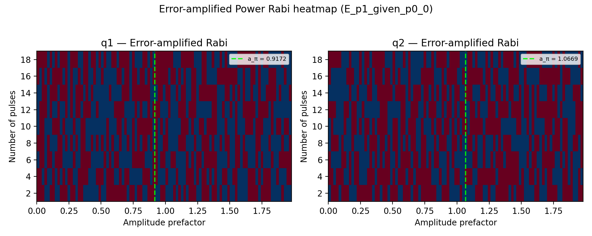
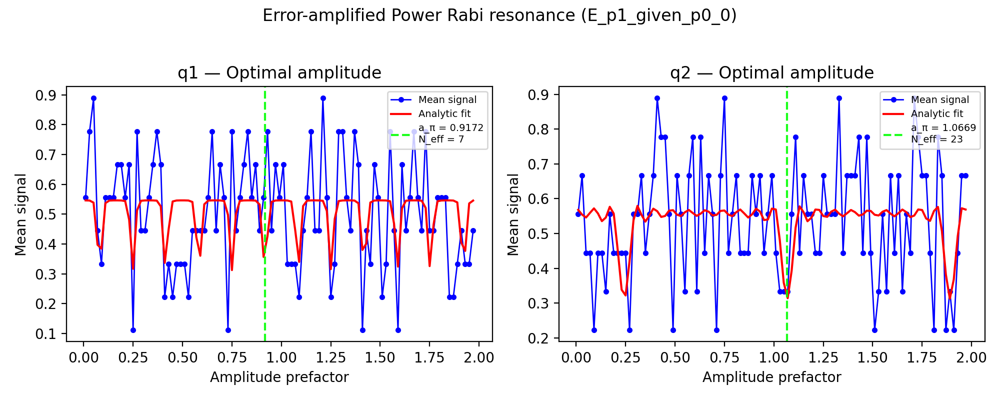

# 09b_power_rabi_error_amplification

## Description

        POWER RABI WITH ERROR AMPLIFICATION
This sequence performs a 2D power-Rabi measurement with error amplification: for each amplitude prefactor, an even
number of π pulses is played and the spin state is measured. Joint-outcome streams are averaged and reduced to
conditional expectations. Small amplitude errors accumulate over many pulses, enabling a precise refinement of
the π-pulse amplitude prefactor in a narrow window around the value from node 09a.

Prerequisites:
    - Having calibrated the relevant voltage points.
    - Having calibrated the qubit frequency and gate duration.
    - Having run node 09a_power_rabi to obtain a coarse π-pulse amplitude prefactor.

Datasets:
    - ``ds_raw``: untouched joint-outcome streams fetched from the OPX (never modified after acquisition).
    - ``ds_fit``: processed 2D sweeps plus analysis outputs (conditional expectations and mean-signal diagnostics).
      Used by ``plot_data``.
    - ``fit_results``: compact per-qubit calibration dict (``FitParameters`` serialized with ``asdict``). Used by
      logging, ``node.outcomes``, and ``update_state``.

Results (``node.results["fit_results"][qubit]``):
    - ``success``: whether the fit passed sanity checks and the state update is applied.
    - ``opt_amp``: refined amplitude prefactor for a π rotation.
    - ``rabi_frequency`` [rad / (unit amplitude · pulse)]: fitted Rabi frequency from the mean-signal model.
    - ``decay_rate`` [1 / pulse]: exponential decay rate per pulse in the error-amplification sequence.
    - ``gauss_decay_rate`` [1 / pulse]: Gaussian decay contribution per pulse.
    - ``n_eff``: effective number of pulses before the contrast envelope decays to 1/e.

Figures (``node.results["figures"]``):
    - ``"heatmap"``: 2D map of the analysis signal vs amplitude prefactor and number of pulses.
    - ``"resonance"``: n_pulses-averaged signal vs amplitude with analytic fit overlay.

State update:
    - The amplitude prefactor of the selected operation (``node.parameters.operation``).
    - When calibrating x180, x90 is also updated to half the x180 prefactor.

## Parameters

| Parameter | Value | Description |
|-----------|-------|-------------|
| `analysis_signal` | `E_p1_given_p0_0` | Which conditional expectation to use for fitting.
E_p1_given_p0_0: P(second=1 | first=0) — post-select on empty dot.
E_p1_given_p0_1: P(second=1 | first=1) — post-select on loaded dot. |
| `parity_measurement` | `False` | Whether or not to perform parity measurement. |
| `target_state` | `None` | The state you want to initialize into for heralded initialization. |
| `max_loops` | `100` | Maximum number of initialization loops for heralded initialization. |
| `return_n_loops` | `False` | Whether to return the number of times it has looped over the initialise sequence to achieve the desired result. |
| `multiplexed` | `False` | Whether to play control pulses, readout pulses and active/thermal reset at the same time for all qubits (True)
or to play the experiment sequentially for each qubit (False). Default is False. |
| `use_state_discrimination` | `False` | Whether to use on-the-fly state discrimination and return the qubit 'state', or simply return the demodulated
quadratures 'I' and 'Q'. Default is False. |
| `reset_type` | `thermal` | The qubit reset method to use. Must be implemented as a method of Quam.qubit. Can be "thermal", "active", or
"active_gef". Default is "thermal". |
| `qubits` | `['q1', 'q2']` | A list of qubit names which should participate in the execution of the node. Default is None. |
| `num_shots` | `1` | Number of averages to perform. Default is 100. |
| `min_amp_factor` | `0.01` | Minimum amplitude prefactor. Narrow window around expected a_π after node 09a. |
| `max_amp_factor` | `1.99` | Maximum amplitude prefactor. Narrow window around expected a_π after node 09a. |
| `amp_factor_step` | `0.02` | Step size for the amplitude prefactor sweep. Default is 0.001. |
| `max_n_pulses` | `20` | Number of pulses in the error-amplified power Rabi pulse sequence. |
| `operation` | `x180` | The operation to perform to drive the qubit. |
| `use_simulated_data` | `False` | Whether to generate simulated data instead of measuring via the OPX. Default False. |
| `simulate` | `False` | Simulate the waveforms on the OPX instead of executing the program. Default is False. |
| `simulation_duration_ns` | `40000` | Duration over which the simulation will collect samples (in nanoseconds). Default is 50_000 ns. |
| `use_waveform_report` | `True` | Whether to use the interactive waveform report in simulation. Default is True. |
| `timeout` | `500` | Waiting time for the OPX resources to become available before giving up (in seconds). Default is 120 s. |
| `load_data_id` | `None` | Optional QUAlibrate node run index for loading historical data. Default is None. |

## Execution Output

## Fit Results

### q1
| Parameter | Value |
|-----------|-------|
| `opt_amp` | `0.9171554126537537` |
| `rabi_frequency` | `18.774918132245073` |
| `decay_rate` | `0.02258582781337878` |
| `gauss_decay_rate` | `0.1400788196979392` |
| `n_eff` | `6.586478311820505` |
| `success` | `True` |

### q2
| Parameter | Value |
|-----------|-------|
| `opt_amp` | `1.0669094681708735` |
| `rabi_frequency` | `3.81081499142091` |
| `decay_rate` | `0.04400830803697274` |
| `gauss_decay_rate` | `2.7139842401886742e-06` |
| `n_eff` | `22.722981894220634` |
| `success` | `True` |

## State Updates

| Parameter | Before | After |
|-----------|--------|-------|
| `qubits.q1.xy.operations.gaussian_x180.amplitude` | `0.25` | `0.10514675637000964` |
| `qubits.q1.xy.operations.gaussian_x90.amplitude` | `0.125` | `0.05257337818500482` |
| `qubits.q2.xy.operations.gaussian_x180.amplitude` | `0.25` | `0.14228697665908202` |
| `qubits.q2.xy.operations.gaussian_x90.amplitude` | `0.125` | `0.07114348832954101` |

## Metadata

| Key | Value |
|-----|-------|
| Timestamp | 2026-08-03T11:28:49 UTC |
| Node | 09b_power_rabi_error_amplification |
| Duration | 15.4s |
| Status | completed |

---
*Generated by execute test infrastructure*
