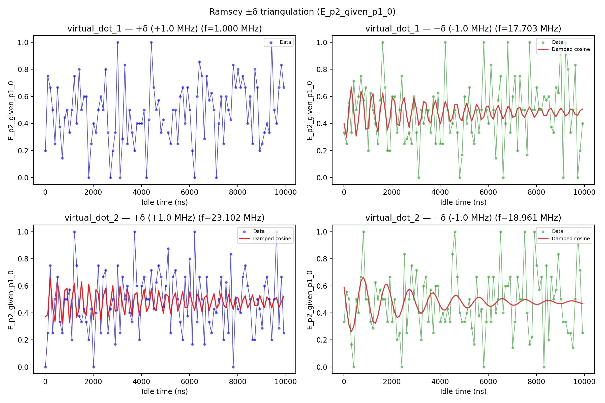

# 11a_ramsey

## Description

        RAMSEY PARITY DIFFERENCE (±δ triangulation)
This sequence performs a Ramsey measurement at two symmetric detunings ±δ from the qubit
intermediate frequency.  At each detuning the idle time between two π/2 pulses is swept,
producing a damped-cosine oscillation whose frequency equals the true detuning from resonance.

By fitting both traces independently, the analysis triangulates the residual frequency offset:
    Δ = (f₋ − f₊) / 2
This resolves the sign ambiguity inherent in a single-detuning measurement and provides a
robust correction for the qubit drive frequency.

The sequence uses voltage sequences to navigate through voltage space (empty - initialization -
measurement) using OPX channels on the fast lines of the bias-tees.  At each idle time the
parity is measured before (P1) and after (P2) the qubit pulse, and the parity difference
(P_diff) is calculated.

Prerequisites:
    - Having calibrated the resonators coupled to the SensorDot components.
    - Having calibrated the voltage points (empty - initialization - measurement).
    - Qubit pulse calibration (X90 pulse amplitude and frequency).

State update:
    - The qubit intermediate frequency (Larmor frequency correction).

## Parameters

| Parameter | Value | Description |
|-----------|-------|-------------|
| `analysis_signal` | `E_p2_given_p1_0` | Which conditional expectation to use for fitting.
E_p2_given_p1_0: P(second=1 | first=0) — post-select on empty dot.
E_p2_given_p1_1: P(second=1 | first=1) — post-select on loaded dot. |
| `multiplexed` | `False` | Whether to play control pulses, readout pulses and active/thermal reset at the same time for all qubits (True)
or to play the experiment sequentially for each qubit (False). Default is False. |
| `use_state_discrimination` | `False` | Whether to use on-the-fly state discrimination and return the qubit 'state', or simply return the demodulated
quadratures 'I' and 'Q'. Default is False. |
| `reset_type` | `thermal` | The qubit reset method to use. Must be implemented as a method of Quam.qubit. Can be "thermal", "active", or
"active_gef". Default is "thermal". |
| `qubits` | `['q1', 'q2']` | A list of qubit names which should participate in the execution of the node. Default is None. |
| `num_shots` | `10` | Number of averages to perform. Default is 100. |
| `min_wait_time_in_ns` | `16` | Minimum wait time in nanoseconds. Default is 16. |
| `max_wait_time_in_ns` | `9916` | Maximum wait time in nanoseconds. Default is 30000. |
| `wait_time_num_points` | `100` | Number of points for the wait time scan. Default is 500. |
| `log_or_linear_sweep` | `linear` | Type of sweep, either "log" (logarithmic) or "linear". Default is "log". |
| `simulate` | `False` | Simulate the waveforms on the OPX instead of executing the program. Default is False. |
| `simulation_duration_ns` | `40000` | Duration over which the simulation will collect samples (in nanoseconds). Default is 50_000 ns. |
| `use_waveform_report` | `True` | Whether to use the interactive waveform report in simulation. Default is True. |
| `timeout` | `120` | Waiting time for the OPX resources to become available before giving up (in seconds). Default is 120 s. |
| `load_data_id` | `None` | Optional QUAlibrate node run index for loading historical data. Default is None. |
| `frequency_detuning_in_mhz` | `1.0` | Frequency detuning in MHz. Default is 1.0 MHz. |

## Execution Output

## Fit Results

### virtual_dot_1
| Parameter | Value |
|-----------|-------|
| `freq_offset` | `8351651.264718212` |
| `t2_star` | `4764.38279625764` |
| `decay_rate` | `0.00020989077552405886` |
| `freq_plus` | `1000000.0` |
| `freq_minus` | `17703302.529436424` |
| `success` | `False` |
| `_diag` | `{'detuning_hz': array([ 1000000., -1000000.]), 'fit_plus': {'ramsey_freq': 1000000.0, 'decay_rate': nan, 't2_star': nan, 'success': False, 'fitted_curve': None, 'tau_shifted': array([   0.,  100.,  200.,  300.,  400.,  500.,  600.,  700.,  800.,
        900., 1000., 1100., 1200., 1300., 1400., 1500., 1600., 1700.,
       1800., 1900., 2000., 2100., 2200., 2300., 2400., 2500., 2600.,
       2700., 2800., 2900., 3000., 3100., 3200., 3300., 3400., 3500.,
       3600., 3700., 3800., 3900., 4000., 4100., 4200., 4300., 4400.,
       4500., 4600., 4700., 4800., 4900., 5000., 5100., 5200., 5300.,
       5400., 5500., 5600., 5700., 5800., 5900., 6000., 6100., 6200.,
       6300., 6400., 6500., 6600., 6700., 6800., 6900., 7000., 7100.,
       7200., 7300., 7400., 7500., 7600., 7700., 7800., 7900., 8000.,
       8100., 8200., 8300., 8400., 8500., 8600., 8700., 8800., 8900.,
       9000., 9100., 9200., 9300., 9400., 9500., 9600., 9700., 9800.,
       9900.]), 'signal': array([0.2       , 0.75      , 0.66666667, 0.5       , 0.25      ,
       0.66666667, 0.375     , 0.14285714, 0.44444444, 0.5       ,
       0.33333333, 0.5       , 0.75      , 0.4       , 0.8       ,
       0.5       , 0.6       , 0.6       , 0.        , 0.25      ,
       0.4       , 0.33333333, 0.5       , 0.6       , 0.5       ,
       0.8       , 0.33333333, 0.        , 0.2       , 0.33333333,
       1.        , 0.        , 0.28571429, 0.83333333, 0.25      ,
       0.5       , 0.33333333, 0.2       , 0.4       , 0.4       ,
       0.4       , 0.5       , 0.        , 0.42857143, 1.        ,
       0.66666667, 0.5       , 0.57142857, 0.33333333, 0.42857143,
              nan, 0.33333333, 0.25      , 0.5       , 0.5       ,
       0.25      , 0.6       , 0.66666667, 0.4       , 0.66666667,
       0.5       , 0.2       , 0.        , 0.6       , 0.85714286,
       0.75      , 0.28571429, 0.75      , 0.57142857, 0.625     ,
       0.5       , 0.        , 0.4       , 0.6       , 0.25      ,
       0.6       , 0.5       , 0.42857143, 0.83333333, 0.66666667,
       0.8       , 0.66666667, 0.75      , 0.66666667, 0.4       ,
       0.6       , 0.25      , 0.8       , 0.66666667, 0.2       ,
       0.25      , 0.33333333, 0.4       , 0.33333333, 1.        ,
       0.5       , 0.4       , 0.66666667, 0.83333333, 0.66666667])}, 'fit_minus': {'ramsey_freq': 17703302.529436424, 'decay_rate': 0.00020989077552405886, 't2_star': 4764.38279625764, 'success': True, 'fitted_curve': array([0.39768862, 0.2973286 , 0.51814356, 0.66946926, 0.49548631,
       0.30697425, 0.42677276, 0.63742392, 0.57510588, 0.35756662,
       0.36304866, 0.57301275, 0.6201403 , 0.4305656 , 0.33807817,
       0.49678479, 0.62506605, 0.50488881, 0.35189792, 0.42896486,
       0.59489394, 0.56239304, 0.39517649, 0.38462222, 0.54233142,
       0.59179889, 0.4529147 , 0.3708304 , 0.48352584, 0.59035225,
       0.50894191, 0.38619588, 0.43363543, 0.56317121, 0.54999993,
       0.42250314, 0.40332362, 0.52079398, 0.56849289, 0.46775211,
       0.39688012, 0.47579757, 0.56344528, 0.50963942, 0.41217074,
       0.43944709, 0.53971412, 0.53857483, 0.44214547, 0.41917963,
       0.50591507, 0.54957655, 0.47729989, 0.41740091, 0.47176205,
       0.54276126, 0.50834856, 0.4316824 , 0.44555288, 0.52252791,
       0.52843224, 0.45609468, 0.43238547, 0.49583405, 0.53439846,
       0.48317969, 0.433422  , 0.47012109, 0.52698938, 0.50598711,
       0.44621675, 0.45144344, 0.5100607 , 0.51967337, 0.46586411,
       0.44322165, 0.48916977, 0.52234506, 0.48656279, 0.44582394,
       0.46997124, 0.51505989, 0.50315449, 0.45694912, 0.45683725,
       0.50111524, 0.51226949, 0.47259462, 0.45200038, 0.48490616,
       0.51286349, 0.48828556, 0.45534555, 0.47069485, 0.50611024,
       0.50022777, 0.46480065, 0.46160254, 0.49477538, 0.50611835]), 'tau_shifted': array([   0.,  100.,  200.,  300.,  400.,  500.,  600.,  700.,  800.,
        900., 1000., 1100., 1200., 1300., 1400., 1500., 1600., 1700.,
       1800., 1900., 2000., 2100., 2200., 2300., 2400., 2500., 2600.,
       2700., 2800., 2900., 3000., 3100., 3200., 3300., 3400., 3500.,
       3600., 3700., 3800., 3900., 4000., 4100., 4200., 4300., 4400.,
       4500., 4600., 4700., 4800., 4900., 5000., 5100., 5200., 5300.,
       5400., 5500., 5600., 5700., 5800., 5900., 6000., 6100., 6200.,
       6300., 6400., 6500., 6600., 6700., 6800., 6900., 7000., 7100.,
       7200., 7300., 7400., 7500., 7600., 7700., 7800., 7900., 8000.,
       8100., 8200., 8300., 8400., 8500., 8600., 8700., 8800., 8900.,
       9000., 9100., 9200., 9300., 9400., 9500., 9600., 9700., 9800.,
       9900.]), 'signal': array([0.33333333, 0.25      , 0.55555556, 0.33333333, 0.71428571,
       0.5       , 0.6       , 0.75      , 0.57142857, 0.66666667,
       0.2       , 0.625     , 0.5       , 0.4       , 0.25      ,
       0.57142857, 1.        , 0.66666667, 0.2       , 0.2       ,
       0.6       , 0.6       , 0.33333333, 0.5       , 0.75      ,
       0.25      , 0.28571429, 0.33333333, 0.25      , 0.6       ,
       0.33333333, 0.        , 0.5       , 0.4       , 0.5       ,
       0.5       , 0.33333333, 0.6       , 0.25      , 0.625     ,
       0.25      , 0.25      , 1.        , 0.5       , 0.33333333,
       0.4       , 0.5       , 0.33333333, 0.        , 0.16666667,
       0.6       , 0.4       , 0.66666667, 0.33333333, 0.25      ,
       0.5       , 0.33333333, 0.5       , 1.        , 0.5       ,
       0.4       , 0.83333333, 0.5       , 0.14285714, 0.57142857,
       0.75      , 0.        , 0.4       , 1.        , 0.33333333,
       0.6       , 0.75      , 0.2       , 0.75      , 0.5       ,
       0.5       , 0.16666667, 1.        , 0.5       , 0.5       ,
       0.66666667, 0.5       , 0.5       , 0.6       , 0.57142857,
       0.6       , 0.375     , 0.33333333, 0.66666667, 0.625     ,
       1.        , 0.        , 1.        , 0.8       , 0.33333333,
       0.5       , 0.83333333, 0.        , 0.2       , 0.4       ])}}` |

### virtual_dot_2
| Parameter | Value |
|-----------|-------|
| `freq_offset` | `-2070391.3428405076` |
| `t2_star` | `4884.1931929929215` |
| `decay_rate` | `0.0002408450247697645` |
| `freq_plus` | `23101890.51341362` |
| `freq_minus` | `18961107.827732604` |
| `success` | `True` |
| `_diag` | `{'detuning_hz': array([ 1000000., -1000000.]), 'fit_plus': {'ramsey_freq': 23101890.51341362, 'decay_rate': 0.0001475969235168679, 't2_star': 6775.208968943831, 'success': True, 'fitted_curve': array([0.37049044, 0.38693409, 0.65726198, 0.44459578, 0.3368752 ,
       0.62173697, 0.51904791, 0.31719265, 0.56377228, 0.58033525,
       0.32887627, 0.49576621, 0.61847529, 0.36715203, 0.43088468,
       0.62852316, 0.42283508, 0.38061198, 0.61104015, 0.48436676,
       0.35281365, 0.57152542, 0.54010891, 0.35061886, 0.51900171,
       0.58045811, 0.37225516, 0.4640828 , 0.59941226, 0.41178483,
       0.41691668, 0.59535229, 0.46053316, 0.38538741, 0.57096384,
       0.50889128, 0.37387925, 0.53238614, 0.5481353 , 0.38277936,
       0.48780759, 0.57193112, 0.40874646, 0.44580928, 0.57727892,
       0.44563187, 0.41377782, 0.56477375, 0.48583084, 0.39666894,
       0.53819315, 0.52178311, 0.39631611, 0.50354339, 0.54733816,
       0.41136316, 0.46778288, 0.55874951, 0.43778014, 0.43748146,
       0.55514941, 0.46981972, 0.41766362, 0.53846201, 0.50120349,
       0.4110296 , 0.5128183 , 0.52630388, 0.41766338, 0.48362103,
       0.5411081 , 0.43523924, 0.45645857, 0.54380793, 0.45964711,
       0.43607718, 0.53494032, 0.48588806, 0.42559294, 0.51709139,
       0.5090549 , 0.4260656 , 0.4942545 , 0.52521297, 0.43648098,
       0.47098781, 0.53203028, 0.45411036, 0.45154099, 0.52906395,
       0.47514993, 0.43911185, 0.5176803 , 0.49550071, 0.43535636,
       0.50065412, 0.51153585, 0.44021951, 0.48154679, 0.52071738]), 'tau_shifted': array([   0.,  100.,  200.,  300.,  400.,  500.,  600.,  700.,  800.,
        900., 1000., 1100., 1200., 1300., 1400., 1500., 1600., 1700.,
       1800., 1900., 2000., 2100., 2200., 2300., 2400., 2500., 2600.,
       2700., 2800., 2900., 3000., 3100., 3200., 3300., 3400., 3500.,
       3600., 3700., 3800., 3900., 4000., 4100., 4200., 4300., 4400.,
       4500., 4600., 4700., 4800., 4900., 5000., 5100., 5200., 5300.,
       5400., 5500., 5600., 5700., 5800., 5900., 6000., 6100., 6200.,
       6300., 6400., 6500., 6600., 6700., 6800., 6900., 7000., 7100.,
       7200., 7300., 7400., 7500., 7600., 7700., 7800., 7900., 8000.,
       8100., 8200., 8300., 8400., 8500., 8600., 8700., 8800., 8900.,
       9000., 9100., 9200., 9300., 9400., 9500., 9600., 9700., 9800.,
       9900.]), 'signal': array([0.        , 0.25      , 0.75      , 0.25      , 0.5       ,
       0.66666667, 0.33333333, 0.25      , 0.5       , 0.5       ,
       0.57142857, 0.2       , 1.        , 0.75      , 0.375     ,
       0.33333333, 0.42857143, 0.33333333, 0.2       , 0.42857143,
       0.        , 0.4       , 0.75      , 0.25      , 0.66666667,
       0.71428571, 0.25      , 0.42857143, 0.5       , 0.16666667,
       0.75      , 0.25      , 0.66666667, 0.5       , 0.6       ,
       0.4       , 0.33333333, 1.        , 0.6       , 0.2       ,
       0.6       , 0.66666667, 0.5       , 0.5       , 0.71428571,
       0.42857143, 0.625     , 0.75      , 0.66666667, 0.44444444,
       0.6       , 0.875     , 0.25      , 0.66666667, 0.71428571,
       0.5       , 0.33333333, 0.2       , 0.66666667, 0.375     ,
       0.8       , 0.16666667, 1.        , 0.33333333, 0.66666667,
       0.5       , 0.16666667, 0.66666667, 0.33333333, 0.25      ,
       0.42857143, 0.4       , 0.5       , 0.66666667, 0.2       ,
       0.625     , 0.25      , 0.83333333, 0.        , 0.5       ,
       0.42857143, 0.4       , 0.66666667, 0.75      , 0.6       ,
       0.5       , 0.2       , 0.2       , 0.5       , 0.42857143,
       0.28571429, 0.6       , 0.66666667, 0.5       , 0.2       ,
       0.5       , 1.        , 0.28571429, 0.66666667, 0.25      ])}, 'fit_minus': {'ramsey_freq': 18961107.827732604, 'decay_rate': 0.0003340931260226611, 't2_star': 2993.1774170420117, 'success': True, 'fitted_curve': array([0.58876304, 0.43594928, 0.30996005, 0.25929883, 0.29929758,
       0.40814728, 0.53799468, 0.6357069 , 0.66439894, 0.61709119,
       0.51755954, 0.40886702, 0.33494609, 0.32302473, 0.37384915,
       0.46309788, 0.55270008, 0.60690468, 0.6063859 , 0.55488766,
       0.47623958, 0.40355685, 0.36543561, 0.37484255, 0.42495472,
       0.49315926, 0.55109071, 0.57631332, 0.5608839 , 0.51358236,
       0.45532992, 0.41006213, 0.39498992, 0.41417155, 0.45774446,
       0.50675775, 0.54131607, 0.54857384, 0.52740166, 0.48807935,
       0.44745954, 0.42182295, 0.42042354, 0.44225274, 0.47710493,
       0.51024131, 0.52855989, 0.52571401, 0.50420642, 0.47381932,
       0.44724327, 0.43482896, 0.44061115, 0.4611081 , 0.48719572,
       0.50811039, 0.5158469 , 0.50817214, 0.48914248, 0.46707978,
       0.45097743, 0.44687087, 0.45562222, 0.47291086, 0.49129127,
       0.50336382, 0.50472238, 0.49551774, 0.48010292, 0.46502589,
       0.45627665, 0.45693492, 0.46613015, 0.47964402, 0.49180884,
       0.49786118, 0.49578278, 0.48692792, 0.47526542, 0.46562708,
       0.46172529, 0.46474508, 0.47303495, 0.48294874, 0.49042844,
       0.4926489 , 0.48906466, 0.48148009, 0.47317806, 0.4675153 ,
       0.46657922, 0.47043756, 0.47724194, 0.48408876, 0.48824514,
       0.48822766, 0.48431307, 0.47831417, 0.4727577 , 0.46983066]), 'tau_shifted': array([   0.,  100.,  200.,  300.,  400.,  500.,  600.,  700.,  800.,
        900., 1000., 1100., 1200., 1300., 1400., 1500., 1600., 1700.,
       1800., 1900., 2000., 2100., 2200., 2300., 2400., 2500., 2600.,
       2700., 2800., 2900., 3000., 3100., 3200., 3300., 3400., 3500.,
       3600., 3700., 3800., 3900., 4000., 4100., 4200., 4300., 4400.,
       4500., 4600., 4700., 4800., 4900., 5000., 5100., 5200., 5300.,
       5400., 5500., 5600., 5700., 5800., 5900., 6000., 6100., 6200.,
       6300., 6400., 6500., 6600., 6700., 6800., 6900., 7000., 7100.,
       7200., 7300., 7400., 7500., 7600., 7700., 7800., 7900., 8000.,
       8100., 8200., 8300., 8400., 8500., 8600., 8700., 8800., 8900.,
       9000., 9100., 9200., 9300., 9400., 9500., 9600., 9700., 9800.,
       9900.]), 'signal': array([0.33333333, 0.55555556, 0.5       , 0.16666667, 0.        ,
       0.5       , 0.4       , 0.66666667, 1.        , 0.5       ,
       0.5       , 0.33333333, 0.28571429, 0.625     , 0.5       ,
       0.57142857, 0.5       , 0.5       , 0.33333333, 0.66666667,
       0.33333333, 0.5       , 0.2       , 0.25      , 0.        ,
       0.83333333, 0.25      , 0.5       , 0.75      , 0.5       ,
       0.71428571, 0.4       , 0.2       , 0.6       , 0.66666667,
       0.33333333, 0.57142857, 0.25      , 0.6       , 0.6       ,
       0.33333333, 0.4       , 0.33333333, 0.42857143, 0.33333333,
       0.83333333, 1.        , 0.66666667, 0.4       , 0.33333333,
       0.33333333, 0.4       , 0.5       , 0.28571429, 0.16666667,
       0.66666667, 0.375     , 0.42857143, 0.        , 0.33333333,
       0.66666667, 0.33333333, 0.66666667, 0.4       , 0.5       ,
       1.        , 0.4       , 0.6       , 0.6       , 0.66666667,
       0.14285714, 0.33333333, 0.66666667, 0.5       , 0.5       ,
       1.        , 0.4       , 0.16666667, 0.22222222, 1.        ,
       0.75      , 0.57142857, 0.66666667, 0.        , 0.75      ,
       0.2       , 0.66666667, 0.5       , 0.57142857, 0.83333333,
       0.5       , 0.33333333, 0.33333333, 0.25      , 0.25      ,
       0.14285714, 0.5       , 1.        , 0.71428571, 0.25      ])}}` |

## State Updates

| Parameter | Before | After |
|-----------|--------|-------|
| `qubits.q2.larmor_frequency` | `5250000000.0` | `5252070391.34284` |

## Metadata

| Key | Value |
|-----|-------|
| Timestamp | 2026-04-29T00:44:49 UTC |
| Node | 11a_ramsey |
| Duration | 10.3s |
| Status | completed |

---
*Generated by execute test infrastructure*
