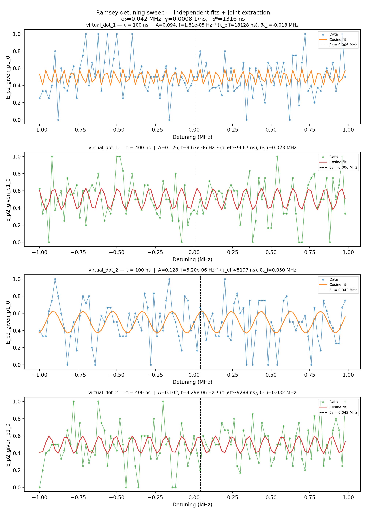

# 11b_ramsey_detuning

## Description

RAMSEY DETUNING PARITY DIFFERENCE (TWO-τ)

Sweeps the drive-frequency detuning at two fixed idle times (τ_short
and τ_long) and measures pre/post parity via joint-outcome streams;
analysis uses the selected conditional expectation (default: P(second=1|first=0)).

The two traces act as a Vernier: wide fringes (short τ) localise the
resonance coarsely, narrow fringes (long τ) sharpen the estimate.  Each
trace is fitted independently with a profiled differential-evolution
search over the oscillation frequency (linear parameters solved by
least-squares).  The resonance detuning δ₀ is the amplitude-weighted
mean of the per-trace estimates.  The amplitude ratio between traces
gives the exponential decay rate γ and dephasing time T₂*.

Prerequisites:
    - Calibrated resonators and voltage points (empty - init - measure).
    - Calibrated X90 pulse amplitude and frequency.

State update:
    - qubit.xy.intermediate_frequency

## Parameters

| Parameter | Value | Description |
|-----------|-------|-------------|
| `analysis_signal` | `E_p2_given_p1_0` | Which conditional expectation to use for fitting.
E_p2_given_p1_0: P(second=1 | first=0) — post-select on empty dot.
E_p2_given_p1_1: P(second=1 | first=1) — post-select on loaded dot. |
| `multiplexed` | `False` | Whether to play control pulses, readout pulses and active/thermal reset at the same time for all qubits (True)
or to play the experiment sequentially for each qubit (False). Default is False. |
| `use_state_discrimination` | `False` | Whether to use on-the-fly state discrimination and return the qubit 'state', or simply return the demodulated
quadratures 'I' and 'Q'. Default is False. |
| `reset_type` | `thermal` | The qubit reset method to use. Must be implemented as a method of Quam.qubit. Can be "thermal", "active", or
"active_gef". Default is "thermal". |
| `qubits` | `['q1', 'q2']` | A list of qubit names which should participate in the execution of the node. Default is None. |
| `num_shots` | `10` | Number of averages to perform. Default is 100. |
| `simulate` | `False` | Simulate the waveforms on the OPX instead of executing the program. Default is False. |
| `simulation_duration_ns` | `40000` | Duration over which the simulation will collect samples (in nanoseconds). Default is 50_000 ns. |
| `use_waveform_report` | `True` | Whether to use the interactive waveform report in simulation. Default is True. |
| `timeout` | `120` | Waiting time for the OPX resources to become available before giving up (in seconds). Default is 120 s. |
| `load_data_id` | `None` | Optional QUAlibrate node run index for loading historical data. Default is None. |
| `detuning_span_in_mhz` | `2.0` | Frequency detuning span. Default 5MHz. |
| `detuning_step_in_mhz` | `0.02` | Frequency detuning step. Default 0.1MHz |
| `idle_time_ns` | `100` | Short idle time in ns (gives wide fringes for coarse localisation). |
| `idle_time_long_ns` | `400` | Long idle time in ns (gives narrow fringes for precision + T2* via amplitude ratio). |

## Execution Output

## Fit Results

### virtual_dot_1
| Parameter | Value |
|-----------|-------|
| `freq_offset` | `5673.962277674147` |
| `contrast` | `0.09410221529366952` |
| `decay_rate` | `0.0` |
| `t2_star` | `nan` |
| `success` | `True` |
| `_diag` | `{'freq_offset': 5673.962277674147, 'contrast': 0.09410221529366952, 'decay_rate': 0.0, 't2_star': nan, 'success': True, 'fitted_curves': array([[0.52906101, 0.40682556, 0.57706996, 0.47808732, 0.43646242,
        0.58953306, 0.43225571, 0.48355359, 0.57417372, 0.4051227 ,
        0.53416996, 0.53553507, 0.40471397, 0.57333973, 0.48504603,
        0.43115041, 0.58947687, 0.43764075, 0.47661238, 0.57780819,
        0.40734123, 0.52765271, 0.54178515, 0.40310976, 0.56917417,
        0.49206302, 0.42619798, 0.58889513, 0.44334909, 0.46977662,
        0.58098234, 0.41005245, 0.52095555, 0.54777632, 0.40202192,
        0.56459657, 0.49909907, 0.42163284, 0.5877911 , 0.44934883,
        0.4630845 , 0.58367844, 0.41324122, 0.51411592, 0.55347506,
        0.40145651, 0.55963252, 0.50611483, 0.4174805 , 0.58617095,
        0.45560642, 0.45657345, 0.58588141, 0.41688971, 0.50717206,
        0.55884954, 0.40141671, 0.55430977, 0.5130711 , 0.41376417,
        0.58404373, 0.46208688, 0.45027985, 0.58757893, 0.42097751,
        0.50016278, 0.56386969, 0.40190272, 0.54865808, 0.51992897,
        0.41050464, 0.58142134, 0.46875399, 0.44423891, 0.58876151,
        0.42548179, 0.49312727, 0.56850746, 0.40291185, 0.54270905,
        0.52665011, 0.40772013, 0.57831844, 0.47557046, 0.43848439,
        0.58942255, 0.43037734, 0.48610488, 0.57273691, 0.40443843,
        0.53649592, 0.53319694, 0.4054262 , 0.57475237, 0.48249819,
        0.43304846, 0.58955835, 0.43563681, 0.47913484, 0.5765344 ],
       [0.60191505, 0.46318045, 0.37887716, 0.45883936, 0.59888864,
        0.6165624 , 0.48883446, 0.38211461, 0.43544235, 0.57933986,
        0.62633089, 0.51519338, 0.39072236, 0.41508436, 0.55653945,
        0.63079349, 0.54110491, 0.4043241 , 0.39865534, 0.53148416,
        0.62975509, 0.56543629, 0.42232521, 0.38687352, 0.50526929,
        0.62326111, 0.58712384, 0.44393877, 0.38025395, 0.47904087,
        0.61159542, 0.60521947, 0.46821991, 0.37908602, 0.45394551,
        0.59526801, 0.61893212, 0.49410715, 0.38342077, 0.43108026,
        0.57499265, 0.62766231, 0.5204688 , 0.39306872, 0.41144472,
        0.55165571, 0.6310284 , 0.54615243, 0.40760808, 0.39589727,
        0.52627737, 0.62888323, 0.57003525, 0.42640327, 0.38511759,
        0.49996708, 0.62132058, 0.5910732 , 0.44863261, 0.37957692,
        0.47387504, 0.60867107, 0.60834659, 0.47332434, 0.37951748,
        0.44914187, 0.59148767, 0.62110027, 0.49939902, 0.38494187,
        0.42684882, 0.57052159, 0.62877672, 0.52571678, 0.39561296,
        0.40797046, 0.54668937, 0.63104035, 0.55112709, 0.41106424,
        0.39333208, 0.52103288, 0.6277922 , 0.57451913, 0.43062025,
        0.3835736 , 0.4946737 , 0.61917427, 0.59487027, 0.45342607,
        0.37912163, 0.46876417, 0.6055633 , 0.61129086, 0.47848472,
        0.38017079, 0.44443695, 0.58755431, 0.62306303, 0.50470074]]), '_traces': [{'osc_freq': 1.812771437275151e-05, 'amplitude': 0.09410221529366952, 'delta0': -17631.74675689838, 'bg': 0.49547153629192464, 'C': -0.03986511541254934, 'S': -0.08524083233005325, 'fitted_curve': array([0.52906101, 0.40682556, 0.57706996, 0.47808732, 0.43646242,
       0.58953306, 0.43225571, 0.48355359, 0.57417372, 0.4051227 ,
       0.53416996, 0.53553507, 0.40471397, 0.57333973, 0.48504603,
       0.43115041, 0.58947687, 0.43764075, 0.47661238, 0.57780819,
       0.40734123, 0.52765271, 0.54178515, 0.40310976, 0.56917417,
       0.49206302, 0.42619798, 0.58889513, 0.44334909, 0.46977662,
       0.58098234, 0.41005245, 0.52095555, 0.54777632, 0.40202192,
       0.56459657, 0.49909907, 0.42163284, 0.5877911 , 0.44934883,
       0.4630845 , 0.58367844, 0.41324122, 0.51411592, 0.55347506,
       0.40145651, 0.55963252, 0.50611483, 0.4174805 , 0.58617095,
       0.45560642, 0.45657345, 0.58588141, 0.41688971, 0.50717206,
       0.55884954, 0.40141671, 0.55430977, 0.5130711 , 0.41376417,
       0.58404373, 0.46208688, 0.45027985, 0.58757893, 0.42097751,
       0.50016278, 0.56386969, 0.40190272, 0.54865808, 0.51992897,
       0.41050464, 0.58142134, 0.46875399, 0.44423891, 0.58876151,
       0.42548179, 0.49312727, 0.56850746, 0.40291185, 0.54270905,
       0.52665011, 0.40772013, 0.57831844, 0.47557046, 0.43848439,
       0.58942255, 0.43037734, 0.48610488, 0.57273691, 0.40443843,
       0.53649592, 0.53319694, 0.4054262 , 0.57475237, 0.48249819,
       0.43304846, 0.58955835, 0.43563681, 0.47913484, 0.5765344 ]), 'success': True, 'tau_ns': 100.0}, {'osc_freq': 9.666623286892688e-06, 'amplitude': 0.1261033400572802, 'delta0': 23065.403679200685, 'bg': 0.5049592358811286, 'C': 0.021318131356594845, 'S': 0.12428833271496167, 'fitted_curve': array([0.60191505, 0.46318045, 0.37887716, 0.45883936, 0.59888864,
       0.6165624 , 0.48883446, 0.38211461, 0.43544235, 0.57933986,
       0.62633089, 0.51519338, 0.39072236, 0.41508436, 0.55653945,
       0.63079349, 0.54110491, 0.4043241 , 0.39865534, 0.53148416,
       0.62975509, 0.56543629, 0.42232521, 0.38687352, 0.50526929,
       0.62326111, 0.58712384, 0.44393877, 0.38025395, 0.47904087,
       0.61159542, 0.60521947, 0.46821991, 0.37908602, 0.45394551,
       0.59526801, 0.61893212, 0.49410715, 0.38342077, 0.43108026,
       0.57499265, 0.62766231, 0.5204688 , 0.39306872, 0.41144472,
       0.55165571, 0.6310284 , 0.54615243, 0.40760808, 0.39589727,
       0.52627737, 0.62888323, 0.57003525, 0.42640327, 0.38511759,
       0.49996708, 0.62132058, 0.5910732 , 0.44863261, 0.37957692,
       0.47387504, 0.60867107, 0.60834659, 0.47332434, 0.37951748,
       0.44914187, 0.59148767, 0.62110027, 0.49939902, 0.38494187,
       0.42684882, 0.57052159, 0.62877672, 0.52571678, 0.39561296,
       0.40797046, 0.54668937, 0.63104035, 0.55112709, 0.41106424,
       0.39333208, 0.52103288, 0.6277922 , 0.57451913, 0.43062025,
       0.3835736 , 0.4946737 , 0.61917427, 0.59487027, 0.45342607,
       0.37912163, 0.46876417, 0.6055633 , 0.61129086, 0.47848472,
       0.38017079, 0.44443695, 0.58755431, 0.62306303, 0.50470074]), 'success': True, 'tau_ns': 400.0}]}` |

### virtual_dot_2
| Parameter | Value |
|-----------|-------|
| `freq_offset` | `42127.26019695878` |
| `contrast` | `0.12753705701222015` |
| `decay_rate` | `0.0007598070332993916` |
| `t2_star` | `1316.1236421537094` |
| `success` | `True` |
| `_diag` | `{'freq_offset': 42127.26019695878, 'contrast': 0.12753705701222015, 'decay_rate': 0.0007598070332993916, 't2_star': 1316.1236421537094, 'success': True, 'fitted_curves': array([[0.37335917, 0.41861686, 0.4959829 , 0.57361308, 0.61955447,
        0.61489738, 0.56155869, 0.48149285, 0.40765532, 0.37043796,
        0.3851596 , 0.44576075, 0.5272977 , 0.59620948, 0.62413168,
        0.59957141, 0.53263778, 0.45088097, 0.38795246, 0.36975391,
        0.40377591, 0.47601487, 0.5567369 , 0.61271644, 0.62091208,
        0.57795043, 0.50151472, 0.42306623, 0.3748947 , 0.37682776,
        0.42806975, 0.50752924, 0.58250034, 0.62212461, 0.61009252,
        0.55135654, 0.47009265, 0.39974945, 0.36928051, 0.39122698,
        0.4565556 , 0.53837681, 0.60301264, 0.62385868, 0.59233461,
        0.52141588, 0.44029296, 0.38235641, 0.37145317, 0.41207107,
        0.48749159, 0.56667132, 0.61701951, 0.61781262, 0.56872421,
        0.48995929, 0.41393785, 0.37195066, 0.38127984, 0.43808545,
        0.51898606, 0.59068259, 0.62366445, 0.60435614, 0.54070506,
        0.45891027, 0.39263888, 0.3691685 , 0.39815963, 0.4676794 ,
        0.54911316, 0.6089424 , 0.62254114, 0.58431208, 0.50999047,
        0.43016742, 0.37769845, 0.37418004, 0.42106037, 0.49904329,
        0.57603068, 0.62033418, 0.61371827, 0.55890609, 0.47845858,
        0.4054883 , 0.37003014, 0.38667885, 0.44858173, 0.53025929,
        0.59809267, 0.62416135, 0.59773534, 0.5296917 , 0.44803751,
        0.386382  , 0.37010285, 0.40590064, 0.47904083, 0.55941859],
       [0.40897844, 0.41514644, 0.52032388, 0.59677197, 0.55164391,
        0.43974808, 0.39698282, 0.47528686, 0.57955935, 0.58316055,
        0.48171678, 0.39843227, 0.43445669, 0.54603811, 0.59766005,
        0.52662726, 0.41920962, 0.40586666, 0.50280351, 0.59228963,
        0.56564344, 0.45522695, 0.39514182, 0.4583619 , 0.56810592,
        0.59108894, 0.49939789, 0.40439226, 0.42145711, 0.52986705,
        0.59795738, 0.54303188, 0.43179798, 0.39935011, 0.48509644,
        0.58489741, 0.57754398, 0.47196694, 0.39639042, 0.44260267,
        0.55447857, 0.59614398, 0.51699594, 0.41316036, 0.41074633,
        0.51268571, 0.59517235, 0.55802559, 0.44636046, 0.39579511,
        0.46774154, 0.57482027, 0.58698336, 0.48945865, 0.40069064,
        0.42848875, 0.53909197, 0.59817184, 0.53397541, 0.42446973,
        0.40265029, 0.49501696, 0.58938972, 0.57115213, 0.46245389,
        0.39530983, 0.45126693, 0.56236486, 0.59367434, 0.50716977,
        0.4079116 , 0.41644965, 0.52241438, 0.59711083, 0.54981958,
        0.43797623, 0.39741536, 0.47739847, 0.58078546, 0.58201204,
        0.47958852, 0.39790905, 0.43617396, 0.54791023, 0.59741331,
        0.52456133, 0.41783358, 0.40685172, 0.50495331, 0.59299322,
        0.5640463 , 0.45326882, 0.39520086, 0.46036641, 0.56962141,
        0.59027483, 0.49724293, 0.40351367, 0.42292194, 0.53189625]]), '_traces': [{'osc_freq': 5.197285247483736e-06, 'amplitude': 0.12753705701222015, 'delta0': 50296.831987659505, 'bg': 0.49662462961380255, 'C': -0.009133035891732947, 'S': 0.1272096245051396, 'fitted_curve': array([0.37335917, 0.41861686, 0.4959829 , 0.57361308, 0.61955447,
       0.61489738, 0.56155869, 0.48149285, 0.40765532, 0.37043796,
       0.3851596 , 0.44576075, 0.5272977 , 0.59620948, 0.62413168,
       0.59957141, 0.53263778, 0.45088097, 0.38795246, 0.36975391,
       0.40377591, 0.47601487, 0.5567369 , 0.61271644, 0.62091208,
       0.57795043, 0.50151472, 0.42306623, 0.3748947 , 0.37682776,
       0.42806975, 0.50752924, 0.58250034, 0.62212461, 0.61009252,
       0.55135654, 0.47009265, 0.39974945, 0.36928051, 0.39122698,
       0.4565556 , 0.53837681, 0.60301264, 0.62385868, 0.59233461,
       0.52141588, 0.44029296, 0.38235641, 0.37145317, 0.41207107,
       0.48749159, 0.56667132, 0.61701951, 0.61781262, 0.56872421,
       0.48995929, 0.41393785, 0.37195066, 0.38127984, 0.43808545,
       0.51898606, 0.59068259, 0.62366445, 0.60435614, 0.54070506,
       0.45891027, 0.39263888, 0.3691685 , 0.39815963, 0.4676794 ,
       0.54911316, 0.6089424 , 0.62254114, 0.58431208, 0.50999047,
       0.43016742, 0.37769845, 0.37418004, 0.42106037, 0.49904329,
       0.57603068, 0.62033418, 0.61371827, 0.55890609, 0.47845858,
       0.4054883 , 0.37003014, 0.38667885, 0.44858173, 0.53025929,
       0.59809267, 0.62416135, 0.59773534, 0.5296917 , 0.44803751,
       0.386382  , 0.37010285, 0.40590064, 0.47904083, 0.55941859]), 'success': True, 'tau_ns': 100.0}, {'osc_freq': 9.28812726782997e-06, 'amplitude': 0.10154122316774707, 'delta0': 31866.174987114922, 'bg': 0.4966687323114351, 'C': -0.028927193154286584, 'S': 0.09733364011798186, 'fitted_curve': array([0.40897844, 0.41514644, 0.52032388, 0.59677197, 0.55164391,
       0.43974808, 0.39698282, 0.47528686, 0.57955935, 0.58316055,
       0.48171678, 0.39843227, 0.43445669, 0.54603811, 0.59766005,
       0.52662726, 0.41920962, 0.40586666, 0.50280351, 0.59228963,
       0.56564344, 0.45522695, 0.39514182, 0.4583619 , 0.56810592,
       0.59108894, 0.49939789, 0.40439226, 0.42145711, 0.52986705,
       0.59795738, 0.54303188, 0.43179798, 0.39935011, 0.48509644,
       0.58489741, 0.57754398, 0.47196694, 0.39639042, 0.44260267,
       0.55447857, 0.59614398, 0.51699594, 0.41316036, 0.41074633,
       0.51268571, 0.59517235, 0.55802559, 0.44636046, 0.39579511,
       0.46774154, 0.57482027, 0.58698336, 0.48945865, 0.40069064,
       0.42848875, 0.53909197, 0.59817184, 0.53397541, 0.42446973,
       0.40265029, 0.49501696, 0.58938972, 0.57115213, 0.46245389,
       0.39530983, 0.45126693, 0.56236486, 0.59367434, 0.50716977,
       0.4079116 , 0.41644965, 0.52241438, 0.59711083, 0.54981958,
       0.43797623, 0.39741536, 0.47739847, 0.58078546, 0.58201204,
       0.47958852, 0.39790905, 0.43617396, 0.54791023, 0.59741331,
       0.52456133, 0.41783358, 0.40685172, 0.50495331, 0.59299322,
       0.5640463 , 0.45326882, 0.39520086, 0.46036641, 0.56962141,
       0.59027483, 0.49724293, 0.40351367, 0.42292194, 0.53189625]), 'success': True, 'tau_ns': 400.0}]}` |

## State Updates

| Parameter | Before | After |
|-----------|--------|-------|
| `qubits.q1.larmor_frequency` | `5250000000.0` | `5249994326.037723` |
| `qubits.q2.larmor_frequency` | `5250000000.0` | `5249957872.739803` |

## Metadata

| Key | Value |
|-----|-------|
| Timestamp | 2026-04-29T00:44:59 UTC |
| Node | 11b_ramsey_detuning |
| Duration | 9.6s |
| Status | completed |

---
*Generated by execute test infrastructure*
