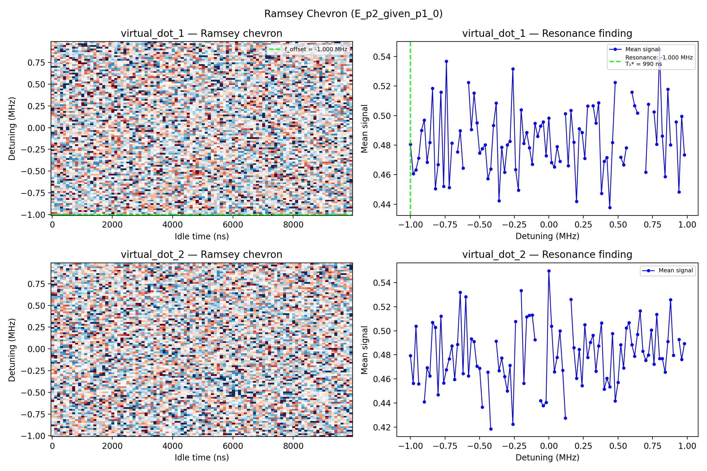

# 11c_ramsey_chevron

## Description

        RAMSEY CHEVRON PARITY DIFFERENCE
This sequence performs a Ramsey measurement with parity difference to characterize the qubit detuning and idle time.
The measurement involves sweeping the detuning frequency of the qubit, and performing a sequence of
two π/2 rotations with a swept idle time in between to create a 2D measurement. PSB is used to measure the
parity of the resulting state.

The sequence uses voltage sequences to navigate through a triangle in voltage space (empty -
initialization - measurement) using OPX channels on the fast lines of the bias-tees. At each pulse duration,
the parity is measured before (P1) and after (P2) the qubit manipulation; joint-outcome streams are
saved and reduced to conditional readout expectations in post-processing.

The analysis signal (default: conditional second parity given first parity) reveals Ramsey oscillations as a function of pulse duration and as a function of
pulse detuning, which can be used to extract the qubit coupling strength, coherence time, and optimal pulse parameters.

Prerequisites:
    - Having calibrated the resonators coupled to the SensorDot components.
    - Having calibrated the voltage points (empty - initialization - measurement).
    - Qubit pulse calibration (X90 pulse amplitude and frequency).

State update:
    - The qubit Larmor frequency.
    - The qubit  T2* (Ramsey) time.

## Parameters

| Parameter | Value | Description |
|-----------|-------|-------------|
| `analysis_signal` | `E_p2_given_p1_0` | Which conditional expectation to use for fitting.
E_p2_given_p1_0: P(second=1 | first=0) — post-select on empty dot.
E_p2_given_p1_1: P(second=1 | first=1) — post-select on loaded dot. |
| `multiplexed` | `False` | Whether to play control pulses, readout pulses and active/thermal reset at the same time for all qubits (True)
or to play the experiment sequentially for each qubit (False). Default is False. |
| `use_state_discrimination` | `False` | Whether to use on-the-fly state discrimination and return the qubit 'state', or simply return the demodulated
quadratures 'I' and 'Q'. Default is False. |
| `reset_type` | `thermal` | The qubit reset method to use. Must be implemented as a method of Quam.qubit. Can be "thermal", "active", or
"active_gef". Default is "thermal". |
| `qubits` | `['q1', 'q2']` | A list of qubit names which should participate in the execution of the node. Default is None. |
| `num_shots` | `10` | Number of averages to perform. Default is 100. |
| `min_wait_time_in_ns` | `16` | Minimum wait time in nanoseconds. Default is 16. |
| `max_wait_time_in_ns` | `9916` | Maximum wait time in nanoseconds. Default is 30000. |
| `wait_time_num_points` | `100` | Number of points for the wait time scan. Default is 500. |
| `log_or_linear_sweep` | `linear` | Type of sweep, either "log" (logarithmic) or "linear". Default is "log". |
| `simulate` | `False` | Simulate the waveforms on the OPX instead of executing the program. Default is False. |
| `simulation_duration_ns` | `40000` | Duration over which the simulation will collect samples (in nanoseconds). Default is 50_000 ns. |
| `use_waveform_report` | `True` | Whether to use the interactive waveform report in simulation. Default is True. |
| `timeout` | `120` | Waiting time for the OPX resources to become available before giving up (in seconds). Default is 120 s. |
| `load_data_id` | `None` | Optional QUAlibrate node run index for loading historical data. Default is None. |
| `detuning_span_in_mhz` | `2.0` | Frequency detuning span. Default 5MHz. |
| `detuning_step_in_mhz` | `0.02` | Frequency detuning step. Default 0.1MHz |

## Execution Output

## Fit Results

### virtual_dot_1
| Parameter | Value |
|-----------|-------|
| `freq_offset` | `-1000000.0` |
| `t2_star` | `990.0000000000002` |
| `decay_rate` | `0.0010101010101010099` |
| `gauss_decay_rate` | `0.0` |
| `success` | `True` |
| `_diag` | `{'mean_parity': array([0.48069444, 0.46061111, 0.4632619 , 0.47130159, 0.48999206,
       0.4970119 , 0.46839286, 0.48185714, 0.51839286, 0.45060714,
       0.46684524, 0.51592063, 0.45213095, 0.5368373 , 0.45123016,
       0.48131746,        nan, 0.47541667, 0.48972619, 0.46445635,
              nan, 0.52246429, 0.49054365, 0.5152381 , 0.49516667,
       0.4745873 , 0.47764683, 0.48026587, 0.4573254 , 0.46393651,
       0.4933373 , 0.50849206, 0.44229762, 0.47867857, 0.46168651,
       0.4802619 , 0.4826627 , 0.53152778, 0.46348413, 0.44961905,
       0.50393254, 0.48112302, 0.4886746 , 0.47813492, 0.46701587,
       0.49467063, 0.48589683, 0.49295238, 0.49573413, 0.4729246 ,
       0.49830556, 0.46817857, 0.46523016, 0.4789881 , 0.46906349,
              nan, 0.50141667, 0.46600794, 0.50355952, 0.48202778,
       0.44185714, 0.4910873 , 0.48865476, 0.471     , 0.50642857,
              nan, 0.50675   , 0.49502381, 0.50875   , 0.44735714,
       0.46902381, 0.4717381 , 0.43779762, 0.48188095, 0.52251984,
              nan, 0.47179762, 0.46675397, 0.47831349,        nan,
       0.51588492, 0.50671429, 0.50178571,        nan,        nan,
       0.46167857, 0.50760714,        nan, 0.50248016, 0.48065873,
       0.54475397, 0.48615079, 0.45871825, 0.51778968, 0.48015476,
              nan, 0.49574206, 0.44838095, 0.49954762, 0.4735119 ]), 'mean_parity_fit': None, 'resonance_idx': 0}` |

### virtual_dot_2
| Parameter | Value |
|-----------|-------|
| `freq_offset` | `-1000000.0` |
| `t2_star` | `nan` |
| `decay_rate` | `nan` |
| `gauss_decay_rate` | `0.0` |
| `success` | `False` |
| `_diag` | `{'mean_parity': array([0.47932143, 0.45634524, 0.5037381 , 0.45602381,        nan,
       0.44104365, 0.46925794, 0.46245238, 0.50703571, 0.50286111,
       0.44688095, 0.51213095, 0.45669444, 0.4677381 , 0.47666667,
       0.4874881 , 0.45947619, 0.48872619, 0.53198413, 0.46440079,
       0.52822619, 0.46246032, 0.49321032, 0.49107143, 0.47067063,
       0.46896825, 0.43659524,        nan, 0.46569444, 0.41857937,
              nan, 0.49143651, 0.46699206, 0.4773373 , 0.4620754 ,
       0.44996032, 0.47127778, 0.4224881 , 0.50779762,        nan,
       0.53342857, 0.45639683, 0.51160714, 0.51294048, 0.51301587,
       0.4925754 ,        nan, 0.44205159, 0.43769841, 0.44054762,
       0.54988095, 0.50376984, 0.46588492, 0.4779881 , 0.5       ,
       0.46710714, 0.42763492,        nan, 0.52615476, 0.4860119 ,
       0.46048413, 0.48446825, 0.45440476, 0.50503968, 0.47786508,
       0.49046429, 0.49631746, 0.46646429, 0.48735714, 0.50661508,
       0.45144048, 0.46057143, 0.45350794, 0.49769048, 0.44160714,
       0.45705952, 0.48844444, 0.46911905, 0.50231746, 0.5066746 ,
       0.48844841, 0.479     , 0.49707937, 0.51657143, 0.48296825,
       0.47553571, 0.47991667, 0.50054365, 0.47217857, 0.51351984,
       0.47683333, 0.47701984, 0.46559524, 0.4910754 , 0.52581349,
       0.47967857,        nan, 0.49281746, 0.47616667, 0.48938492]), 'mean_parity_fit': None, 'resonance_idx': 0}` |

## State Updates

| Parameter | Before | After |
|-----------|--------|-------|
| `qubits.q1.larmor_frequency` | `5250000000.0` | `5251000000.0` |

## Metadata

| Key | Value |
|-----|-------|
| Timestamp | 2026-04-29T00:45:11 UTC |
| Node | 11c_ramsey_chevron |
| Duration | 12.3s |
| Status | completed |

---
*Generated by execute test infrastructure*
