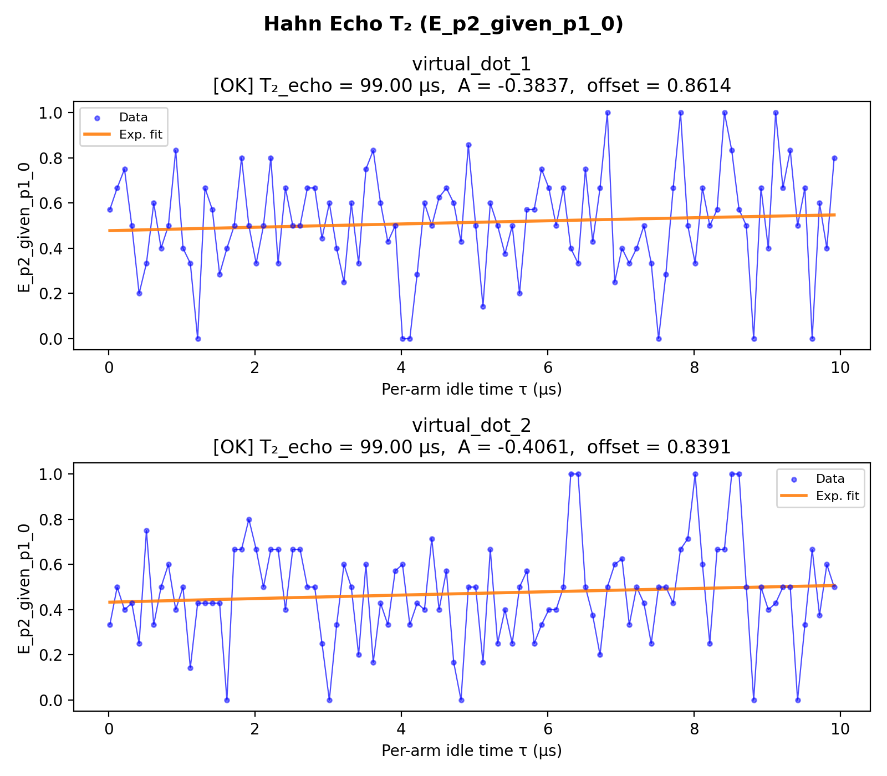

# 12_hahn_echo

## Description

        HAHN ECHO (SPIN ECHO) T2 MEASUREMENT - using standard QUA (pulse > 16ns and 4ns granularity)
The goal of this script is to measure the spin-spin relaxation time T2 using the Hahn echo (spin echo) technique.
Unlike the Ramsey experiment which measures T2* (sensitive to low-frequency noise and inhomogeneous broadening),
the Hahn echo refocuses static dephasing, yielding the intrinsic T2 coherence time which is always >= T2*.

The QUA program is divided into three sections:
    1) step between the initialization point and the operation point using sticky elements.
    2) apply the Hahn echo pulse sequence: pi/2 - tau - pi - tau - pi/2.
    3) measure the state of the qubit using RF reflectometry via parity readout.

The Hahn echo sequence works by:
    - First pi/2 pulse (x90): Creates superposition, placing qubit on Bloch sphere equator.
    - First wait period (tau): Qubit dephases due to noise and field inhomogeneities.
    - Pi pulse (x180): Flips the qubit state, reversing the accumulated phase.
    - Second wait period (tau): Previously accumulated phase is undone (refocused).
    - Final pi/2 pulse (x90): Projects the refocused state for measurement.

The echo amplitude decays as exp(-2*tau/T2), where T2 reflects irreversible dephasing from
high-frequency noise that cannot be refocused. This is the simplest dynamical decoupling sequence
and forms the basis for more advanced sequences (CPMG, XY-n) that extend coherence further.

The measurement sweeps per-arm idle time τ (joint-outcome streams).
The fitting uses profiled differential evolution: a 1-D global search over T2_echo with
the linear parameters (offset, amplitude) solved analytically at each step via least-squares.

Prerequisites:
    - Having run the Ramsey node to calibrate the qubit frequency and T2*, and the corresponding prerequisites.
    - Having calibrated pi and pi/2 pulse parameters from Rabi measurements.

Before proceeding to the next node:
    - Extract T2 from exponential fit of the echo decay curve.
    - Compare T2 to T2* to assess the contribution of low-frequency noise.
    - Consider dynamical decoupling sequences if longer coherence is needed.

State update:
    - T2echo

## Parameters

| Parameter | Value | Description |
|-----------|-------|-------------|
| `analysis_signal` | `E_p2_given_p1_0` | Which conditional expectation to use for fitting.
E_p2_given_p1_0: P(second=1 | first=0) — post-select on empty dot.
E_p2_given_p1_1: P(second=1 | first=1) — post-select on loaded dot. |
| `multiplexed` | `False` | Whether to play control pulses, readout pulses and active/thermal reset at the same time for all qubits (True)
or to play the experiment sequentially for each qubit (False). Default is False. |
| `use_state_discrimination` | `False` | Whether to use on-the-fly state discrimination and return the qubit 'state', or simply return the demodulated
quadratures 'I' and 'Q'. Default is False. |
| `reset_wait_time` | `5000` | The wait time for qubit reset. |
| `qubits` | `['q1', 'q2']` | A list of qubit names which should participate in the execution of the node. Default is None. |
| `num_shots` | `10` | Number of averages to perform. Default is 100. |
| `tau_min` | `16` | Minimum per-arm idle time in nanoseconds. Must be >= 4 clock cycles. Default is 16 ns. |
| `tau_max` | `10000` | Maximum per-arm idle time in nanoseconds. Default is 10000 ns (10 µs). |
| `tau_step` | `100` | Step size for the per-arm idle time sweep in nanoseconds. Default is 16 ns. |
| `operation` | `x180` | Name of the qubit pi-pulse operation. Default is 'x180'. |
| `simulate` | `False` | Simulate the waveforms on the OPX instead of executing the program. Default is False. |
| `simulation_duration_ns` | `40000` | Duration over which the simulation will collect samples (in nanoseconds). Default is 50_000 ns. |
| `use_waveform_report` | `True` | Whether to use the interactive waveform report in simulation. Default is True. |
| `timeout` | `120` | Waiting time for the OPX resources to become available before giving up (in seconds). Default is 120 s. |
| `load_data_id` | `None` | Optional QUAlibrate node run index for loading historical data. Default is None. |

## Execution Output

## Fit Results

### virtual_dot_1
| Parameter | Value |
|-----------|-------|
| `T2_echo` | `98999.99859572688` |
| `amplitude` | `-0.3836534831976026` |
| `offset` | `0.8614476054643934` |
| `decay_rate` | `2.0202020488577317e-05` |
| `success` | `True` |
| `_diag` | `{'T2_echo': 98999.99859572688, 'amplitude': -0.3836534831976026, 'offset': 0.8614476054643934, 'decay_rate': 2.0202020488577317e-05, 'fitted_curve': array([0.47791811, 0.47869214, 0.4794646 , 0.4802355 , 0.48100485,
       0.48177265, 0.48253889, 0.48330359, 0.48406675, 0.48482836,
       0.48558844, 0.48634699, 0.487104  , 0.48785949, 0.48861345,
       0.48936589, 0.49011681, 0.49086622, 0.49161411, 0.4923605 ,
       0.49310537, 0.49384875, 0.49459062, 0.495331  , 0.49606988,
       0.49680727, 0.49754318, 0.4982776 , 0.49901053, 0.49974199,
       0.50047197, 0.50120048, 0.50192752, 0.50265309, 0.50337719,
       0.50409984, 0.50482102, 0.50554075, 0.50625903, 0.50697586,
       0.50769124, 0.50840518, 0.50911767, 0.50982873, 0.51053836,
       0.51124655, 0.51195331, 0.51265865, 0.51336256, 0.51406505,
       0.51476613, 0.51546579, 0.51616404, 0.51686087, 0.51755631,
       0.51825034, 0.51894296, 0.51963419, 0.52032403, 0.52101247,
       0.52169953, 0.52238519, 0.52306948, 0.52375238, 0.5244339 ,
       0.52511405, 0.52579283, 0.52647023, 0.52714627, 0.52782095,
       0.52849426, 0.52916621, 0.52983681, 0.53050605, 0.53117395,
       0.53184049, 0.5325057 , 0.53316955, 0.53383207, 0.53449325,
       0.5351531 , 0.53581162, 0.5364688 , 0.53712466, 0.5377792 ,
       0.53843242, 0.53908431, 0.53973489, 0.54038416, 0.54103212,
       0.54167877, 0.54232412, 0.54296816, 0.5436109 , 0.54425235,
       0.5448925 , 0.54553136, 0.54616893, 0.54680522, 0.54744021]), 'signal': array([0.57142857, 0.66666667, 0.75      , 0.5       , 0.2       ,
       0.33333333, 0.6       , 0.4       , 0.5       , 0.83333333,
       0.4       , 0.33333333, 0.        , 0.66666667, 0.57142857,
       0.28571429, 0.4       , 0.5       , 0.8       , 0.5       ,
       0.33333333, 0.5       , 0.8       , 0.33333333, 0.66666667,
       0.5       , 0.5       , 0.66666667, 0.66666667, 0.44444444,
       0.6       , 0.4       , 0.25      , 0.6       , 0.33333333,
       0.75      , 0.83333333, 0.6       , 0.42857143, 0.5       ,
       0.        , 0.        , 0.28571429, 0.6       , 0.5       ,
       0.625     , 0.66666667, 0.6       , 0.42857143, 0.85714286,
       0.5       , 0.14285714, 0.6       , 0.5       , 0.375     ,
       0.5       , 0.2       , 0.57142857, 0.57142857, 0.75      ,
       0.66666667, 0.5       , 0.66666667, 0.4       , 0.33333333,
       0.75      , 0.42857143, 0.66666667, 1.        , 0.25      ,
       0.4       , 0.33333333, 0.4       , 0.5       , 0.33333333,
       0.        , 0.28571429, 0.66666667, 1.        , 0.5       ,
       0.33333333, 0.66666667, 0.5       , 0.57142857, 1.        ,
       0.83333333, 0.57142857, 0.5       , 0.        , 0.66666667,
       0.4       , 1.        , 0.66666667, 0.83333333, 0.5       ,
       0.66666667, 0.        , 0.6       , 0.4       , 0.8       ]), 'success': True}` |

### virtual_dot_2
| Parameter | Value |
|-----------|-------|
| `T2_echo` | `98999.99859572688` |
| `amplitude` | `-0.40610746699255523` |
| `offset` | `0.8390983521400449` |
| `decay_rate` | `2.0202020488577317e-05` |
| `success` | `True` |
| `_diag` | `{'T2_echo': 98999.99859572688, 'amplitude': -0.40610746699255523, 'offset': 0.8390983521400449, 'decay_rate': 2.0202020488577317e-05, 'fitted_curve': array([0.43312213, 0.43394146, 0.43475913, 0.43557515, 0.43638953,
       0.43720226, 0.43801335, 0.43882281, 0.43963063, 0.44043682,
       0.44124138, 0.44204432, 0.44284564, 0.44364534, 0.44444343,
       0.44523991, 0.44603478, 0.44682805, 0.44761971, 0.44840978,
       0.44919825, 0.44998514, 0.45077043, 0.45155414, 0.45233627,
       0.45311681, 0.45389579, 0.45467319, 0.45544902, 0.45622329,
       0.45699599, 0.45776714, 0.45853673, 0.45930476, 0.46007125,
       0.46083619, 0.46159958, 0.46236143, 0.46312175, 0.46388053,
       0.46463778, 0.46539351, 0.4661477 , 0.46690038, 0.46765153,
       0.46840117, 0.4691493 , 0.46989592, 0.47064103, 0.47138464,
       0.47212674, 0.47286735, 0.47360646, 0.47434409, 0.47508022,
       0.47581487, 0.47654803, 0.47727972, 0.47800993, 0.47873866,
       0.47946593, 0.48019172, 0.48091606, 0.48163893, 0.48236034,
       0.48308029, 0.4837988 , 0.48451585, 0.48523145, 0.48594561,
       0.48665833, 0.48736962, 0.48807946, 0.48878787, 0.48949486,
       0.49020042, 0.49090455, 0.49160726, 0.49230855, 0.49300843,
       0.4937069 , 0.49440395, 0.4950996 , 0.49579385, 0.49648669,
       0.49717814, 0.49786819, 0.49855685, 0.49924412, 0.49993   ,
       0.50061449, 0.50129761, 0.50197935, 0.50265971, 0.5033387 ,
       0.50401631, 0.50469256, 0.50536745, 0.50604097, 0.50671314]), 'signal': array([0.33333333, 0.5       , 0.4       , 0.42857143, 0.25      ,
       0.75      , 0.33333333, 0.5       , 0.6       , 0.4       ,
       0.5       , 0.14285714, 0.42857143, 0.42857143, 0.42857143,
       0.42857143, 0.        , 0.66666667, 0.66666667, 0.8       ,
       0.66666667, 0.5       , 0.66666667, 0.66666667, 0.4       ,
       0.66666667, 0.66666667, 0.5       , 0.5       , 0.25      ,
       0.        , 0.33333333, 0.6       , 0.5       , 0.2       ,
       0.6       , 0.16666667, 0.42857143, 0.33333333, 0.57142857,
       0.6       , 0.33333333, 0.42857143, 0.4       , 0.71428571,
       0.4       , 0.57142857, 0.16666667, 0.        , 0.5       ,
       0.5       , 0.16666667, 0.66666667, 0.25      , 0.4       ,
       0.25      , 0.5       , 0.57142857, 0.25      , 0.33333333,
       0.4       , 0.4       , 0.5       , 1.        , 1.        ,
       0.5       , 0.375     , 0.2       , 0.5       , 0.6       ,
       0.625     , 0.33333333, 0.5       , 0.42857143, 0.25      ,
       0.5       , 0.5       , 0.42857143, 0.66666667, 0.71428571,
       1.        , 0.6       , 0.25      , 0.66666667, 0.66666667,
       1.        , 1.        , 0.5       , 0.        , 0.5       ,
       0.4       , 0.42857143, 0.5       , 0.5       , 0.        ,
       0.33333333, 0.66666667, 0.375     , 0.6       , 0.5       ]), 'success': True}` |

## State Updates

| Parameter | Before | After |
|-----------|--------|-------|
| `qubits.q1.T2echo` | `None` | `98999.99859572688` |
| `qubits.q2.T2echo` | `None` | `98999.99859572688` |

## Metadata

| Key | Value |
|-----|-------|
| Timestamp | 2026-04-29T00:45:21 UTC |
| Node | 12_hahn_echo |
| Duration | 9.5s |
| Status | completed |

---
*Generated by execute test infrastructure*
