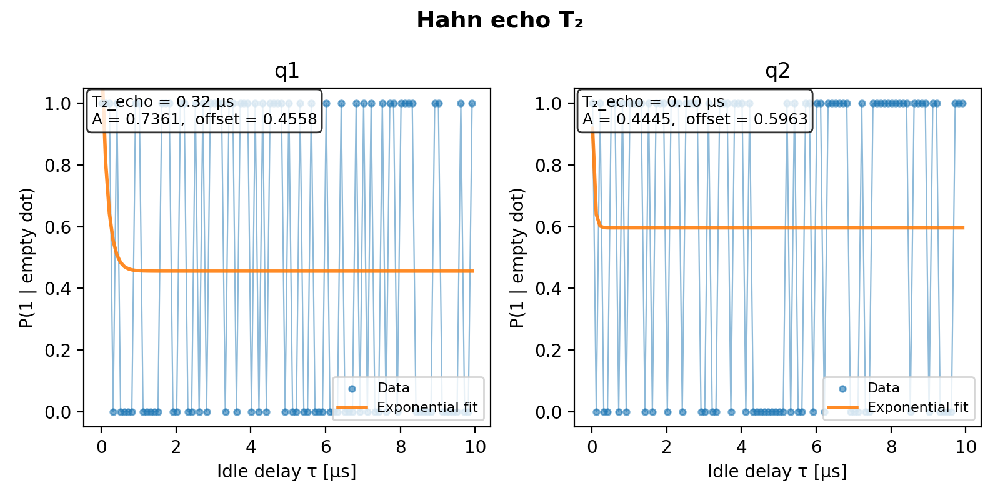

# 12_hahn_echo

## Description

        HAHN ECHO (SPIN ECHO) T2 MEASUREMENT
This node measures the spin-spin relaxation time T2 using the Hahn echo (spin echo) technique.
Unlike Ramsey (T2*), the Hahn echo refocuses static dephasing and yields the intrinsic T2 coherence
time, which is always >= T2*.

The sequence is x90 - tau - y180 - tau - x90. The swept parameter tau is the duration
of each of the two idle gaps (after the first x90 and after the y180 refocusing pulse).
Total free evolution is 2*tau. The echo amplitude decays as exp(-2*tau/T2_echo).

Prerequisites:
    - Ramsey node (qubit frequency and T2*) and its prerequisites.
    - Calibrated x90 and y180 pulses from Rabi measurements.

Datasets:
    - ``ds_raw``: raw parity streams from the OPX (``p_{qubit}`` or joint-outcome streams).
      Never modified after acquisition.
    - ``ds_fit``: processed conditional expectations, fitted decay curves, and per-qubit
      summary scalars on the ``qubit`` coordinate. Used by ``plot_data``.
    - ``fit_results``: compact per-qubit calibration dict (``FitParameters`` serialized with
      ``asdict``). Used by logging, ``node.outcomes``, and ``update_state``.

Results (``node.results["fit_results"][<qubit>]``):
    - ``success``: whether the exponential fit converged to a physical result.
    - ``T2_echo`` [ns]: Hahn echo coherence time.
    - ``amplitude``: echo contrast.
    - ``offset``: baseline level.
    - ``decay_rate`` [1/ns]: effective rate 2 / T2_echo.

Figures (``node.results["figures"]``):
    - ``"decay"``: horizontal subplots of conditional readout vs idle delay tau
      (each pi/2-pi segment; 2 tau total evolution) with exponential fit overlay.

State update:
    - ``qubit.T2echo`` from fitted ``T2_echo`` (successful qubits only).

## Parameters

| Parameter | Value | Description |
|-----------|-------|-------------|
| `analysis_signal` | `E_p1_given_p0_0` | Which conditional expectation to use for fitting.
E_p1_given_p0_0: P(second=1 | first=0) — post-select on empty dot.
E_p1_given_p0_1: P(second=1 | first=1) — post-select on loaded dot. |
| `parity_measurement` | `False` | Whether to use parity pre measurement. Default is False. |
| `multiplexed` | `False` | Whether to play control pulses, readout pulses and active/thermal reset at the same time for all qubits (True)
or to play the experiment sequentially for each qubit (False). Default is False. |
| `use_state_discrimination` | `False` | Whether to use on-the-fly state discrimination and return the qubit 'state', or simply return the demodulated
quadratures 'I' and 'Q'. Default is False. |
| `reset_type` | `thermal` | The qubit reset method to use. Must be implemented as a method of Quam.qubit. Can be "thermal", "active", or
"active_gef". Default is "thermal". |
| `qubits` | `['q1', 'q2']` | A list of qubit names which should participate in the execution of the node. Default is None. |
| `target_state` | `None` | The state you want to initialize into for heralded initialization. |
| `max_loops` | `100` | Maximum number of initialization loops for heralded initialization. |
| `return_n_loops` | `False` | Whether to return the number of times it has looped over the initialise sequence to achieve the desired result. |
| `num_shots` | `1` | Number of averages to perform. Default is 100. |
| `tau_min` | `16` | Minimum Hahn echo idle delay τ in nanoseconds (each x90–y180 segment; total evolution 2τ). Must be a multiple of 4 ns (1 QUA clock cycle). Default is 16 ns. |
| `tau_max` | `10000` | Maximum Hahn echo idle delay τ in nanoseconds (each x90–y180 segment; total evolution 2τ). Default is 10 000 ns (10 µs per segment; 20 µs total evolution). |
| `tau_step` | `100` | Step size for the τ sweep in nanoseconds. Default is 100 ns (25 QUA clock cycles). |
| `use_simulated_data` | `False` | Whether to generate simulated data instead of measuring via the OPX. |
| `sim_noise_std` | `0.03` | Gaussian noise std dev on simulated traces before clipping to [0, 1]. |
| `simulate` | `False` | Simulate the waveforms on the OPX instead of executing the program. Default is False. |
| `simulation_duration_ns` | `40000` | Duration over which the simulation will collect samples (in nanoseconds). Default is 50_000 ns. |
| `use_waveform_report` | `True` | Whether to use the interactive waveform report in simulation. Default is True. |
| `timeout` | `500` | Waiting time for the OPX resources to become available before giving up (in seconds). Default is 120 s. |
| `load_data_id` | `None` | Optional QUAlibrate node run index for loading historical data. Default is None. |

## Execution Output

## Fit Results

### q1
| Parameter | Value |
|-----------|-------|
| `T2_echo` | `315.3169534559347` |
| `amplitude` | `0.7360872454306562` |
| `offset` | `0.45584046556377333` |
| `decay_rate` | `0.006342824190325365` |
| `success` | `True` |

### q2
| Parameter | Value |
|-----------|-------|
| `T2_echo` | `100.00000021663436` |
| `amplitude` | `0.4444706388771287` |
| `offset` | `0.596267317023425` |
| `decay_rate` | `0.019999999956673127` |
| `success` | `True` |

## State Updates

| Parameter | Before | After |
|-----------|--------|-------|
| `qubits.q1.T2echo` | `None` | `315.3169534559347` |
| `qubits.q2.T2echo` | `None` | `100.00000021663436` |

## Metadata

| Key | Value |
|-----|-------|
| Timestamp | 2026-08-03T12:40:11 UTC |
| Node | 12_hahn_echo |
| Duration | 7.0s |
| Status | completed |

---
*Generated by execute test infrastructure*
