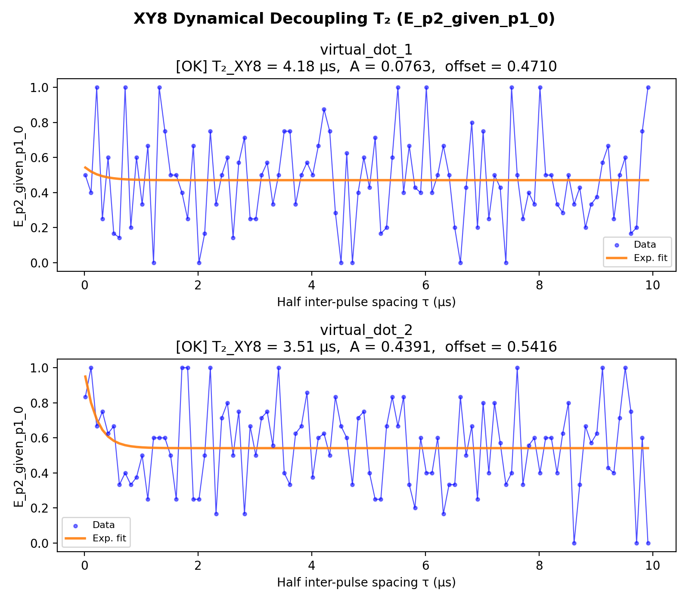

# 13_xy8

## Description

        XY8 DYNAMICAL DECOUPLING T2 MEASUREMENT - using standard QUA (pulse > 16ns and 4ns granularity)
The goal of this script is to measure the qubit coherence time under XY8 dynamical decoupling.
The XY8 sequence applies 8 refocusing pi pulses with alternating X and Y rotation axes,
using CPMG timing (half-intervals at bookends, full intervals between pulses).

Unlike the Hahn echo (single pi pulse), XY8 filters higher-frequency noise components
and cancels pulse imperfections to first order through the XYXY·YXYX alternation pattern.
The resulting T2_XY8 is typically longer than T2_echo (Hahn echo) and reflects the
coherence limit set by noise at the DD filter frequency 1/(2τ).

The QUA program is divided into three sections:
    1) step between the initialization point and the operation point using sticky elements.
    2) apply the XY8 pulse sequence with CPMG timing:
       pi/2 - τ - X - 2τ - Y - 2τ - X - 2τ - Y - 2τ - Y - 2τ - X - 2τ - Y - 2τ - X - τ - pi/2
    3) measure the state of the qubit using RF reflectometry via parity readout.

Total idle time per sweep point: 16τ (2 half-intervals + 7 full intervals).

The measurement sweeps the half inter-pulse spacing τ (joint-outcome streams).
The fitting uses profiled differential evolution: a 1-D global search over T2_xy8 with
the linear parameters (offset, amplitude) solved analytically at each step via least-squares.

Prerequisites:
    - Having run the Hahn echo node (12) and its prerequisites.
    - Having calibrated pi and pi/2 pulse parameters from Rabi measurements.
    - Having calibrated y180 pulse (same amplitude as x180, axis_angle=pi/2).

Before proceeding to the next node:
    - Compare T2_XY8 to T2_echo to assess the benefit of dynamical decoupling.
    - Consider whether the coherence is pulse-error limited or decoherence limited.

State update:
    - None (diagnostic measurement)

## Parameters

| Parameter | Value | Description |
|-----------|-------|-------------|
| `analysis_signal` | `E_p2_given_p1_0` | Which conditional expectation to use for fitting.
E_p2_given_p1_0: P(second=1 | first=0) — post-select on empty dot.
E_p2_given_p1_1: P(second=1 | first=1) — post-select on loaded dot. |
| `multiplexed` | `False` | Whether to play control pulses, readout pulses and active/thermal reset at the same time for all qubits (True)
or to play the experiment sequentially for each qubit (False). Default is False. |
| `use_state_discrimination` | `False` | Whether to use on-the-fly state discrimination and return the qubit 'state', or simply return the demodulated
quadratures 'I' and 'Q'. Default is False. |
| `reset_wait_time` | `5000` | The wait time for qubit reset. |
| `qubits` | `['q1', 'q2']` | A list of qubit names which should participate in the execution of the node. Default is None. |
| `num_shots` | `10` | Number of averages to perform. Default is 100. |
| `tau_min` | `16` | Minimum half inter-pulse spacing in nanoseconds. Must be >= 4 clock cycles. Default is 16 ns. |
| `tau_max` | `10000` | Maximum half inter-pulse spacing in nanoseconds. Default is 10000 ns (10 µs). |
| `tau_step` | `100` | Step size for the half inter-pulse spacing sweep in nanoseconds. Default is 4 ns (1 clock cycle). |
| `simulate` | `False` | Simulate the waveforms on the OPX instead of executing the program. Default is False. |
| `simulation_duration_ns` | `40000` | Duration over which the simulation will collect samples (in nanoseconds). Default is 50_000 ns. |
| `use_waveform_report` | `True` | Whether to use the interactive waveform report in simulation. Default is True. |
| `timeout` | `120` | Waiting time for the OPX resources to become available before giving up (in seconds). Default is 120 s. |
| `load_data_id` | `None` | Optional QUAlibrate node run index for loading historical data. Default is None. |

## Execution Output

## Fit Results

### virtual_dot_1
| Parameter | Value |
|-----------|-------|
| `T2_xy8` | `4176.840048937942` |
| `amplitude` | `0.07629732373994957` |
| `offset` | `0.47097118051541004` |
| `decay_rate` | `0.003830647047178254` |
| `success` | `True` |
| `_diag` | `{'T2_xy8': 4176.840048937942, 'amplitude': 0.07629732373994957, 'offset': 0.47097118051541004, 'decay_rate': 0.003830647047178254, 'fitted_curve': array([0.54273264, 0.5198959 , 0.50432653, 0.49371182, 0.48647504,
       0.48154122, 0.47817751, 0.47588423, 0.47432074, 0.47325481,
       0.47252809, 0.47203263, 0.47169484, 0.47146455, 0.47130755,
       0.4712005 , 0.47112753, 0.47107777, 0.47104385, 0.47102073,
       0.47100496, 0.47099421, 0.47098688, 0.47098188, 0.47097848,
       0.47097616, 0.47097457, 0.47097349, 0.47097276, 0.47097226,
       0.47097191, 0.47097168, 0.47097152, 0.47097141, 0.47097134,
       0.47097129, 0.47097125, 0.47097123, 0.47097121, 0.4709712 ,
       0.4709712 , 0.47097119, 0.47097119, 0.47097119, 0.47097118,
       0.47097118, 0.47097118, 0.47097118, 0.47097118, 0.47097118,
       0.47097118, 0.47097118, 0.47097118, 0.47097118, 0.47097118,
       0.47097118, 0.47097118, 0.47097118, 0.47097118, 0.47097118,
       0.47097118, 0.47097118, 0.47097118, 0.47097118, 0.47097118,
       0.47097118, 0.47097118, 0.47097118, 0.47097118, 0.47097118,
       0.47097118, 0.47097118, 0.47097118, 0.47097118, 0.47097118,
       0.47097118, 0.47097118, 0.47097118, 0.47097118, 0.47097118,
       0.47097118, 0.47097118, 0.47097118, 0.47097118, 0.47097118,
       0.47097118, 0.47097118, 0.47097118, 0.47097118, 0.47097118,
       0.47097118, 0.47097118, 0.47097118, 0.47097118, 0.47097118,
       0.47097118, 0.47097118, 0.47097118, 0.47097118, 0.47097118]), 'signal': array([0.5       , 0.4       , 1.        , 0.25      , 0.6       ,
       0.16666667, 0.14285714, 1.        , 0.2       , 0.6       ,
       0.33333333, 0.66666667, 0.        , 1.        , 0.75      ,
       0.5       , 0.5       , 0.4       , 0.25      , 0.66666667,
       0.        , 0.16666667, 0.75      , 0.33333333, 0.5       ,
       0.6       , 0.14285714, 0.57142857, 0.71428571, 0.25      ,
       0.25      , 0.5       , 0.57142857, 0.33333333, 0.5       ,
       0.75      , 0.75      , 0.33333333, 0.5       , 0.57142857,
       0.5       , 0.66666667, 0.875     , 0.75      , 0.28571429,
       0.        , 0.625     , 0.        , 0.4       , 0.6       ,
       0.42857143, 0.71428571, 0.16666667, 0.2       , 0.6       ,
       1.        , 0.4       , 0.66666667, 0.42857143, 0.4       ,
       1.        , 0.4       , 0.5       , 0.66666667, 0.5       ,
       0.2       , 0.        , 0.42857143, 0.8       , 0.2       ,
       0.75      , 0.25      , 0.5       , 0.42857143, 0.        ,
       1.        , 0.5       , 0.25      , 0.4       , 0.33333333,
       1.        , 0.5       , 0.5       , 0.33333333, 0.28571429,
       0.5       , 0.33333333, 0.42857143, 0.2       , 0.33333333,
       0.375     , 0.57142857, 0.66666667, 0.25      , 0.5       ,
       0.6       , 0.16666667, 0.2       , 0.75      , 1.        ]), 'success': True}` |

### virtual_dot_2
| Parameter | Value |
|-----------|-------|
| `T2_xy8` | `3513.6539847751847` |
| `amplitude` | `0.4390572240866346` |
| `offset` | `0.5415585215768081` |
| `decay_rate` | `0.004553664097070655` |
| `success` | `True` |
| `_diag` | `{'T2_xy8': 3513.6539847751847, 'amplitude': 0.4390572240866346, 'offset': 0.5415585215768081, 'decay_rate': 0.004553664097070655, 'fitted_curve': array([0.94976419, 0.8004489 , 0.70575082, 0.64569183, 0.60760148,
       0.583444  , 0.56812294, 0.55840609, 0.55224351, 0.54833511,
       0.54585634, 0.54428426, 0.54328723, 0.54265489, 0.54225386,
       0.54199952, 0.54183821, 0.5417359 , 0.54167102, 0.54162987,
       0.54160377, 0.54158722, 0.54157672, 0.54157006, 0.54156584,
       0.54156316, 0.54156147, 0.54156039, 0.54155971, 0.54155927,
       0.541559  , 0.54155882, 0.54155871, 0.54155864, 0.5415586 ,
       0.54155857, 0.54155855, 0.54155854, 0.54155853, 0.54155853,
       0.54155853, 0.54155852, 0.54155852, 0.54155852, 0.54155852,
       0.54155852, 0.54155852, 0.54155852, 0.54155852, 0.54155852,
       0.54155852, 0.54155852, 0.54155852, 0.54155852, 0.54155852,
       0.54155852, 0.54155852, 0.54155852, 0.54155852, 0.54155852,
       0.54155852, 0.54155852, 0.54155852, 0.54155852, 0.54155852,
       0.54155852, 0.54155852, 0.54155852, 0.54155852, 0.54155852,
       0.54155852, 0.54155852, 0.54155852, 0.54155852, 0.54155852,
       0.54155852, 0.54155852, 0.54155852, 0.54155852, 0.54155852,
       0.54155852, 0.54155852, 0.54155852, 0.54155852, 0.54155852,
       0.54155852, 0.54155852, 0.54155852, 0.54155852, 0.54155852,
       0.54155852, 0.54155852, 0.54155852, 0.54155852, 0.54155852,
       0.54155852, 0.54155852, 0.54155852, 0.54155852, 0.54155852]), 'signal': array([0.83333333, 1.        , 0.66666667, 0.75      , 0.625     ,
       0.66666667, 0.33333333, 0.4       , 0.33333333, 0.375     ,
       0.5       , 0.25      , 0.6       , 0.6       , 0.6       ,
       0.5       , 0.25      , 1.        , 1.        , 0.25      ,
       0.25      , 0.5       , 1.        , 0.16666667, 0.71428571,
       0.8       , 0.5       , 0.75      , 0.16666667, 0.66666667,
       0.5       , 0.71428571, 0.75      , 0.55555556, 1.        ,
       0.4       , 0.33333333, 0.625     , 0.66666667, 0.85714286,
       0.375     , 0.6       , 0.625     , 0.5       , 0.83333333,
       0.66666667, 0.6       , 0.33333333, 0.71428571, 0.75      ,
       0.4       , 0.25      , 0.25      , 0.66666667, 0.83333333,
       0.66666667, 0.83333333, 0.33333333, 0.2       , 0.6       ,
       0.4       , 0.4       , 0.6       , 0.16666667, 0.33333333,
       0.33333333, 0.83333333, 0.5       , 0.66666667, 0.25      ,
       0.8       , 0.4       , 0.8       , 0.57142857, 0.33333333,
       0.4       , 1.        , 0.33333333, 0.55555556, 0.6       ,
       0.4       , 0.6       , 0.6       , 0.4       , 0.625     ,
       0.8       , 0.        , 0.33333333, 0.66666667, 0.57142857,
       0.625     , 1.        , 0.42857143, 0.4       , 0.71428571,
       1.        , 0.75      , 0.        , 0.6       , 0.        ]), 'success': True}` |

## Metadata

| Key | Value |
|-----|-------|
| Timestamp | 2026-04-29T00:45:34 UTC |
| Node | 13_xy8 |
| Duration | 12.7s |
| Status | completed |

---
*Generated by execute test infrastructure*
