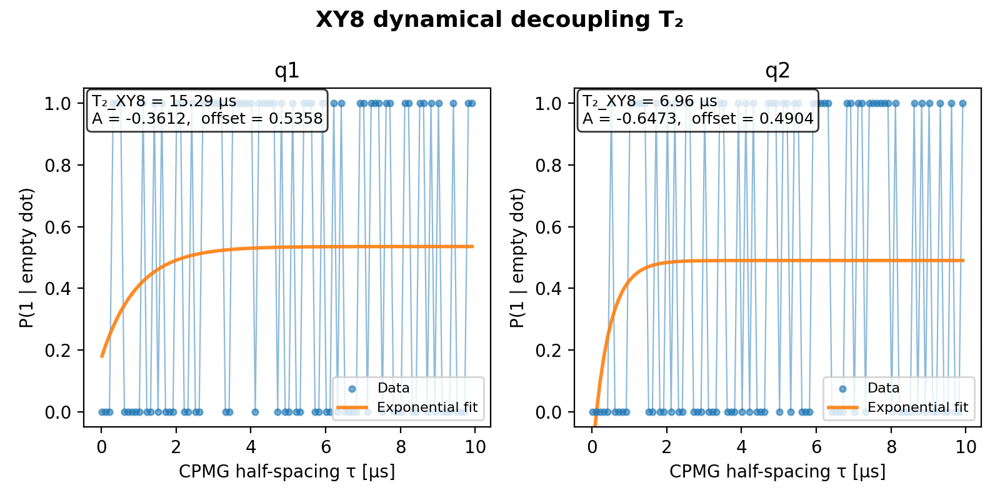

# 13_xy8

## Description

        XY8 DYNAMICAL DECOUPLING T2 MEASUREMENT
This node measures qubit coherence under XY8 dynamical decoupling. Eight refocusing pi
pulses with alternating X/Y axes and CPMG timing filter higher-frequency noise.

Pulse sequence (CPMG timing; X = x180, Y = y180):

    pi/2 - tau - X - 2*tau - Y - 2*tau - X - 2*tau - Y - 2*tau - Y - 2*tau - X - 2*tau - Y - 2*tau - X - tau - pi/2

The swept parameter tau is the CPMG half-spacing: the two bookend delays are tau, and
the seven intervals between refocusing pulses are 2*tau. Total free evolution per point
is 16*tau. The signal decays as exp(-16*tau/T2_xy8).

Prerequisites:
    - Hahn echo node (12) and its prerequisites.
    - Calibrated pi, pi/2, and y180 pulses from Rabi measurements.

Datasets:
    - ``ds_raw``: raw parity streams from the OPX (``p_{qubit}`` or joint-outcome streams).
      Never modified after acquisition.
    - ``ds_fit``: processed conditional expectations, fitted decay curves, and per-qubit
      summary scalars on the ``qubit`` coordinate. Used by ``plot_data``.
    - ``fit_results``: compact per-qubit calibration dict (``FitParameters`` serialized with
      ``asdict``). Used by logging and ``node.outcomes``.

Results (``node.results["fit_results"][<qubit>]``):
    - ``success``: whether the exponential fit converged to a physical result.
    - ``T2_xy8`` [ns]: XY8 coherence time.
    - ``amplitude``: dynamical-decoupling contrast.
    - ``offset``: baseline level.
    - ``decay_rate`` [1/ns]: effective rate 16 / T2_xy8.

Figures (``node.results["figures"]``):
    - ``"decay"``: horizontal subplots of conditional readout vs CPMG half-spacing tau
      (16 tau total idle) with exponential fit overlay for each qubit.

State update:
    - None (diagnostic measurement; inspect ``fit_results`` and ``ds_fit``).

## Parameters

| Parameter | Value | Description |
|-----------|-------|-------------|
| `analysis_signal` | `E_p1_given_p0_0` | Which conditional expectation to use for fitting.
E_p1_given_p0_0: P(second=1 | first=0) — post-select on empty dot.
E_p1_given_p0_1: P(second=1 | first=1) — post-select on loaded dot. |
| `parity_measurement` | `False` | Whether to use parity pre measurement. Default is False. |
| `multiplexed` | `False` | Whether to play control pulses, readout pulses and active/thermal reset at the same time for all qubits (True)
or to play the experiment sequentially for each qubit (False). Default is False. |
| `use_state_discrimination` | `False` | Whether to use on-the-fly state discrimination and return the qubit 'state', or simply return the demodulated
quadratures 'I' and 'Q'. Default is False. |
| `reset_type` | `thermal` | The qubit reset method to use. Must be implemented as a method of Quam.qubit. Can be "thermal", "active", or
"active_gef". Default is "thermal". |
| `qubits` | `['q1', 'q2']` | A list of qubit names which should participate in the execution of the node. Default is None. |
| `target_state` | `None` | The state you want to initialize into for heralded initialization. |
| `max_loops` | `100` | Maximum number of initialization loops for heralded initialization. |
| `return_n_loops` | `False` | Whether to return the number of times it has looped over the initialise sequence to achieve the desired result. |
| `num_shots` | `1` | Number of averages to perform. Default is 100. |
| `tau_min` | `16` | Minimum CPMG half-spacing τ in nanoseconds (bookend τ, inter-pulse 2τ; total idle 16τ). Must be a multiple of 4 ns (1 QUA clock cycle). Default is 16 ns. |
| `tau_max` | `10000` | Maximum CPMG half-spacing τ in nanoseconds (bookend τ, inter-pulse 2τ; total idle 16τ). Default is 4000 ns (64 µs total idle at τ_max; suitable for T₂ ~ 32 µs). |
| `tau_step` | `100` | Step size for the τ sweep in nanoseconds. Default is 100 ns (25 QUA clock cycle). |
| `use_simulated_data` | `False` | Whether to generate simulated data instead of measuring via the OPX. |
| `sim_noise_std` | `0.03` | Gaussian noise std dev on simulated traces before clipping to [0, 1]. |
| `simulate` | `False` | Simulate the waveforms on the OPX instead of executing the program. Default is False. |
| `simulation_duration_ns` | `40000` | Duration over which the simulation will collect samples (in nanoseconds). Default is 50_000 ns. |
| `use_waveform_report` | `True` | Whether to use the interactive waveform report in simulation. Default is True. |
| `timeout` | `500` | Waiting time for the OPX resources to become available before giving up (in seconds). Default is 120 s. |
| `load_data_id` | `None` | Optional QUAlibrate node run index for loading historical data. Default is None. |

## Execution Output

## Fit Results

### q1
| Parameter | Value |
|-----------|-------|
| `T2_xy8` | `15290.8269033049` |
| `amplitude` | `-0.3612187978568144` |
| `offset` | `0.5357537554254529` |
| `decay_rate` | `0.0010463789892580513` |
| `success` | `True` |

### q2
| Parameter | Value |
|-----------|-------|
| `T2_xy8` | `6959.208264862187` |
| `amplitude` | `-0.6472785436311916` |
| `offset` | `0.4903755172677284` |
| `decay_rate` | `0.002299112110322344` |
| `success` | `True` |

## Metadata

| Key | Value |
|-----|-------|
| Timestamp | 2026-08-03T12:40:28 UTC |
| Node | 13_xy8 |
| Duration | 6.0s |
| Status | completed |

---
*Generated by execute test infrastructure*
