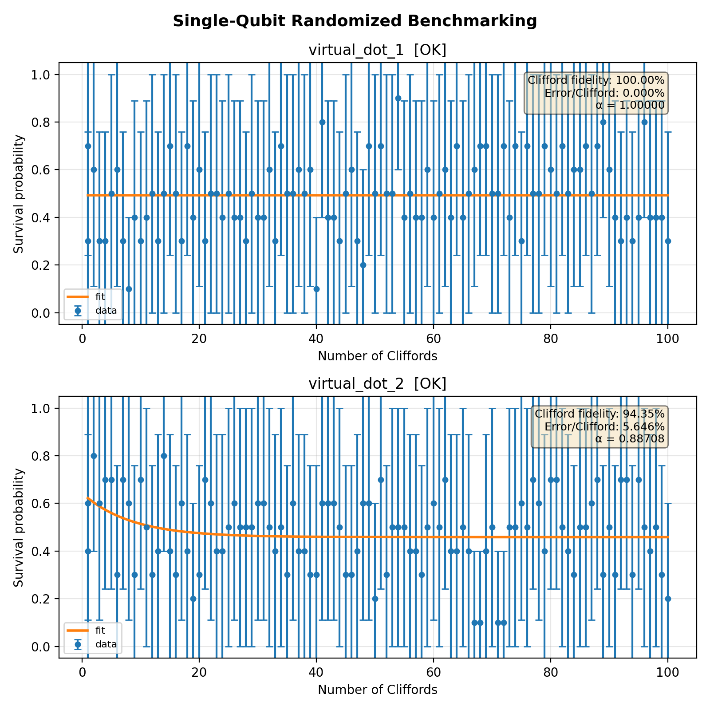

# 14_single_qubit_randomized_benchmarking

## Description

        SINGLE QUBIT RANDOMIZED BENCHMARKING (PPU-optimized)
The program plays random sequences of single-qubit Clifford gates and measures the
survival probability (return to ground state) afterward.  The 24 single-qubit
Cliffords are decomposed via Qiskit transpilation (basis: rx, ry, rz) into native
gates {x90, x180, -x90, y90, y180, -y90} plus virtual Z rotations
(frame_rotation_2pi, zero duration).

The PPU generates random Clifford circuits on-chip:
  1. PPU PHASE: For each circuit, random Cliffords are generated incrementally
     across depth checkpoints using preloaded composition and inverse tables.
  2. EXPERIMENT PHASE: For each (depth, shot), the pre-computed gate sequences
     are played back from arrays — no RNG or composition in the hot path.

Depth convention: depth d = d-1 random Cliffords + 1 recovery (inverse) = d total.
A single random circuit of max length is generated per circuit_idx; shorter depths
are truncations of the same circuit (standard RB truncation approach).

The survival probability vs circuit depth is fit to F(m) = A·α^m + B.  The average
error per Clifford is epc = (1 − α)·(d − 1)/d with d = 2, giving the average
Clifford gate fidelity F_avg = 1 − epc.

Prerequisites:
    - Having calibrated the sensor dots and resonators (nodes 2a, b, 3).
    - Having calibrated initialization, operation and PSB measurement points (nodes 4, 5).
    - Having calibrated π and π/2 pulse parameters (nodes 08a, 08b, 10a).
    - Native gate operations (x90, x180, -x90, y90, y180, -y90) defined on the qubit XY channel.

State update:
    - The averaged single qubit gate fidelity: qubit.gate_fidelity["averaged"].

TODO:
    Fix alignment/timing consistency between FEM output channels (LF vs MW) so pulses
    and background offsets line up across hardware and simulated RB waveforms.

## Parameters

| Parameter | Value | Description |
|-----------|-------|-------------|
| `multiplexed` | `False` | Whether to play control pulses, readout pulses and active/thermal reset at the same time for all qubits (True)
or to play the experiment sequentially for each qubit (False). Default is False. |
| `use_state_discrimination` | `False` | Whether to use on-the-fly state discrimination and return the qubit 'state', or simply return the demodulated
quadratures 'I' and 'Q'. Default is False. |
| `reset_wait_time` | `5000` | The wait time for qubit reset. |
| `qubits` | `['q1', 'q2']` | A list of qubit names which should participate in the execution of the node. Default is None. |
| `num_circuits_per_length` | `1` | Number of random circuits per depth. Default is 50. |
| `num_shots` | `10` | Number of repetitions (shots) per circuit. Default is 400. |
| `max_circuit_depth` | `100` | Maximum circuit depth (total Clifford count). Default is 256. |
| `delta_clifford` | `1` | Step between depths in linear scale mode. Default is 20. |
| `log_scale` | `False` | If True, use log-scale depths: 2, 4, 8, 16, ... up to max_circuit_depth. Default is True. |
| `seed` | `None` | Seed for the QUA pseudo-random number generator. Default is None (random). |
| `operation_x90` | `x90` | Name of the π/2 X rotation operation on the xy channel. Default is 'x90'. |
| `operation_x180` | `x180` | Name of the π X rotation operation on the xy channel. Default is 'x180'. |
| `simulate` | `False` | Simulate the waveforms on the OPX instead of executing the program. Default is False. |
| `simulation_duration_ns` | `60000` | Duration over which the simulation will collect samples (in nanoseconds). Default is 50_000 ns. |
| `use_waveform_report` | `True` | Whether to use the interactive waveform report in simulation. Default is True. |
| `timeout` | `180` | Waiting time for the OPX resources to become available before giving up (in seconds). Default is 120 s. |
| `load_data_id` | `None` | Optional QUAlibrate node run index for loading historical data. Default is None. |

## Execution Output

## Fit Results

### virtual_dot_1
| Parameter | Value |
|-----------|-------|
| `alpha` | `0.9999999999999849` |
| `A` | `0.046090964763188136` |
| `B` | `0.4469783418484996` |
| `error_per_clifford` | `7.549516567451064e-15` |
| `gate_fidelity` | `0.9999999999999925` |
| `fitted_curve` | `[0.49306931 0.49306931 0.49306931 0.49306931 0.49306931 0.49306931
 0.49306931 0.49306931 0.49306931 0.49306931 0.49306931 0.49306931
 0.49306931 0.49306931 0.49306931 0.49306931 0.49306931 0.49306931
 0.49306931 0.49306931 0.49306931 0.49306931 0.49306931 0.49306931
 0.49306931 0.49306931 0.49306931 0.49306931 0.49306931 0.49306931
 0.49306931 0.49306931 0.49306931 0.49306931 0.49306931 0.49306931
 0.49306931 0.49306931 0.49306931 0.49306931 0.49306931 0.49306931
 0.49306931 0.49306931 0.49306931 0.49306931 0.49306931 0.49306931
 0.49306931 0.49306931 0.49306931 0.49306931 0.49306931 0.49306931
 0.49306931 0.49306931 0.49306931 0.49306931 0.49306931 0.49306931
 0.49306931 0.49306931 0.49306931 0.49306931 0.49306931 0.49306931
 0.49306931 0.49306931 0.49306931 0.49306931 0.49306931 0.49306931
 0.49306931 0.49306931 0.49306931 0.49306931 0.49306931 0.49306931
 0.49306931 0.49306931 0.49306931 0.49306931 0.49306931 0.49306931
 0.49306931 0.49306931 0.49306931 0.49306931 0.49306931 0.49306931
 0.49306931 0.49306931 0.49306931 0.49306931 0.49306931 0.49306931
 0.49306931 0.49306931 0.49306931 0.49306931 0.49306931]` |
| `success` | `True` |

### virtual_dot_2
| Parameter | Value |
|-----------|-------|
| `alpha` | `0.8870844059496479` |
| `A` | `0.18504536405482686` |
| `B` | `0.45823872100609037` |
| `error_per_clifford` | `0.05645779702517606` |
| `gate_fidelity` | `0.9435422029748239` |
| `fitted_curve` | `[0.62238958 0.62238958 0.60385439 0.58741211 0.57282642 0.55988768
 0.54840993 0.53822819 0.52919613 0.52118393 0.51407644 0.50777149
 0.50217847 0.49721698 0.49281573 0.48891145 0.48544802 0.48237566
 0.47965023 0.47723253 0.47508784 0.47318531 0.47149761 0.47000047
 0.46867239 0.46749426 0.46644917 0.46552208 0.46469968 0.46397013
 0.46332297 0.46274888 0.46223961 0.46178785 0.4613871  0.46103159
 0.46071624 0.46043649 0.46018832 0.45996818 0.4597729  0.45959967
 0.459446   0.45930968 0.45918875 0.45908147 0.45898631 0.4589019
 0.45882702 0.45876059 0.45870166 0.45864939 0.45860302 0.45856188
 0.45852539 0.45849302 0.45846431 0.45843884 0.45841624 0.4583962
 0.45837841 0.45836264 0.45834865 0.45833624 0.45832522 0.45831546
 0.45830679 0.45829911 0.45829229 0.45828624 0.45828087 0.45827611
 0.45827189 0.45826815 0.45826482 0.45826188 0.45825926 0.45825694
 0.45825488 0.45825306 0.45825144 0.45825    0.45824873 0.4582476
 0.4582466  0.45824571 0.45824492 0.45824422 0.4582436  0.45824305
 0.45824256 0.45824213 0.45824174 0.4582414  0.4582411  0.45824083
 0.45824059 0.45824038 0.45824019 0.45824003 0.45823988]` |
| `success` | `True` |

## State Updates

| Parameter | Before | After |
|-----------|--------|-------|
| `qubits.q1.gate_fidelity` | `None` | `{'averaged': 0.9999999999999925}` |
| `qubits.q2.gate_fidelity` | `None` | `{'averaged': 0.9435422029748239}` |

## Metadata

| Key | Value |
|-----|-------|
| Timestamp | 2026-04-29T00:45:44 UTC |
| Node | 14_single_qubit_randomized_benchmarking |
| Duration | 10.0s |
| Status | completed |

---
*Generated by execute test infrastructure*
