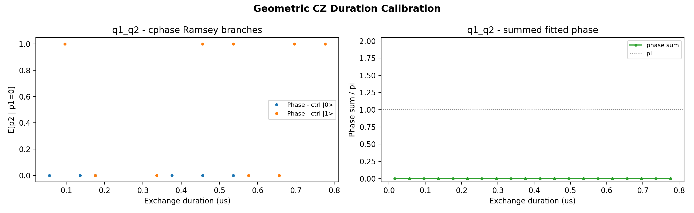

# 16a_geometric_cz_duration_calibration

## Description

        GEOMETRIC CZ DURATION CALIBRATION - fixed exchange amplitude
This node calibrates the exchange pulse duration for a geometric CZ gate at a fixed exchange amplitude.
It runs only the two cphase Ramsey experiments from node 16:
    Experiment 0: target Ramsey with control prepared in |0>
    Experiment 1: target Ramsey with control prepared in |1>

The analysis fits the two phase oscillations versus exchange duration and selects the duration at which
the sum of the accumulated branch phases equals pi modulo 2pi.

Prerequisites:
    - Having calibrated single-qubit gates (X90, X180) for both qubits.
    - Having calibrated the readout for the qubit pair (parity readout).
    - Having chosen a fixed exchange amplitude for the barrier gate.

State update:
    - CZ voltage point on qubit pair (barrier gate voltage)
    - CZ macro duration

## Parameters

| Parameter | Value | Description |
|-----------|-------|-------------|
| `analysis_signal` | `E_p2_given_p1_0` | Which conditional expectation to use for fitting.
E_p2_given_p1_0: P(second=1 | first=0) — post-select on empty dot.
E_p2_given_p1_1: P(second=1 | first=1) — post-select on loaded dot. |
| `multiplexed` | `False` | Whether to play control pulses, readout pulses and active/thermal reset at the same time for all qubits (True)
or to play the experiment sequentially for each qubit (False). Default is False. |
| `use_state_discrimination` | `False` | Whether to use on-the-fly state discrimination and return the qubit 'state', or simply return the demodulated
quadratures 'I' and 'Q'. Default is False. |
| `reset_wait_time` | `5000` | The wait time for qubit reset. |
| `qubit_pairs` | `['q1_q2']` | A list of qubit pair names which should participate in the execution of the node. Default is None. |
| `num_shots` | `1` | Number of averages to perform. Default is 100. |
| `exchange_amplitude` | `0.3` | Fixed exchange pulse amplitude (virtual barrier gate voltage, V). Default is 0.3. |
| `min_exchange_duration_in_ns` | `16` | Minimum exchange pulse duration in nanoseconds. Must be >= 16 ns (4 clock cycles). Default is 16 ns. |
| `max_exchange_duration_in_ns` | `800` | Maximum exchange pulse duration in nanoseconds. Default is 2000 ns. |
| `duration_step_in_ns` | `40` | Step size for the exchange pulse duration sweep in nanoseconds. Default is 20 ns. |
| `simulate` | `False` | Simulate the waveforms on the OPX instead of executing the program. Default is False. |
| `simulation_duration_ns` | `40000` | Duration over which the simulation will collect samples (in nanoseconds). Default is 50_000 ns. |
| `use_waveform_report` | `True` | Whether to use the interactive waveform report in simulation. Default is True. |
| `timeout` | `300` | Waiting time for the OPX resources to become available before giving up (in seconds). Default is 120 s. |
| `load_data_id` | `None` | Optional QUAlibrate node run index for loading historical data. Default is None. |

## Execution Output

## Fit Results

### q1_q2
| Parameter | Value |
|-----------|-------|
| `exchange_amplitude` | `0.3` |
| `optimal_duration` | `0.0` |
| `phase_ctrl_ground_frequency` | `0.0` |
| `phase_ctrl_excited_frequency` | `0.0` |
| `phase_ctrl_ground_phase` | `0.0` |
| `phase_ctrl_excited_phase` | `0.0` |
| `phase_sum_at_optimal` | `0.0` |
| `success` | `False` |

## Metadata

| Key | Value |
|-----|-------|
| Timestamp | 2026-04-29T00:50:22 UTC |
| Node | 16a_geometric_cz_duration_calibration |
| Duration | 15.4s |
| Status | completed |

---
*Generated by execute test infrastructure*
