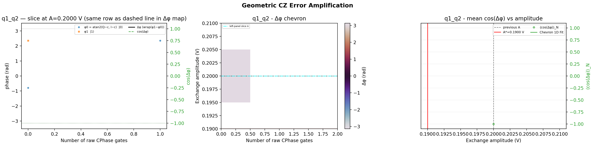

# 17_geometric_cz_error_amplification

## Description

        GEOMETRIC CZ ERROR AMPLIFICATION - fixed duration, amplitude refinement
This node refines the exchange amplitude of a geometric CZ/CPhase gate using coherent error amplification.
It keeps the CZ duration fixed from the currently calibrated CZ macro and sweeps a small set of exchange
amplitudes around the saved CZ voltage point.

For each amplitude, the target qubit is prepared in a Ramsey sequence and the raw exchange CPhase pulse is
repeated N times. The control qubit is prepared in |0> or |1>, and two final analysis quadratures are measured
for the target qubit. The repetition axis defaults to a dense integer range, but can be replaced by an explicit
sparse list of N values. The central summary panel shows **Δφ(V, N)** (wrapped φ1−φ0). The optimal exchange
voltage and green 1D curve use **cos(Δφ)** — mean over N and the same 2D chevron fit as power-Rabi error
amplification. The **left panel** is a horizontal slice of the Δφ map (φ0, φ1, Δφ and cos(Δφ) vs N at the
reference amplitude; cyan dash-dot line on the center panel marks the same row).

Prerequisites:
    - Having calibrated the geometric CZ duration and saved the CZ voltage point (node 16 or 16a).
    - Having calibrated single-qubit gates (X90, X180) for both qubits.
    - Having calibrated the readout for the qubit pair (parity readout).

State update:
    - CZ voltage point on qubit pair (barrier gate voltage)

## Parameters

| Parameter | Value | Description |
|-----------|-------|-------------|
| `analysis_signal` | `E_p2_given_p1_0` | Which conditional expectation to use for fitting.
E_p2_given_p1_0: P(second=1 | first=0) — post-select on empty dot.
E_p2_given_p1_1: P(second=1 | first=1) — post-select on loaded dot. |
| `multiplexed` | `False` | Whether to play control pulses, readout pulses and active/thermal reset at the same time for all qubits (True)
or to play the experiment sequentially for each qubit (False). Default is False. |
| `use_state_discrimination` | `False` | Whether to use on-the-fly state discrimination and return the qubit 'state', or simply return the demodulated
quadratures 'I' and 'Q'. Default is False. |
| `reset_wait_time` | `5000` | The wait time for qubit reset. |
| `qubit_pairs` | `['q1_q2']` | A list of qubit pair names which should participate in the execution of the node. Default is None. |
| `num_shots` | `1` | Number of averages to perform. Default is 100. |
| `exchange_amplitude_center` | `0.2` | Center of the exchange amplitude sweep. If None, use the saved CZ voltage point. |
| `exchange_amplitude_span` | `0.01` | Half span of the exchange amplitude sweep around the center (V). Default is 0.02. |
| `exchange_amplitude_step` | `0.01` | Step size for the exchange amplitude sweep (V). Default is 0.002. |
| `num_cphase_gates` | `[0, 1, 2]` | Explicit raw CPhase repetition counts. If set, overrides the dense range. |
| `min_num_cphase_gates` | `0` | Minimum raw CPhase repetition count for the dense range. Default is 0. |
| `max_num_cphase_gates` | `32` | Maximum raw CPhase repetition count for the dense range. Default is 32. |
| `num_cphase_gate_step` | `1` | Step size for the dense raw CPhase repetition range. Default is 1. |
| `quadrature_signal_center` | `0.5` | Signal value corresponding to the center of the Ramsey I/Q circle. Default is 0.5. |
| `simulate` | `False` | Simulate the waveforms on the OPX instead of executing the program. Default is False. |
| `simulation_duration_ns` | `40000` | Duration over which the simulation will collect samples (in nanoseconds). Default is 50_000 ns. |
| `use_waveform_report` | `True` | Whether to use the interactive waveform report in simulation. Default is True. |
| `timeout` | `300` | Waiting time for the OPX resources to become available before giving up (in seconds). Default is 120 s. |
| `load_data_id` | `None` | Optional QUAlibrate node run index for loading historical data. Default is None. |

## Execution Output

## Fit Results

### q1_q2
| Parameter | Value |
|-----------|-------|
| `optimal_amplitude` | `0.19` |
| `success` | `True` |

## State Updates

| Parameter | Before | After |
|-----------|--------|-------|
| `virtual_gate_sets.main_qpu.macros.q1_q2_CZ.duration` | `248` | `524` |
| `virtual_gate_sets.main_qpu.macros.q1_q2_CZ.voltages.virtual_barrier_1` | `0.2` | `0.19` |
| `virtual_gate_sets.main_qpu.macros.q1_q2_CZ.voltages.virtual_dot_1` | `0.075` | `None` |
| `virtual_gate_sets.main_qpu.macros.q1_q2_CZ.voltages.virtual_dot_2` | `0.075` | `None` |

## Metadata

| Key | Value |
|-----|-------|
| Timestamp | 2026-04-29T00:51:06 UTC |
| Node | 17_geometric_cz_error_amplification |
| Duration | 44.2s |
| Status | completed |

---
*Generated by execute test infrastructure*
