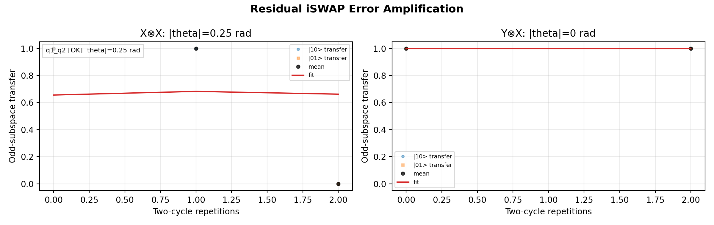

# 17a_iswap_error_amplification

## Description

        RESIDUAL iSWAP ERROR AMPLIFICATION - fixed CPhase amplitude and duration
This node diagnoses the residual iSWAP/SWAP component of the calibrated geometric CZ/CPhase block.
It does not sweep exchange amplitude or duration. Instead, it reads the saved CZ voltage point and CZ
macro duration, repeats the raw exchange block at that fixed operating point, and fits the coherent
population-transfer buildup in the odd-parity subspace.

The protocol prepares |10> and |01>, applies repeated *two-beat* blocks (raw CPhase, π pulses, raw
CPhase, π pulses), and measures odd-subspace transfer. The π pulses are not an accident of gate
decomposition: they are part of a **component-selective** readout, not a naive stack of n identical
CZ operations. In an average-Hamiltonian (toggling-frame) picture, instantaneously applied local Pauli
pulses change which parts of a small two-qubit error Hamiltonian are coherently accumulated between
sub-blocks. Recent work on superconducting two-qubit hardware implements similar interleaved-π
constructions in the *two-qubit* context (tunable exchange / coupler), both to mitigate coherent
entangling error and to probe noise during two-qubit gates [1,2]. The original toggling-frame /
average-Hamiltonian formalism is older NMR theory [3]. Here, two `π` settings—`X⊗X` and `Y⊗X`—act as
quadrature projections of a small residual iSWAP-like term in the odd subspace, so the analysis can
fit a magnitude |theta| from the pair (not just a single unphysical projection of an unknown error
axis). Repeating only raw exchange `n` times with no `π` sandwich would coherently amplify *some*
unwanted rotation, but would not, by itself, supply the two independent traces required for the
`theta_x` / `theta_y` / `|theta_iswap|` decomposition implemented in
`calibration_utils.iswap_error_amplification` without changing the fit model.
Tradeoff: the sequence is more sensitive to π-pulse infidelity and calibration drift. Prerequisites
treat `X180` and `Y180` as pre-characterized; if those dominate, interpret results cautiously.
References: [1] J. Qiu et al., "Suppressing Coherent Two-Qubit Errors via Dynamical Decoupling",
   Phys. Rev. Applied 16, 054047 (2021), doi:10.1103/PhysRevApplied.16.054047 (tunable-coupler
   superconducting device: DD-style sequences in the entangling subspace, mixed X/Y control).
   [2] T. McCourt et al., "Learning Noise via Dynamical Decoupling of Entangled Qubits", Phys. Rev. A
   107, 052610 (2023), doi:10.1103/PhysRevA.107.052610 (DD sequences to characterize non-single-
   qubit-dephasing noise that is on during two-qubit gates, interleaving local pulses with
   entangling evolution).  [3] U. Haeberlen, J. S. Waugh, "Coherent Averaging Effects in Magnetic
   Resonance", Phys. Rev. 175, 453 (1968) (classical NMR reference for the toggling / average
   Hamiltonian picture underlying pulse interleaving).

The protocol measures odd-subspace transfer with two `dd_axis` settings:
    - X⊗X selects the residual swap component proportional to theta*cos(chi).
    - Y⊗X selects the complementary component proportional to theta*sin(chi).

The analysis reports the absolute component magnitudes and their quadrature sum |theta_iswap|. It is a
diagnostic node in v1; it does not update the CZ state.

Prerequisites:
    - Having calibrated the geometric CZ duration and saved the CZ voltage point (node 16/16a and node 17).
    - Having calibrated single-qubit X180 and Y180 gates for both qubits.
    - Having calibrated the readout for the qubit pair (parity readout).

State update:
    - None (diagnostic measurement).

## Parameters

| Parameter | Value | Description |
|-----------|-------|-------------|
| `analysis_signal` | `E_p2_given_p1_0` | Which conditional expectation to use for fitting.
E_p2_given_p1_0: P(second=1 | first=0) — post-select on empty dot.
E_p2_given_p1_1: P(second=1 | first=1) — post-select on loaded dot. |
| `multiplexed` | `False` | Whether to play control pulses, readout pulses and active/thermal reset at the same time for all qubits (True)
or to play the experiment sequentially for each qubit (False). Default is False. |
| `use_state_discrimination` | `False` | Whether to use on-the-fly state discrimination and return the qubit 'state', or simply return the demodulated
quadratures 'I' and 'Q'. Default is False. |
| `reset_wait_time` | `5000` | The wait time for qubit reset. |
| `qubit_pairs` | `['q1_q2']` | A list of qubit pair names which should participate in the execution of the node. Default is None. |
| `num_shots` | `1` | Number of averages to perform. Default is 100. |
| `exchange_amplitude` | `0.2` | Fixed exchange amplitude. If None, use the saved CZ voltage point. |
| `exchange_duration_in_ns` | `64` | Fixed exchange duration. If None, use the saved CZ macro duration. |
| `num_cycle_repetitions` | `[0, 1, 2]` | Explicit two-cycle repetition counts. If set, overrides the dense range. |
| `min_num_cycles` | `0` | Minimum two-cycle repetition count for the dense range. Default is 0. |
| `max_num_cycles` | `32` | Maximum two-cycle repetition count for the dense range. Default is 32. |
| `num_cycle_step` | `2` | Step size for the dense two-cycle repetition range. Default is 2. |
| `max_theta_rad` | `0.25` | Upper bound for each residual iSWAP component fit, in radians. |
| `min_fit_contrast` | `0.0001` | Below this transfer span, report a successful zero-angle diagnostic. |
| `simulate` | `False` | Simulate the waveforms on the OPX instead of executing the program. Default is False. |
| `simulation_duration_ns` | `40000` | Duration over which the simulation will collect samples (in nanoseconds). Default is 50_000 ns. |
| `use_waveform_report` | `True` | Whether to use the interactive waveform report in simulation. Default is True. |
| `timeout` | `300` | Waiting time for the OPX resources to become available before giving up (in seconds). Default is 120 s. |
| `load_data_id` | `None` | Optional QUAlibrate node run index for loading historical data. Default is None. |

## Execution Output

## Fit Results

### q1_q2
| Parameter | Value |
|-----------|-------|
| `theta_x` | `0.249999999894373` |
| `theta_y` | `0.0` |
| `theta_iswap_abs` | `0.249999999894373` |
| `fit_x` | `{'theta_abs': 0.249999999894373, 'offset': 0.6555720042678777, 'contrast': 1.4999999988071138, 'decay_rate': 2.552796850488577, 'rmse': 0.4682408157195135, 'span': 1.0, 'success': True}` |
| `fit_y` | `{'theta_abs': 0.0, 'offset': 1.0, 'contrast': 0.0, 'decay_rate': 0.0, 'rmse': 0.0, 'span': 0.0, 'success': True}` |
| `success` | `True` |

## Metadata

| Key | Value |
|-----|-------|
| Timestamp | 2026-04-29T00:51:26 UTC |
| Node | 17a_iswap_error_amplification |
| Duration | 19.2s |
| Status | completed |

---
*Generated by execute test infrastructure*
