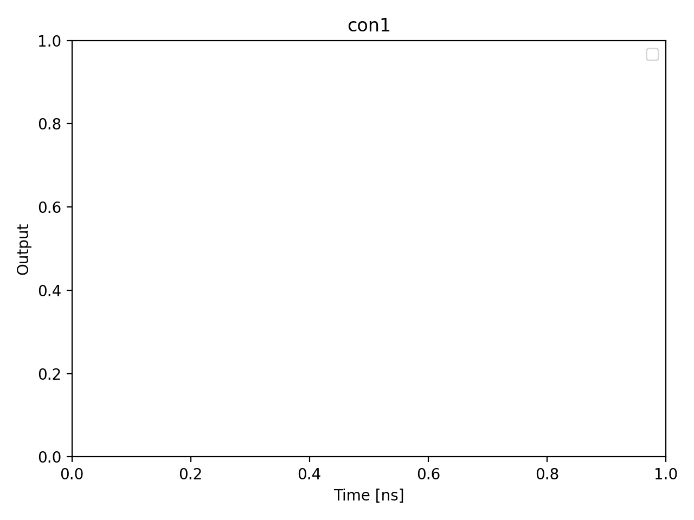

# 02_optimize_initialization

## Description

        OPTIMISE INITIALISATION (CMA-ES)
Uses CMA-ES to optimise the two-stage balanced initialisation macro by
jointly tuning the ramp amplitudes (detuning and barrier for two voltage
points V1 and V2), ramp durations, and hold duration.

The waveform is anti-symmetric:

    0 → −V2 → −V1 → hold → +V1 → +V2 → 0

so the net integrated voltage is exactly zero for any parameter values.

Each CMA-ES generation proposes a batch of candidate parameter vectors.
For every candidate the QUA program performs the two-stage ramp followed
by a PSB state measurement for ``num_shots`` repetitions.  The average
binary state assignment serves as the objective (lower = purer ground
state when ``find_minimum`` is True).

The QUA program is compiled once per qubit pair and uses input streams
so that each new generation only requires pushing fresh parameter values.

Prerequisites:
    - Having initialised the Quam.
    - Having calibrated the PSB measurement point (06a-06c).
    - Having the balanced measurement macro configured with a valid threshold.

State update:
    - Replaces the initialise macro on each qubit pair with a
      ``TwoStageBalancedInitializeMacro`` configured with the optimal
      ramp amplitudes, durations, and hold time.

## Parameters

| Parameter | Value | Description |
|-----------|-------|-------------|
| `multiplexed` | `False` | Whether to play control pulses, readout pulses and active/thermal reset at the same time for all qubits (True)
or to play the experiment sequentially for each qubit (False). Default is False. |
| `use_state_discrimination` | `False` | Whether to use on-the-fly state discrimination and return the qubit 'state', or simply return the demodulated
quadratures 'I' and 'Q'. Default is False. |
| `reset_wait_time` | `5000` | The wait time for qubit reset. |
| `qubit_pairs` | `['q1_q2']` | A list of qubit pair names which should participate in the execution of the node. Default is None. |
| `num_shots` | `1` | Number of shots per candidate evaluation. Default is 100. |
| `point_2_detuning_initial` | `-0.05` | Starting detuning amplitude for outer ramp point (V) . Default is -0.05 V. |
| `point_2_detuning_min` | `-0.2` | Lower bound for outer-point detuning (V). Default is -0.2 V. |
| `point_2_detuning_max` | `0.0` | Upper bound for outer-point detuning (V). Default is 0.0 V. |
| `point_2_barrier_initial` | `0.0` | Starting barrier amplitude for outer ramp point (V). Default is 0.0 V. |
| `point_2_barrier_min` | `-0.1` | Lower bound for outer-point barrier (V). Default is -0.1 V. |
| `point_2_barrier_max` | `0.1` | Upper bound for outer-point barrier (V). Default is 0.1 V. |
| `point_1_detuning_initial` | `-0.02` | Starting detuning amplitude for inner ramp point (V). Default is -0.02 V. |
| `point_1_detuning_min` | `-0.15` | Lower bound for inner-point detuning (V). Default is -0.15 V. |
| `point_1_detuning_max` | `0.0` | Upper bound for inner-point detuning (V). Default is 0.0 V. |
| `point_1_barrier_initial` | `0.0` | Starting barrier amplitude for inner ramp point (V). Default is 0.0 V. |
| `point_1_barrier_min` | `-0.1` | Lower bound for inner-point barrier (V). Default is -0.1 V. |
| `point_1_barrier_max` | `0.1` | Upper bound for inner-point barrier (V). Default is 0.1 V. |
| `ramp_duration_1_initial` | `200` | Starting outer ramp duration in ns (0<->V2 segments). Default is 200. |
| `ramp_duration_1_min` | `16` | Lower bound for outer ramp duration (ns). Default is 16. |
| `ramp_duration_1_max` | `2000` | Upper bound for outer ramp duration (ns). Default is 2000. |
| `ramp_duration_2_initial` | `200` | Starting inner ramp duration in ns (V2<->V1 segments). Default is 200. |
| `ramp_duration_2_min` | `16` | Lower bound for inner ramp duration (ns). Default is 16. |
| `ramp_duration_2_max` | `2000` | Upper bound for inner ramp duration (ns). Default is 2000. |
| `ramp_duration_mid_initial` | `100` | Starting middle-crossing ramp duration in ns (-V1 to +V1). Default is 100. |
| `ramp_duration_mid_min` | `16` | Lower bound for middle ramp duration (ns). Default is 16. |
| `ramp_duration_mid_max` | `2000` | Upper bound for middle ramp duration (ns). Default is 2000. |
| `hold_duration_initial` | `200` | Starting hold duration at V1 in ns. Default is 200. |
| `hold_duration_min` | `16` | Lower bound for hold duration (ns). Default is 16. |
| `hold_duration_max` | `2000` | Upper bound for hold duration (ns). Default is 2000. |
| `find_minimum` | `True` | If True, lower average state = better initialisation (score = 1 - mean).
If False, higher average state = better. Default is True. |
| `population_size` | `2` | CMA-ES population size (lambda). Default is 10. |
| `sigma0` | `0.01` | Initial step-size for CMA-ES. Default is 0.01. |
| `max_generations` | `50` | Maximum number of CMA-ES generations. Default is 50. |
| `tolx` | `1e-06` | Convergence tolerance on parameter changes. Default is 1e-6. |
| `tolfun` | `1e-06` | Convergence tolerance on function value changes. Default is 1e-6. |
| `success_threshold` | `0.5` | Minimum best-score to consider the optimisation successful (default 0.5,
i.e. better than a random binary guess). |
| `cmaes_log_each_generation` | `True` | If True, log a progress line after each CMA-ES generation (counter vs max). |
| `simulate` | `True` | Simulate the waveforms on the OPX instead of executing the program. Default is False. |
| `simulation_duration_ns` | `40000` | Duration over which the simulation will collect samples (in nanoseconds). Default is 50_000 ns. |
| `use_waveform_report` | `True` | Whether to use the interactive waveform report in simulation. Default is True. |
| `timeout` | `300` | Waiting time for the OPX resources to become available before giving up (in seconds). Default is 120 s. |
| `load_data_id` | `None` | Optional QUAlibrate node run index for loading historical data. Default is None. |

## Simulation Output

---
*Generated by simulation test infrastructure*

## Area Under Curve (Mean Voltage per Channel)

| Controller | Port | Mean Voltage (V) |
|------------|------|------------------|
| con1 | 5-1 | 0.000000e+00 |
| con1 | 5-2 | 0.000000e+00 |
| con1 | 5-3 | 0.000000e+00 |
| con1 | 5-4 | 0.000000e+00 |
| con1 | 5-5 | 0.000000e+00 |
