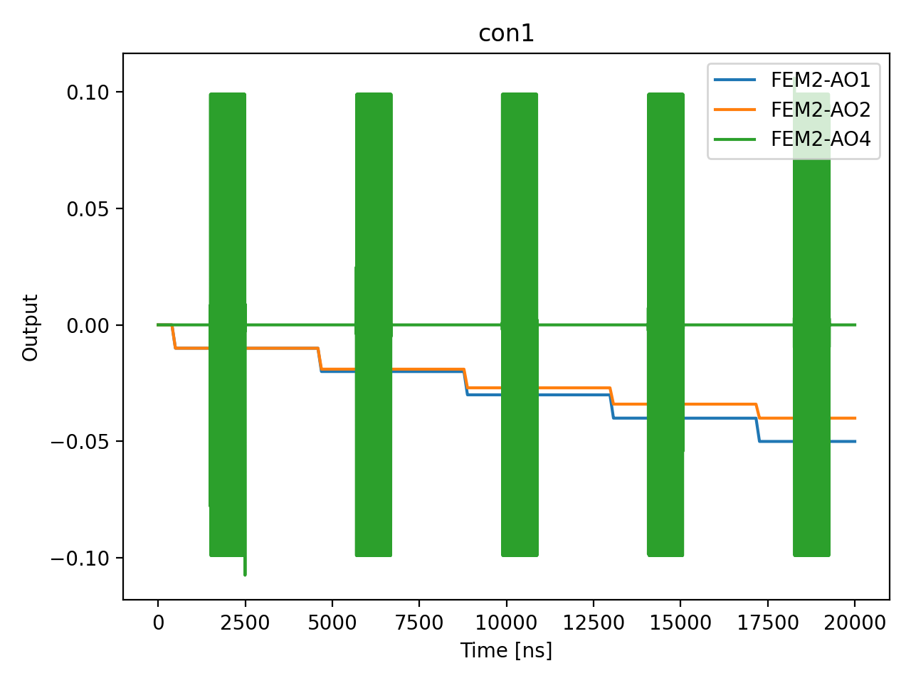

# 02_virtual_plunger_calibration

## Description

        VIRTUAL PLUNGER CALIBRATION — 2D SCAN
Performs 2D scans of a plunger gate versus other device gates (plungers or
barriers) using compensated sensor gates. For plunger-plunger scans the charge
transition line slopes are extracted to determine the virtual plunger gate
transformation that decouples the quantum dots, allowing independent chemical
potential control.

This node assumes that the sensor gate compensation has already been applied
(node 01_sensor_gate_compensation).

The scan can be performed using OPX outputs, QDAC outputs, or a combination
of the two.

Prerequisites:
    - Calibrated sensor gate compensation (node 01).
    - Calibrated IQ mixer / Octave on the readout line.
    - Calibrated time of flight, offsets and gains.
    - Calibrated resonators coupled to SensorDot components.
    - Registered QuantumDot and SensorDot elements in QUAM.
    - Configured VirtualGateSet with sensor compensation in the matrix.
    - (If using QDAC) Configured QdacSpec on each VoltageGate and VirtualDCSet.

## Parameters

| Parameter | Value | Description |
|-----------|-------|-------------|
| `dc_control` | `False` | If an associated external DC offset exists. |
| `device_gate_from_qdac` | `False` | Whether to perform the Y axis sweep using the QDAC instead of the OPX. |
| `device_gate_points` | `21` | Number of points along the device gate (Y axis) sweep. |
| `device_gate_span` | `0.02` | Total voltage span of the device gate (Y axis) sweep in volts. |
| `hold_duration` | `1000` | The dwell time on each pixel, after the ramp. |
| `load_data_id` | `None` | Optional QUAlibrate node run index for loading historical data. Default is None. |
| `model_computed_fields` | `{}` |  |
| `model_config` | `{'extra': 'forbid', 'use_attribute_docstrings': True}` |  |
| `model_extra` | `None` |  |
| `model_fields` | `{'num_shots': FieldInfo(annotation=int, required=False, default=100, description='Number of averages to perform.'), 'scan_pattern': FieldInfo(annotation=Literal['raster', 'switch_raster', 'spiral'], required=False, default='switch_raster', description='The scanning pattern.'), 'per_line_compensation': FieldInfo(annotation=bool, required=False, default=True, description='Whether to send a compensation pulse at the end of each scan line.'), 'sensor_names': FieldInfo(annotation=Union[List[str], NoneType], required=False, default=None, description='List of sensor dot names to measure.'), 'ramp_duration': FieldInfo(annotation=int, required=False, default=100, description='The ramp duration to each pixel. Set to zero for a step.'), 'hold_duration': FieldInfo(annotation=int, required=False, default=1000, description='The dwell time on each pixel, after the ramp.'), 'pre_measurement_delay': FieldInfo(annotation=int, required=False, default=0, description='Extra delay (ns) inserted after the hold duration and before measurement.'), 'post_trigger_wait_ns': FieldInfo(annotation=int, required=False, default=10000, description='A pause in the QUA programme to allow the QDAC to reach the correct level.'), 'simulate': FieldInfo(annotation=bool, required=False, default=False, description='Simulate the waveforms on the OPX instead of executing the program. Default is False.'), 'simulation_duration_ns': FieldInfo(annotation=int, required=False, default=50000, description='Duration over which the simulation will collect samples (in nanoseconds). Default is 50_000 ns.'), 'use_waveform_report': FieldInfo(annotation=bool, required=False, default=True, description='Whether to use the interactive waveform report in simulation. Default is True.'), 'timeout': FieldInfo(annotation=int, required=False, default=120, description='Waiting time for the OPX resources to become available before giving up (in seconds). Default is 120 s.'), 'load_data_id': FieldInfo(annotation=Union[int, NoneType], required=False, default=None, description='Optional QUAlibrate node run index for loading historical data. Default is None.'), 'run_in_video_mode': FieldInfo(annotation=bool, required=False, default=False, description='Optionally open Video Mode with the qualibration node.'), 'virtual_gate_set_id': FieldInfo(annotation=str, required=False, default=None, description='Name of the associated VirtualGateSet in your QPU. '), 'video_mode_port': FieldInfo(annotation=int, required=False, default=8050, description='Localhost port to open VideoMode with'), 'dc_control': FieldInfo(annotation=bool, required=False, default=False, description='If an associated external DC offset exists.'), 'plunger_device_mapping': FieldInfo(annotation=Union[Dict[str, List[str]], NoneType], required=False, default=None, description='Mapping of plunger gate -> list of device gates (plungers or barriers)\nto scan against it.  Only neighbouring pairs need to be specified.\nExample: {"virtual_dot_1": ["virtual_dot_2", "barrier_12"]}.\nIf None, must be generated from the machine (not yet implemented).'), 'plunger_gate_span': FieldInfo(annotation=float, required=False, default=0.1, description='Total voltage span of the plunger gate (X axis) sweep in volts.'), 'plunger_gate_points': FieldInfo(annotation=int, required=False, default=201, description='Number of points along the plunger gate (X axis) sweep.'), 'device_gate_span': FieldInfo(annotation=float, required=False, default=0.1, description='Total voltage span of the device gate (Y axis) sweep in volts.'), 'device_gate_points': FieldInfo(annotation=int, required=False, default=201, description='Number of points along the device gate (Y axis) sweep.'), 'plunger_gate_from_qdac': FieldInfo(annotation=bool, required=False, default=False, description='Whether to perform the X axis sweep using the QDAC instead of the OPX.'), 'device_gate_from_qdac': FieldInfo(annotation=bool, required=False, default=False, description='Whether to perform the Y axis sweep using the QDAC instead of the OPX.')}` |  |
| `model_fields_set` | `{'timeout', 'run_in_video_mode', 'plunger_gate_points', 'simulate', 'num_shots', 'device_gate_span', 'device_gate_points', 'plunger_gate_span', 'load_data_id', 'pre_measurement_delay', 'sensor_names', 'scan_pattern', 'dc_control', 'virtual_gate_set_id', 'plunger_gate_from_qdac', 'video_mode_port', 'hold_duration', 'ramp_duration', 'post_trigger_wait_ns', 'per_line_compensation', 'plunger_device_mapping', 'simulation_duration_ns', 'device_gate_from_qdac', 'use_waveform_report'}` |  |
| `num_shots` | `1` | Number of averages to perform. |
| `per_line_compensation` | `True` | Whether to send a compensation pulse at the end of each scan line. |
| `plunger_device_mapping` | `{'virtual_dot_1': ['virtual_dot_2']}` | Mapping of plunger gate -> list of device gates (plungers or barriers)
to scan against it.  Only neighbouring pairs need to be specified.
Example: {"virtual_dot_1": ["virtual_dot_2", "barrier_12"]}.
If None, must be generated from the machine (not yet implemented). |
| `plunger_gate_from_qdac` | `False` | Whether to perform the X axis sweep using the QDAC instead of the OPX. |
| `plunger_gate_points` | `21` | Number of points along the plunger gate (X axis) sweep. |
| `plunger_gate_span` | `0.02` | Total voltage span of the plunger gate (X axis) sweep in volts. |
| `post_trigger_wait_ns` | `10000` | A pause in the QUA programme to allow the QDAC to reach the correct level. |
| `pre_measurement_delay` | `0` | Extra delay (ns) inserted after the hold duration and before measurement. |
| `ramp_duration` | `100` | The ramp duration to each pixel. Set to zero for a step. |
| `run_in_video_mode` | `False` | Optionally open Video Mode with the qualibration node. |
| `scan_pattern` | `switch_raster` | The scanning pattern. |
| `sensor_names` | `None` | List of sensor dot names to measure. |
| `simulate` | `True` | Simulate the waveforms on the OPX instead of executing the program. Default is False. |
| `simulation_duration_ns` | `20000` | Duration over which the simulation will collect samples (in nanoseconds). Default is 50_000 ns. |
| `targets` | `None` |  |
| `targets_name` | `qubits` |  |
| `timeout` | `30` | Waiting time for the OPX resources to become available before giving up (in seconds). Default is 120 s. |
| `use_waveform_report` | `True` | Whether to use the interactive waveform report in simulation. Default is True. |
| `video_mode_port` | `8050` | Localhost port to open VideoMode with |
| `virtual_gate_set_id` | `main_qpu` | Name of the associated VirtualGateSet in your QPU.  |

## Simulation Output

---
*Generated by simulation test infrastructure*
