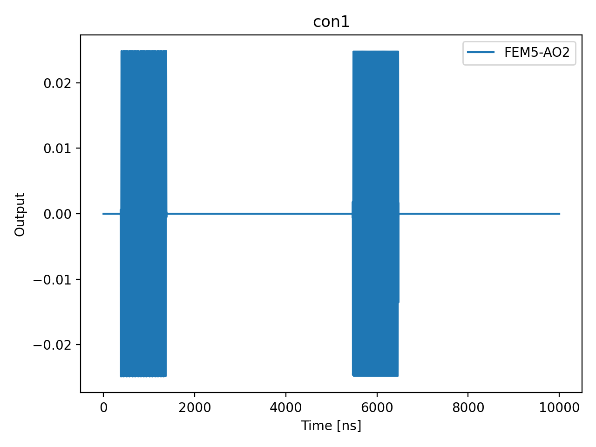

# 02a_resonator_spectroscopy

## Description

        1D RESONATOR SPECTROSCOPY
This sequence involves measuring the resonator by sending a readout pulse and demodulating the signals to extract the
'I' and 'Q' quadratures across varying readout intermediate frequencies for sensors.
The data is then post-processed to determine the resonator resonance frequency.
This frequency is used to update the readout frequency in the state.

Prerequisites:
    - If applicable, having calibrated the IQ mixer/Octave connected to the readout line (node 01a_mixer_calibration.py).
    - Having calibrated the time of flight, offsets, and gains (node 01a_time_of_flight.py).
    - Having initialized the QUAM state parameters for the readout pulse amplitude and duration.

State update:
    - The readout frequency: sensor.readout_resonator.intermediate_frequency

## Parameters

| Parameter | Value | Description |
|-----------|-------|-------------|
| `frequency_span_in_mhz` | `4` | Span of frequencies to sweep in MHz. Default is 30 MHz. |
| `frequency_step_in_mhz` | `2.0` | Step size for frequency sweep in MHz. Default is 0.1 MHz. |
| `load_data_id` | `None` | Optional QUAlibrate node run index for loading historical data. Default is None. |
| `model_computed_fields` | `{}` |  |
| `model_config` | `{'extra': 'forbid', 'use_attribute_docstrings': True}` |  |
| `model_extra` | `None` |  |
| `model_fields` | `{'num_shots': FieldInfo(annotation=int, required=False, default=100, description='Number of averages to perform. Default is 100.'), 'frequency_span_in_mhz': FieldInfo(annotation=int, required=False, default=30, description='Span of frequencies to sweep in MHz. Default is 30 MHz.'), 'frequency_step_in_mhz': FieldInfo(annotation=float, required=False, default=0.1, description='Step size for frequency sweep in MHz. Default is 0.1 MHz.'), 'sensor_names': FieldInfo(annotation=Union[List[str], NoneType], required=False, default=None, description='The list of sensor dot names to be included in the measurement. '), 'simulate': FieldInfo(annotation=bool, required=False, default=False, description='Simulate the waveforms on the OPX instead of executing the program. Default is False.'), 'simulation_duration_ns': FieldInfo(annotation=int, required=False, default=50000, description='Duration over which the simulation will collect samples (in nanoseconds). Default is 50_000 ns.'), 'use_waveform_report': FieldInfo(annotation=bool, required=False, default=True, description='Whether to use the interactive waveform report in simulation. Default is True.'), 'timeout': FieldInfo(annotation=int, required=False, default=120, description='Waiting time for the OPX resources to become available before giving up (in seconds). Default is 120 s.'), 'load_data_id': FieldInfo(annotation=Union[int, NoneType], required=False, default=None, description='Optional QUAlibrate node run index for loading historical data. Default is None.'), 'multiplexed': FieldInfo(annotation=bool, required=False, default=False, description='Whether to play control pulses, readout pulses and active/thermal reset at the same time for all qubits (True)\nor to play the experiment sequentially for each qubit (False). Default is False.'), 'use_state_discrimination': FieldInfo(annotation=bool, required=False, default=False, description="Whether to use on-the-fly state discrimination and return the qubit 'state', or simply return the demodulated\nquadratures 'I' and 'Q'. Default is False."), 'reset_wait_time': FieldInfo(annotation=int, required=False, default=5000, description='The wait time for qubit reset.')}` |  |
| `model_fields_set` | `{'use_waveform_report', 'sensor_names', 'multiplexed', 'reset_wait_time', 'simulate', 'use_state_discrimination', 'num_shots', 'frequency_step_in_mhz', 'simulation_duration_ns', 'load_data_id', 'timeout', 'frequency_span_in_mhz'}` |  |
| `multiplexed` | `False` | Whether to play control pulses, readout pulses and active/thermal reset at the same time for all qubits (True)
or to play the experiment sequentially for each qubit (False). Default is False. |
| `num_shots` | `10` | Number of averages to perform. Default is 100. |
| `reset_wait_time` | `5000` | The wait time for qubit reset. |
| `sensor_names` | `None` | The list of sensor dot names to be included in the measurement.  |
| `simulate` | `True` | Simulate the waveforms on the OPX instead of executing the program. Default is False. |
| `simulation_duration_ns` | `10000` | Duration over which the simulation will collect samples (in nanoseconds). Default is 50_000 ns. |
| `targets` | `None` |  |
| `targets_name` | `qubits` |  |
| `timeout` | `30` | Waiting time for the OPX resources to become available before giving up (in seconds). Default is 120 s. |
| `use_state_discrimination` | `False` | Whether to use on-the-fly state discrimination and return the qubit 'state', or simply return the demodulated
quadratures 'I' and 'Q'. Default is False. |
| `use_waveform_report` | `True` | Whether to use the interactive waveform report in simulation. Default is True. |

## Simulation Output

---
*Generated by simulation test infrastructure*
