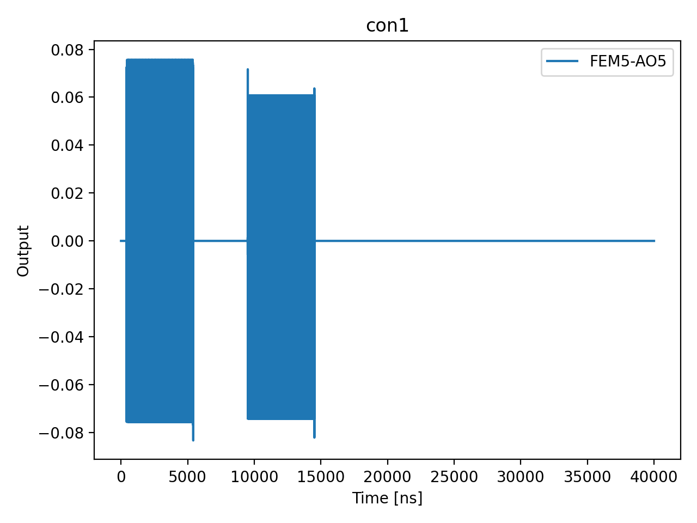

# 02a_resonator_spectroscopy

## Description

        1D RESONATOR SPECTROSCOPY
This sequence involves measuring the resonator by sending a readout pulse and demodulating the signals to extract the
'I' and 'Q' quadratures across varying readout intermediate frequencies for the sensors.
The data is then post-processed to determine the resonator resonance frequency.
This frequency is used to update the readout frequency in the state.

Prerequisites:
    - Having calibrated the time of flight, offsets, and gains (node 01a_time_of_flight.py).
    - Having initialized the QUAM state parameters for the readout pulse amplitude and duration.

Datasets:
    - ``ds_raw``: untouched I/Q fetched from the OPX (never modified after acquisition).
    - ``ds_fit``: processed sweeps plus analysis outputs (derived fields and per-sensor summary
      coordinates). Used by ``plot_data``.
    - ``fit_results``: compact per-sensor calibration dict (``FitParameters`` serialized with
      ``asdict``). Used by logging, ``node.outcomes``, and ``update_state``.

Results (``node.results["fit_results"][<sensor>]``):
    - ``success``: whether the fit passed sanity checks and the state update is applied.
    - ``resonator_frequency`` [Hz]: absolute readout frequency at the resonance dip.
    - ``frequency_shift`` [Hz]: fitted readout frequency offset from IF.
    - ``fwhm`` [Hz]: Lorentzian linewidth (full width at half maximum of the |I + iQ| dip).

Figures (``node.results["figures"]``):
    - ``"phase"``: phase vs readout frequency for each sensor.
    - ``"amplitude"``: |I + iQ| with Lorentzian fit overlay for each sensor.

State update:
    - The readout frequency: sensor.readout_resonator.intermediate_frequency

## Parameters

| Parameter | Value | Description |
|-----------|-------|-------------|
| `sensor_names` | `None` | The list of sensor dot names to be included in the measurement.  |
| `num_shots` | `1` | Number of averages to perform. Default is 100. |
| `frequency_span_in_mhz` | `4` | Span of frequencies to sweep in MHz. Default is 30 MHz. |
| `frequency_step_in_mhz` | `2.0` | Step size for frequency sweep in MHz. Default is 0.1 MHz. |
| `use_simulated_data` | `False` | Whether to generate simulated data instead of measuring via the OPX. Default False. |
| `simulate` | `True` | Simulate the waveforms on the OPX instead of executing the program. Default is False. |
| `simulation_duration_ns` | `40000` | Duration over which the simulation will collect samples (in nanoseconds). Default is 50_000 ns. |
| `use_waveform_report` | `True` | Whether to use the interactive waveform report in simulation. Default is True. |
| `timeout` | `300` | Waiting time for the OPX resources to become available before giving up (in seconds). Default is 120 s. |
| `load_data_id` | `None` | Optional QUAlibrate node run index for loading historical data. Default is None. |
| `multiplexed` | `False` | Whether to play control pulses, readout pulses and active/thermal reset at the same time for all qubits (True)
or to play the experiment sequentially for each qubit (False). Default is False. |
| `use_state_discrimination` | `False` | Whether to use on-the-fly state discrimination and return the qubit 'state', or simply return the demodulated
quadratures 'I' and 'Q'. Default is False. |
| `reset_type` | `thermal` | The qubit reset method to use. Must be implemented as a method of Quam.qubit. Can be "thermal", "active", or
"active_gef". Default is "thermal". |

## Simulation Output

---
*Generated by simulation test infrastructure*
