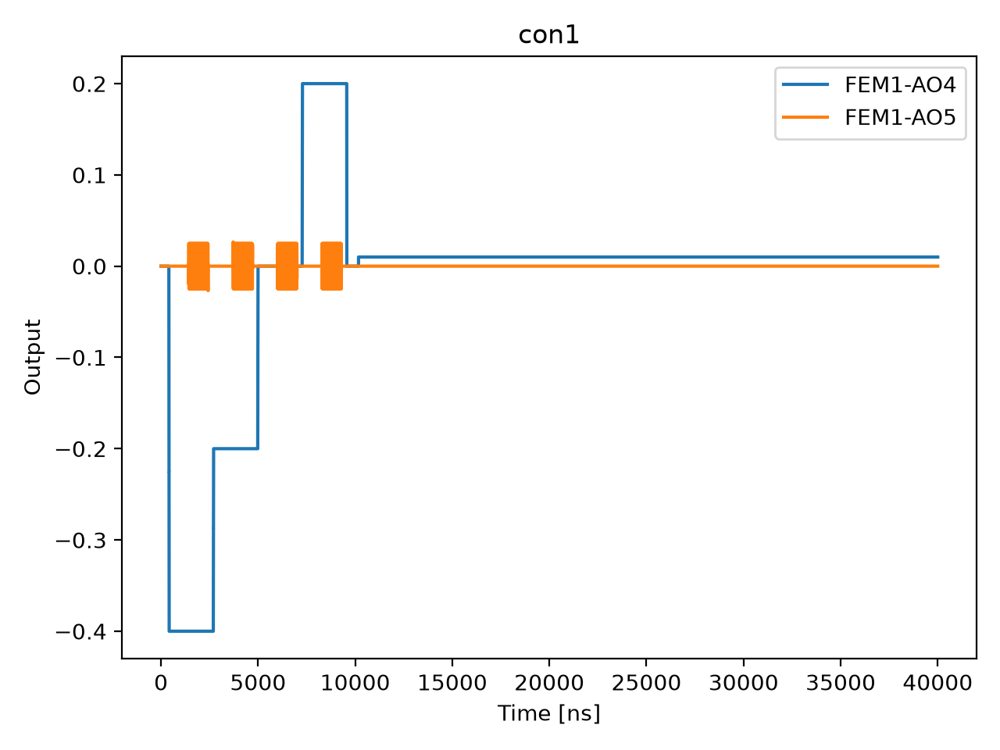

# 03a_sensor_gate_sweep_opx

## Description

        CHARGE SENSOR GATE SWEEP with the OPX
This sequence involves sweeping the voltage biasing the sensor gate using the OPX connected to the AC line of the bias-tee 
connected to the sensor gate plunger. A sticky element is used in order to maintain the voltage level and avoid fast voltage 
drops. It is recommended to use an external DAC to maintain a voltage offset, while doing fast operation with the OPX. The OPX 
measures the response of the sensor dot via RF reflectometry, recording the I and Q quadratures of the demodulated signal.

The measurement performs a voltage sweep across a specified range with configurable step size. At each voltage point,
a readout pulse is sent to the resonator coupled to the sensor dot, and the reflected signal is demodulated and recorded.
A global average is performed (averaging on the most outer loop) and the data is extracted to display the sensor dot peak.

Prerequisites:
    - Connect the AC line of the bias-tee connected to the sensor dot to one OPX channel.
    - Having initialized the Quam (quam_config/populate_quam_state_*.py).
    - Having calibrated the resonators coupled to the SensorDot components.

State update:
    - Update the optimal voltage bias of each sensor dot.

## Parameters

| Parameter | Value | Description |
|-----------|-------|-------------|
| `multiplexed` | `False` | Whether to play control pulses, readout pulses and active/thermal reset at the same time for all qubits (True)
or to play the experiment sequentially for each qubit (False). Default is False. |
| `use_state_discrimination` | `False` | Whether to use on-the-fly state discrimination and return the qubit 'state', or simply return the demodulated
quadratures 'I' and 'Q'. Default is False. |
| `reset_wait_time` | `5000` | The wait time for qubit reset. |
| `num_shots` | `1` | Number of averages to perform. Default is 100. |
| `offset_min` | `-0.4` | Minimum voltage offset for the sensor gate sweep in volts. Default is -0.2 V. |
| `offset_max` | `0.4` | Maximum voltage offset for the sensor gate sweep in volts. Default is 0.2 V. |
| `offset_step` | `0.2` | Step size for the voltage offset sweep in volts. Default is 0.005 V. |
| `duration_after_step` | `1000` | Wait duration after each voltage step in nanoseconds. Default is 1000 ns (1 µs). |
| `sensor_names` | `None` | The list of sensor dot names to be included in the measurement.  |
| `use_simulated_data` | `False` | Whether to generate simulated data instead of measuring via the OPX. Default False. |
| `peak_fit_side` | `right` | Which side to fit the max gradient on. |
| `max_compensation_voltage` | `0.01` | The maximum compensation pulse voltage. |
| `ramp_duration` | `16` | Ramp duration of each voltage point. |
| `simulate` | `True` | Simulate the waveforms on the OPX instead of executing the program. Default is False. |
| `simulation_duration_ns` | `40000` | Duration over which the simulation will collect samples (in nanoseconds). Default is 50_000 ns. |
| `use_waveform_report` | `True` | Whether to use the interactive waveform report in simulation. Default is True. |
| `timeout` | `120` | Waiting time for the OPX resources to become available before giving up (in seconds). Default is 120 s. |
| `load_data_id` | `None` | Optional QUAlibrate node run index for loading historical data. Default is None. |

## Simulation Output

---
*Generated by simulation test infrastructure*
