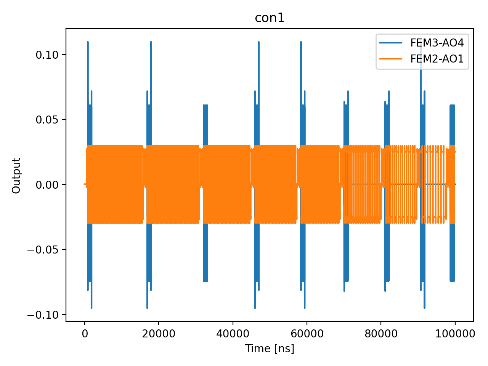

# 04b_bias_tee_filters

## Description

        BIAS TEE FILTERS CHARACTERIZATION
This measurement aims to characterize the bias tees at the device level, in order to extract the relevant digital
filter coefficients. This calibration is performed by tuning the sensor, and tuning the plunger dot gate voltage
on top of a Coulomb peak. A square wave is sent through the plunger at varying frequencies, and the response of the
sensor is measured. High-frequency square waves pass through to the device undistorted, whereas lower frequency square
waves decay with time. This manifests in the integrated signal measured by the sensor.

Prerequisites:
    - Having calibrated the resonator to the most sensitive frequency.
    - Having calibrated the relevant sensor dots.
    - Having identified a Coulomb peak on the plunger dot gate voltage.

State update:
    - The output digital filter parameters.

## Parameters

| Parameter | Value | Description |
|-----------|-------|-------------|
| `num_shots` | `100` | Number of averages to perform. Default is 100. |
| `elements` | `['virtual_dot_1']` | The element which the fast line is connected to. Can be a QuantumDot, BarrierGate or SensorDot. |
| `sensor_names` | `['virtual_sensor_1']` | The list of sensor dot names to be included in the measurement. |
| `square_wave_frequency_start_MHz` | `1.0` | The starting frequency of the square wave in MHz. |
| `square_wave_frequency_stop_MHz` | `5.0` | The ending frequency of the square wave in MHz. |
| `square_wave_frequency_step_MHz` | `0.5` | The frequency step of the square wave in MHz. |
| `square_wave_amplitude` | `0.05` | The amplitude of the square wave applied to the fast line. |
| `estimated_bias_tee_tau_ns` | `None` | Estimated bias tee time constant in ns. Used as the initial guess for the
high-pass fit and as the simulated τ when generating synthetic data.
If None, defaults to 320 ns (f_c ~ 500 kHz). |
| `use_simulated_data` | `False` | Whether to generate simulated data rather than measuring via the OPX. |
| `simulate` | `True` | Simulate the waveforms on the OPX instead of executing the program. Default is False. |
| `simulation_duration_ns` | `100000` | Duration over which the simulation will collect samples (in nanoseconds). Default is 50_000 ns. |
| `use_waveform_report` | `True` | Whether to use the interactive waveform report in simulation. Default is True. |
| `timeout` | `120` | Waiting time for the OPX resources to become available before giving up (in seconds). Default is 120 s. |
| `load_data_id` | `None` | Optional QUAlibrate node run index for loading historical data. Default is None. |
| `multiplexed` | `False` | Whether to play control pulses, readout pulses and active/thermal reset at the same time for all qubits (True)
or to play the experiment sequentially for each qubit (False). Default is False. |
| `use_state_discrimination` | `False` | Whether to use on-the-fly state discrimination and return the qubit 'state', or simply return the demodulated
quadratures 'I' and 'Q'. Default is False. |
| `reset_wait_time` | `5000` | The wait time for qubit reset. |

## Simulation Output

---
*Generated by simulation test infrastructure*
