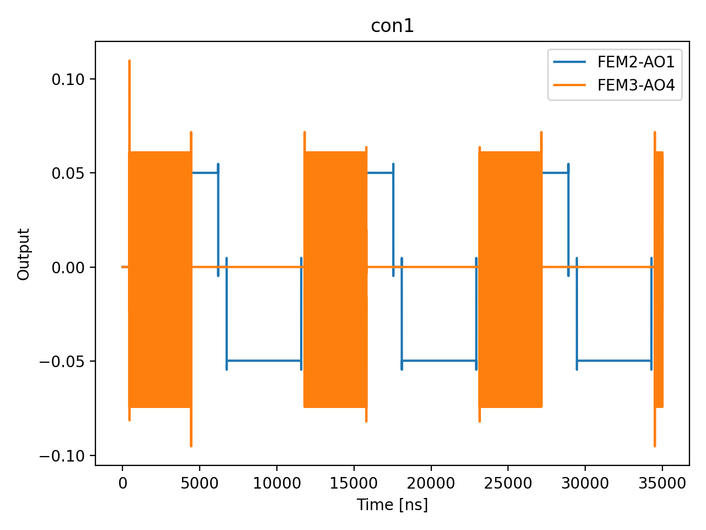

# 04c_bias_tee_filters_single_shot

## Description

        BIAS TEE FILTERS CHARACTERIZATION WITH SINGLE SHOT
This measurement aims to characterize the bias tees at the device level, in order to extract the relevant digital
filter coefficients. This calibration is performed by tuning the sensor, and tuning the plunger dot gate voltage
on top of a Coulomb peak. A single DC step pulse is sent to the plunger gate, and the sensor is measured with time.
Using a sliced demodulation, the resolution can be tuned. The resulting curve against the time after the pulse can
be fitted with an exponential.

Prerequisites:
    - Having calibrated the resonator to the most sensitive frequency.
    - Having calibrated the relevant sensor dots.
    - Having identified a Coulomb peak on the plunger dot gate voltage.

State update:
    - The output digital filter parameters.

## Parameters

| Parameter | Value | Description |
|-----------|-------|-------------|
| `num_shots` | `100` | Number of averages to perform. Default is 100. |
| `elements` | `['virtual_dot_1']` | The element which the fast line is connected to. Can be a QuantumDot, BarrierGate or SensorDot. |
| `sensor_names` | `['virtual_sensor_1']` | The list of sensor dot names to be included in the measurement. |
| `step_amplitude` | `0.05` | The step size on the element. |
| `measurement_time` | `4000` | The measurement time of the sensor. |
| `integration_time` | `100` | How much time to integrate to a single data point. Sliced demodulation will be used. |
| `estimated_bias_tee_tau_ns` | `None` | Estimated bias tee time constant in ns. Used as the initial guess for the
exponential fit and as the simulated τ when generating synthetic data.
If None, defaults to 20000 ns (20 µs). |
| `use_simulated_data` | `False` | Whether to generate simulated data rather than measuring via the OPX. |
| `simulate` | `True` | Simulate the waveforms on the OPX instead of executing the program. Default is False. |
| `simulation_duration_ns` | `35000` | Duration over which the simulation will collect samples (in nanoseconds). Default is 50_000 ns. |
| `use_waveform_report` | `True` | Whether to use the interactive waveform report in simulation. Default is True. |
| `timeout` | `120` | Waiting time for the OPX resources to become available before giving up (in seconds). Default is 120 s. |
| `load_data_id` | `None` | Optional QUAlibrate node run index for loading historical data. Default is None. |
| `multiplexed` | `False` | Whether to play control pulses, readout pulses and active/thermal reset at the same time for all qubits (True)
or to play the experiment sequentially for each qubit (False). Default is False. |
| `use_state_discrimination` | `False` | Whether to use on-the-fly state discrimination and return the qubit 'state', or simply return the demodulated
quadratures 'I' and 'Q'. Default is False. |
| `reset_wait_time` | `5000` | The wait time for qubit reset. |

## Simulation Output

---
*Generated by simulation test infrastructure*
