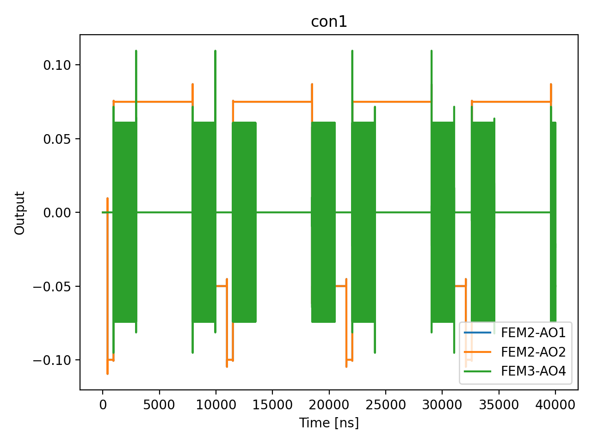

# 05c_charge_state_readout_time_optimization

## Description

        CHARGE STATE READOUT TIME OPTIMIZATION
This measurement aims to characterise the minimum integration time necessary to achieve SNR = 1 for readout. In this node,
a double-quantum-dot is ramped from charge configuration (1,1) to state (0,2), in order to characterise the charge state readout
fidelity. The aim is to characterise the integration time necessary to reach SNR = 1, for use with PSB readout. The measured IQ
blobs in the IQ state distribution map is analysed, and the SNR is extracted through the relevant axis.

Prerequisites:
    - Having calibrated the resonator to the most sensitive frequency.
    - Having calibrated the relevant sensor dots.
    - Having identified the (1,1) (operation) and (0,2) (readout) points on your charge stability diagram.

State update:
    - The integration time of the measure macro.
    - The QuantumDotPair's readout projector, rotating the IQ plane post-measurement to collapse the result
    onto a single axis to maximise the signal.
    - The QuantumDotPair's readout threshold along the projected axis.

## Parameters

| Parameter | Value | Description |
|-----------|-------|-------------|
| `num_shots` | `10` | Number of averages to perform. Default is 100. |
| `quantum_dots` | `['virtual_dot_1', 'virtual_dot_2']` | The double quantum dots to include in the measurement. |
| `integration_time_start` | `100` | Minimum integration time in nanoseconds. |
| `integration_time_stop` | `2000` | Maximum integration time in nanoseconds. |
| `integration_time_step` | `100` | Step size for the integration time sweep in nanoseconds. |
| `wait_time` | `4000` | The amount of time to ensure that any loaded spin decays to a singlet. |
| `threshold_SNR` | `10.0` | "The threshold value of the SNR to set the integration time to. |
| `use_simulated_data` | `False` | Whether to run the node and produce simulated data rather than measuring via the OPX. Default False. |
| `simulate` | `True` | Simulate the waveforms on the OPX instead of executing the program. Default is False. |
| `simulation_duration_ns` | `40000` | Duration over which the simulation will collect samples (in nanoseconds). Default is 50_000 ns. |
| `use_waveform_report` | `True` | Whether to use the interactive waveform report in simulation. Default is True. |
| `timeout` | `120` | Waiting time for the OPX resources to become available before giving up (in seconds). Default is 120 s. |
| `load_data_id` | `None` | Optional QUAlibrate node run index for loading historical data. Default is None. |
| `multiplexed` | `False` | Whether to play control pulses, readout pulses and active/thermal reset at the same time for all qubits (True)
or to play the experiment sequentially for each qubit (False). Default is False. |
| `use_state_discrimination` | `False` | Whether to use on-the-fly state discrimination and return the qubit 'state', or simply return the demodulated
quadratures 'I' and 'Q'. Default is False. |
| `reset_wait_time` | `5000` | The wait time for qubit reset. |

## Simulation Output

---
*Generated by simulation test infrastructure*
