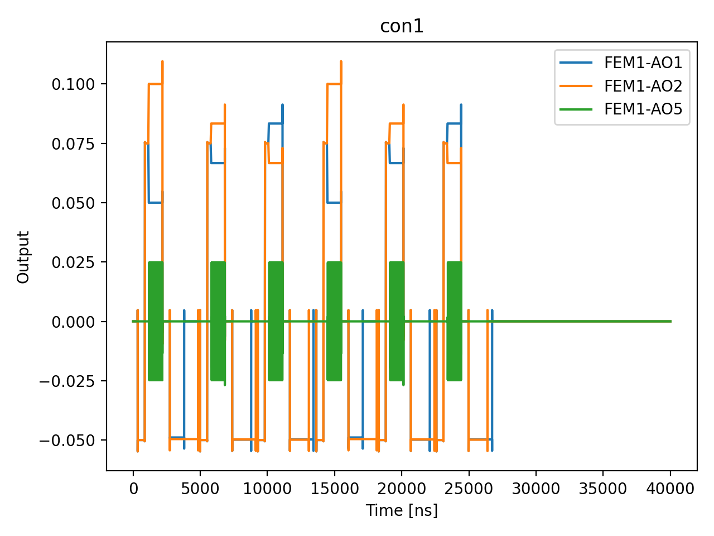

# 06a_PSB_search_opx_sweep_detuning

## Description

        PAULI SPIN BLOCKADE SEARCH - Sweep Detuning
The goal of this sequence is to find the Pauli Spin Blockade (PSB) region.
To do so, the following triangle in voltage space (empty - random initialization - measurement) is applied using OPX
channels on the fast lines of the bias-tees while sweeping the "measure" voltage point along the detuning axis.

The OPX measures the response via RF reflectometry or DC current sensing during the readout window
(last segment of the triangle). A single-point averaging is performed and the data is extracted while
the program is running to display the results.

Depending on the cut-off frequency of the bias-tee, it may be necessary to adjust the barycenter (voltage offset) of each
triangle so that the fast line of the bias-tees sees zero voltage on average. Otherwise, the high-pass filtering effect
of the bias-tee will distort the fast pulses over time, unless a compensation pulse is played.

Prerequisites:
    - Having initialized the Quam (quam_config/populate_quam_state_*.py).
    - Having calibrated the resonators coupled to the SensorDot components.
    - Having calibrated the "empty" and "initialization" voltage points, and having defined the detuning axis.

State update:
    - The optimal detuning value for PSB readout, as the voltage point associated with the .measure macro.

## Parameters

| Parameter | Value | Description |
|-----------|-------|-------------|
| `buffer_duration` | `16` | Buffer duration at the measurement point before readout pulse. |
| `detuning_max` | `0.05` | Maximum detuning value for the sweep in volts. Default is 0.1 V. |
| `detuning_min` | `-0.05` | Minimum detuning value for the sweep in volts. Default is -0.1 V. |
| `detuning_points` | `3` | Number of detuning points to sweep. Default is 21. |
| `labeled_states` | `False` | Whether ds_raw contains labelled S/T preparations (Ig,Qg,Ie,Qe) or a
single mixed-state acquisition (I,Q). PSB search uses random loading, so
defaults to False. Set True only if you explicitly prepare S and T. |
| `load_data_id` | `None` | Optional QUAlibrate node run index for loading historical data. Default is None. |
| `model_computed_fields` | `{}` |  |
| `model_config` | `{'extra': 'forbid', 'use_attribute_docstrings': True}` |  |
| `model_extra` | `None` |  |
| `model_fields` | `{'multiplexed': FieldInfo(annotation=bool, required=False, default=False, description='Whether to play control pulses, readout pulses and active/thermal reset at the same time for all qubits (True)\nor to play the experiment sequentially for each qubit (False). Default is False.'), 'use_state_discrimination': FieldInfo(annotation=bool, required=False, default=False, description="Whether to use on-the-fly state discrimination and return the qubit 'state', or simply return the demodulated\nquadratures 'I' and 'Q'. Default is False."), 'reset_wait_time': FieldInfo(annotation=int, required=False, default=5000, description='The wait time for qubit reset.'), 'qubit_pairs': FieldInfo(annotation=Union[List[str], NoneType], required=False, default=None, description='A list of qubit pair names which should participate in the execution of the node. Default is None.'), 'num_shots': FieldInfo(annotation=int, required=False, default=100, description='Number of shots to acquire per detuning point. Default is 100.'), 'detuning_min': FieldInfo(annotation=float, required=False, default=-0.1, description='Minimum detuning value for the sweep in volts. Default is -0.1 V.'), 'detuning_max': FieldInfo(annotation=float, required=False, default=0.1, description='Maximum detuning value for the sweep in volts. Default is 0.1 V.'), 'detuning_points': FieldInfo(annotation=int, required=False, default=21, description='Number of detuning points to sweep. Default is 21.'), 'ramp_duration': FieldInfo(annotation=int, required=False, default=40, description='Ramp duration to ramp to the measurement point.'), 'buffer_duration': FieldInfo(annotation=int, required=False, default=16, description='Buffer duration at the measurement point before readout pulse.'), 'operation': FieldInfo(annotation=Literal['readout', 'readout_QND'], required=False, default='readout', description='Type of resonator operation whose readout parameters are optimised. Default "readout".'), 'sweep_name': FieldInfo(annotation=str, required=False, default='detuning', description='Name of the swept coordinate in ds_raw (fixed to "detuning" here but kept\nexplicit so iq_sweep analysis remains generic).'), 'optimization_metric': FieldInfo(annotation=Literal['fidelity', 'visibility'], required=False, default='fidelity', description='Metric used to pick the optimal detuning for state updates.\nBoth fidelity and visibility optima are recorded regardless of this choice.'), 'labeled_states': FieldInfo(annotation=bool, required=False, default=False, description='Whether ds_raw contains labelled S/T preparations (Ig,Qg,Ie,Qe) or a\nsingle mixed-state acquisition (I,Q). PSB search uses random loading, so\ndefaults to False. Set True only if you explicitly prepare S and T.'), 'simulate': FieldInfo(annotation=bool, required=False, default=False, description='Simulate the waveforms on the OPX instead of executing the program. Default is False.'), 'simulation_duration_ns': FieldInfo(annotation=int, required=False, default=50000, description='Duration over which the simulation will collect samples (in nanoseconds). Default is 50_000 ns.'), 'use_waveform_report': FieldInfo(annotation=bool, required=False, default=True, description='Whether to use the interactive waveform report in simulation. Default is True.'), 'timeout': FieldInfo(annotation=int, required=False, default=120, description='Waiting time for the OPX resources to become available before giving up (in seconds). Default is 120 s.'), 'load_data_id': FieldInfo(annotation=Union[int, NoneType], required=False, default=None, description='Optional QUAlibrate node run index for loading historical data. Default is None.')}` |  |
| `model_fields_set` | `{'buffer_duration', 'detuning_max', 'detuning_points', 'simulation_duration_ns', 'num_shots', 'detuning_min', 'qubit_pairs', 'sweep_name', 'reset_wait_time', 'timeout', 'optimization_metric', 'use_waveform_report', 'labeled_states', 'multiplexed', 'ramp_duration', 'use_state_discrimination', 'simulate', 'operation', 'load_data_id'}` |  |
| `multiplexed` | `False` | Whether to play control pulses, readout pulses and active/thermal reset at the same time for all qubits (True)
or to play the experiment sequentially for each qubit (False). Default is False. |
| `num_shots` | `2` | Number of shots to acquire per detuning point. Default is 100. |
| `operation` | `readout` | Type of resonator operation whose readout parameters are optimised. Default "readout". |
| `optimization_metric` | `fidelity` | Metric used to pick the optimal detuning for state updates.
Both fidelity and visibility optima are recorded regardless of this choice. |
| `qubit_pairs` | `['q1_q2']` | A list of qubit pair names which should participate in the execution of the node. Default is None. |
| `ramp_duration` | `40` | Ramp duration to ramp to the measurement point. |
| `reset_wait_time` | `5000` | The wait time for qubit reset. |
| `simulate` | `True` | Simulate the waveforms on the OPX instead of executing the program. Default is False. |
| `simulation_duration_ns` | `40000` | Duration over which the simulation will collect samples (in nanoseconds). Default is 50_000 ns. |
| `sweep_name` | `detuning` | Name of the swept coordinate in ds_raw (fixed to "detuning" here but kept
explicit so iq_sweep analysis remains generic). |
| `targets` | `None` |  |
| `targets_name` | `qubits` |  |
| `timeout` | `120` | Waiting time for the OPX resources to become available before giving up (in seconds). Default is 120 s. |
| `use_state_discrimination` | `False` | Whether to use on-the-fly state discrimination and return the qubit 'state', or simply return the demodulated
quadratures 'I' and 'Q'. Default is False. |
| `use_waveform_report` | `True` | Whether to use the interactive waveform report in simulation. Default is True. |

## Simulation Output

---
*Generated by simulation test infrastructure*
