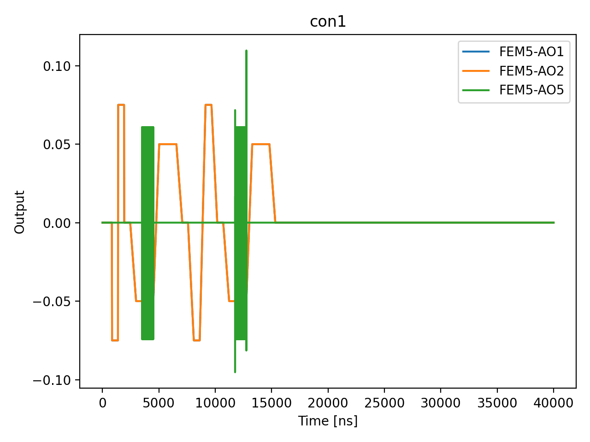

# 07_init_ramp_rate_calibration

## Description

        INITIALISATION RAMP RATE CALIBRATION
This sequence calibrates the ramp duration of the initialisation macro by sweeping the ramp rate
and measuring how mixed the resultant state is.

For each ramp duration the sequence empties the dots, initialises with the given ramp duration,
then performs a state measurement using the balanced measurement macro.  The boolean state
assignment (0 or 1) is averaged over many shots to produce the mean state occupation for each
ramp duration.

The analysis identifies the ramp duration that yields the minimum (or maximum, controlled by the
``find_minimum`` parameter) average state assignment, corresponding to the purest initialisation.

Prerequisites:
    - Having initialised the Quam.
    - Having calibrated the PSB measurement point (06a-06c).
    - Having the balanced measurement macro configured with a valid threshold.

State update:
    - The initialisation macro ``ramp_duration`` on each qubit pair.

## Parameters

| Parameter | Value | Description |
|-----------|-------|-------------|
| `multiplexed` | `False` | Whether to play control pulses, readout pulses and active/thermal reset at the same time for all qubits (True)
or to play the experiment sequentially for each qubit (False). Default is False. |
| `use_state_discrimination` | `False` | Whether to use on-the-fly state discrimination and return the qubit 'state', or simply return the demodulated
quadratures 'I' and 'Q'. Default is False. |
| `reset_wait_time` | `5000` | The wait time for qubit reset. |
| `qubit_pairs` | `['q1_q2']` | A list of qubit pair names which should participate in the execution of the node. Default is None. |
| `num_shots` | `1` | Number of shots per ramp-duration point. Default is 100. |
| `ramp_duration_min` | `16` | Minimum ramp duration in ns (must be multiple of 4). Default is 16. |
| `ramp_duration_max` | `1000` | Maximum ramp duration in ns (must be multiple of 4). Default is 2000. |
| `ramp_duration_step` | `500` | Ramp duration step in ns (must be multiple of 4). Default is 4. |
| `find_minimum` | `True` | If True, find the ramp duration yielding the minimum average state
(purest ground-state preparation). If False, find the maximum. Default is True. |
| `simulate` | `True` | Simulate the waveforms on the OPX instead of executing the program. Default is False. |
| `simulation_duration_ns` | `40000` | Duration over which the simulation will collect samples (in nanoseconds). Default is 50_000 ns. |
| `use_waveform_report` | `True` | Whether to use the interactive waveform report in simulation. Default is True. |
| `timeout` | `300` | Waiting time for the OPX resources to become available before giving up (in seconds). Default is 120 s. |
| `load_data_id` | `None` | Optional QUAlibrate node run index for loading historical data. Default is None. |

## Simulation Output

---
*Generated by simulation test infrastructure*

## Area Under Curve (Mean Voltage per Channel)

| Controller | Port | Mean Voltage (V) |
|------------|------|------------------|
| con1 | 5-1 | -8.592494e-07 |
| con1 | 5-2 | -8.592494e-07 |
| con1 | 5-3 | 0.000000e+00 |
| con1 | 5-4 | 0.000000e+00 |
| con1 | 5-5 | -2.861053e-17 |
