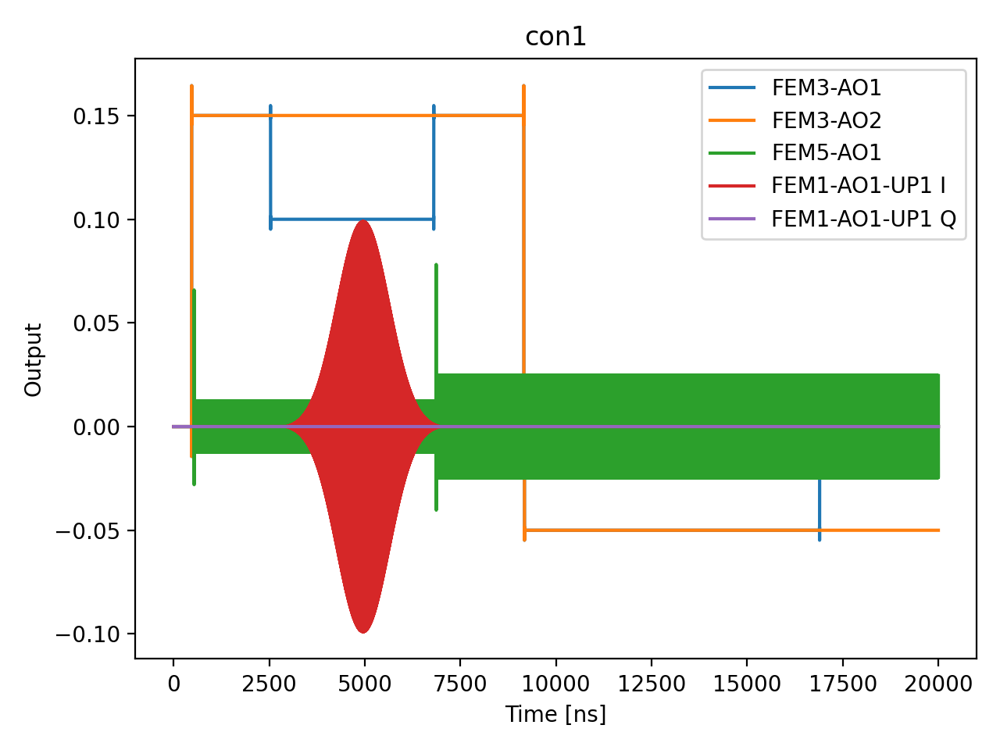

# 08a_power_rabi

## Description

        POWER RABI
This sequence involves parking the qubit at the manipulation bias point, playing the qubit pulse (such as x180) and
measuring the state of the resonator across different qubit pulse amplitudes, exhibit Rabi oscillations.
The results are then analyzed to determine the qubit pulse amplitude suitable for the selected gate duration.

Prerequisites:
    - Having calibrated the relevant voltage points.
    - Having calibrated the qubit frequency.
    - Having set the qubit gate duration.

State update:
    - The qubit pulse amplitude corresponding to the specified operation (x180, x90...).

## Parameters

| Parameter | Value | Description |
|-----------|-------|-------------|
| `amp_factor_step` | `0.5` | Step size for the amplitude factor. Default is 0.005. |
| `gap_wait_time_in_ns` | `16` | Wait time between initialization and qubit pulse in nanoseconds. Default is 128 ns. |
| `load_data_id` | `None` | Optional QUAlibrate node run index for loading historical data. Default is None. |
| `max_amp_factor` | `1.99` | Maximum amplitude factor for the operation. Default is 1.99. |
| `min_amp_factor` | `1.0` | Minimum amplitude factor for the operation. Default is 0.001. |
| `model_computed_fields` | `{}` |  |
| `model_config` | `{'extra': 'forbid', 'use_attribute_docstrings': True}` |  |
| `model_extra` | `None` |  |
| `model_fields` | `{'multiplexed': FieldInfo(annotation=bool, required=False, default=False, description='Whether to play control pulses, readout pulses and active/thermal reset at the same time for all qubits (True)\nor to play the experiment sequentially for each qubit (False). Default is False.'), 'use_state_discrimination': FieldInfo(annotation=bool, required=False, default=False, description="Whether to use on-the-fly state discrimination and return the qubit 'state', or simply return the demodulated\nquadratures 'I' and 'Q'. Default is False."), 'reset_type': FieldInfo(annotation=Literal['thermal', 'active', 'active_gef'], required=False, default='thermal', description='The qubit reset method to use. Must be implemented as a method of Quam.qubit. Can be "thermal", "active", or\n"active_gef". Default is "thermal".'), 'qubits': FieldInfo(annotation=Union[List[str], NoneType], required=False, default=None, description='A list of qubit names which should participate in the execution of the node. Default is None.'), 'num_shots': FieldInfo(annotation=int, required=False, default=100, description='Number of averages to perform. Default is 100.'), 'min_amp_factor': FieldInfo(annotation=float, required=False, default=0.001, description='Minimum amplitude factor for the operation. Default is 0.001.'), 'max_amp_factor': FieldInfo(annotation=float, required=False, default=1.99, description='Maximum amplitude factor for the operation. Default is 1.99.'), 'amp_factor_step': FieldInfo(annotation=float, required=False, default=0.005, description='Step size for the amplitude factor. Default is 0.005.'), 'gap_wait_time_in_ns': FieldInfo(annotation=int, required=False, default=128, description='Wait time between initialization and qubit pulse in nanoseconds. Default is 128 ns.'), 'operation': FieldInfo(annotation=Literal['x180', 'x90', '-x90', 'y90', '-y90'], required=False, default='x180', description='Type of operation to perform. Default is "x180".'), 'update_x90': FieldInfo(annotation=bool, required=False, default=True, description='Flag to update the x90 pulse amplitude after calibrating x180. Default is True.'), 'simulate': FieldInfo(annotation=bool, required=False, default=False, description='Simulate the waveforms on the OPX instead of executing the program. Default is False.'), 'simulation_duration_ns': FieldInfo(annotation=int, required=False, default=50000, description='Duration over which the simulation will collect samples (in nanoseconds). Default is 50_000 ns.'), 'use_waveform_report': FieldInfo(annotation=bool, required=False, default=True, description='Whether to use the interactive waveform report in simulation. Default is True.'), 'timeout': FieldInfo(annotation=int, required=False, default=120, description='Waiting time for the OPX resources to become available before giving up (in seconds). Default is 120 s.'), 'load_data_id': FieldInfo(annotation=Union[int, NoneType], required=False, default=None, description='Optional QUAlibrate node run index for loading historical data. Default is None.')}` |  |
| `model_fields_set` | `{'amp_factor_step', 'gap_wait_time_in_ns', 'simulation_duration_ns', 'use_waveform_report', 'min_amp_factor', 'max_amp_factor', 'simulate', 'multiplexed', 'num_shots', 'update_x90', 'use_state_discrimination', 'operation', 'reset_type', 'load_data_id', 'qubits', 'timeout'}` |  |
| `multiplexed` | `False` | Whether to play control pulses, readout pulses and active/thermal reset at the same time for all qubits (True)
or to play the experiment sequentially for each qubit (False). Default is False. |
| `num_shots` | `10` | Number of averages to perform. Default is 100. |
| `operation` | `x180` | Type of operation to perform. Default is "x180". |
| `qubits` | `None` | A list of qubit names which should participate in the execution of the node. Default is None. |
| `reset_type` | `thermal` | The qubit reset method to use. Must be implemented as a method of Quam.qubit. Can be "thermal", "active", or
"active_gef". Default is "thermal". |
| `simulate` | `True` | Simulate the waveforms on the OPX instead of executing the program. Default is False. |
| `simulation_duration_ns` | `20000` | Duration over which the simulation will collect samples (in nanoseconds). Default is 50_000 ns. |
| `targets` | `None` |  |
| `targets_name` | `qubits` |  |
| `timeout` | `30` | Waiting time for the OPX resources to become available before giving up (in seconds). Default is 120 s. |
| `update_x90` | `True` | Flag to update the x90 pulse amplitude after calibrating x180. Default is True. |
| `use_state_discrimination` | `False` | Whether to use on-the-fly state discrimination and return the qubit 'state', or simply return the demodulated
quadratures 'I' and 'Q'. Default is False. |
| `use_waveform_report` | `True` | Whether to use the interactive waveform report in simulation. Default is True. |

## Simulation Output

---
*Generated by simulation test infrastructure*
