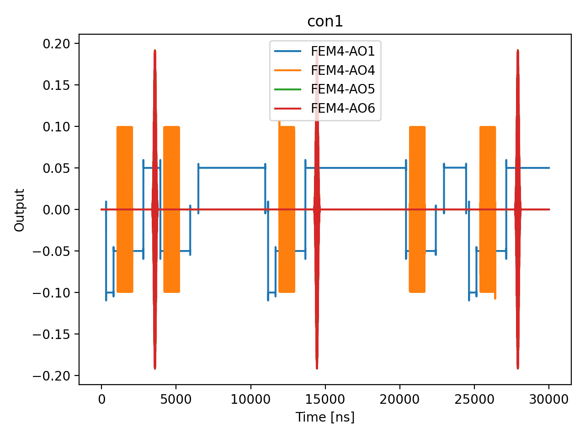

# 10_T1_parity_diff

## Description

        T1 RELAXATION TIME MEASUREMENT - using standard QUA (pulse > 16ns and 4ns granularity)
The goal of this script is to measure the longitudinal (spin-lattice) relaxation time T1 of the qubit.
T1 characterizes how quickly an excited qubit state decays back to the ground state (thermal equilibrium of ensemble) due to energy exchange
with the environment. This sets the fundamental upper limit for qubit coherence and readout fidelity.

The QUA program is divided into three sections:
    1) step between the initialization point and the operation point using sticky elements (long timescale).
    2) apply a pi pulse to excite the qubit, then wait for a variable idle time (short timescale).
    3) measure the state of the qubit using RF reflectometry via parity readout.

The measurement sequence is:
    - Initialize qubit to ground state (with optional conditional pi pulse for active reset).
    - Apply a pi pulse to flip the spin to the excited state.
    - Wait for variable delay time tau.
    - Measure the qubit state via parity readout.

The excited state population decays exponentially as P(t) = exp(-t/T1), and fitting this decay curve
yields the T1 relaxation time. Longer T1 times indicate better isolation from environmental noise sources
such as phonons, charge noise, and Johnson noise from the measurement circuit.

Prerequisites:
    - Readout calibration (resonance frequency for RF reflectometry and sensor operating point).
    - Setting the DC offsets of the external DC voltage source.
    - Connecting the OPX to the fast line of the plunger gates.
    - Having calibrated the initialization and readout point from the charge stability map.
    - Having calibrated the pi pulse parameters (amplitude and duration) from Rabi measurements.

Before proceeding to the next node:
    - Extract T1 from exponential fit of the decay curve.
    - Verify T1 is sufficiently long for intended gate sequences.

State updates:
    - T1 for each qubit

## Parameters

| Parameter | Value | Description |
|-----------|-------|-------------|
| `gap_wait_time_in_ns` | `1024` | Wait time between initialization and X180 pulse in nanoseconds. Default is 128 ns. |
| `load_data_id` | `None` | Optional QUAlibrate node run index for loading historical data. Default is None. |
| `model_computed_fields` | `{}` |  |
| `model_config` | `{'extra': 'forbid', 'use_attribute_docstrings': True}` |  |
| `model_extra` | `None` |  |
| `model_fields` | `{'multiplexed': FieldInfo(annotation=bool, required=False, default=False, description='Whether to play control pulses, readout pulses and active/thermal reset at the same time for all qubits (True)\nor to play the experiment sequentially for each qubit (False). Default is False.'), 'use_state_discrimination': FieldInfo(annotation=bool, required=False, default=False, description="Whether to use on-the-fly state discrimination and return the qubit 'state', or simply return the demodulated\nquadratures 'I' and 'Q'. Default is False."), 'reset_wait_time': FieldInfo(annotation=int, required=False, default=5000, description='The wait time for qubit reset.'), 'sensor_names': FieldInfo(annotation=Union[List[str], NoneType], required=False, default=None, description='The list of sensor dot names to be included in the measurement. '), 'qubits': FieldInfo(annotation=Union[List[str], NoneType], required=False, default=None, description='A list of qubit names which should participate in the execution of the node. Default is None.'), 'num_shots': FieldInfo(annotation=int, required=False, default=100, description='Number of averages to perform. Default is 100.'), 'tau_min': FieldInfo(annotation=int, required=False, default=16, description='Minimum pulse duration in nanoseconds. Must be larger than 4 clock cycles. Default is 16 ns.'), 'tau_max': FieldInfo(annotation=int, required=False, default=10000, description='Maximum pulse duration in nanoseconds. Default is 100000 ns (10 µs).'), 'tau_step': FieldInfo(annotation=int, required=False, default=16, description='Step size for the pulse duration sweep in nanoseconds. Default is 16 ns.'), 'gap_wait_time_in_ns': FieldInfo(annotation=int, required=False, default=128, description='Wait time between initialization and X180 pulse in nanoseconds. Default is 128 ns.'), 'operation': FieldInfo(annotation=str, required=False, default='x180', description="Name of the qubit operation to perform. Default is 'x180'."), 'simulate': FieldInfo(annotation=bool, required=False, default=False, description='Simulate the waveforms on the OPX instead of executing the program. Default is False.'), 'simulation_duration_ns': FieldInfo(annotation=int, required=False, default=50000, description='Duration over which the simulation will collect samples (in nanoseconds). Default is 50_000 ns.'), 'use_waveform_report': FieldInfo(annotation=bool, required=False, default=True, description='Whether to use the interactive waveform report in simulation. Default is True.'), 'timeout': FieldInfo(annotation=int, required=False, default=120, description='Waiting time for the OPX resources to become available before giving up (in seconds). Default is 120 s.'), 'load_data_id': FieldInfo(annotation=Union[int, NoneType], required=False, default=None, description='Optional QUAlibrate node run index for loading historical data. Default is None.')}` |  |
| `model_fields_set` | `{'tau_step', 'qubits', 'use_waveform_report', 'simulation_duration_ns', 'sensor_names', 'simulate', 'gap_wait_time_in_ns', 'load_data_id', 'use_state_discrimination', 'num_shots', 'tau_max', 'timeout', 'operation', 'tau_min', 'reset_wait_time', 'multiplexed'}` |  |
| `multiplexed` | `False` | Whether to play control pulses, readout pulses and active/thermal reset at the same time for all qubits (True)
or to play the experiment sequentially for each qubit (False). Default is False. |
| `num_shots` | `10` | Number of averages to perform. Default is 100. |
| `operation` | `x180` | Name of the qubit operation to perform. Default is 'x180'. |
| `qubits` | `None` | A list of qubit names which should participate in the execution of the node. Default is None. |
| `reset_wait_time` | `5000` | The wait time for qubit reset. |
| `sensor_names` | `None` | The list of sensor dot names to be included in the measurement.  |
| `simulate` | `True` | Simulate the waveforms on the OPX instead of executing the program. Default is False. |
| `simulation_duration_ns` | `20000` | Duration over which the simulation will collect samples (in nanoseconds). Default is 50_000 ns. |
| `targets` | `None` |  |
| `targets_name` | `qubits` |  |
| `tau_max` | `10000` | Maximum pulse duration in nanoseconds. Default is 100000 ns (10 µs). |
| `tau_min` | `500` | Minimum pulse duration in nanoseconds. Must be larger than 4 clock cycles. Default is 16 ns. |
| `tau_step` | `500` | Step size for the pulse duration sweep in nanoseconds. Default is 16 ns. |
| `timeout` | `30` | Waiting time for the OPX resources to become available before giving up (in seconds). Default is 120 s. |
| `use_state_discrimination` | `False` | Whether to use on-the-fly state discrimination and return the qubit 'state', or simply return the demodulated
quadratures 'I' and 'Q'. Default is False. |
| `use_waveform_report` | `True` | Whether to use the interactive waveform report in simulation. Default is True. |

## Simulation Output

---
*Generated by simulation test infrastructure*
