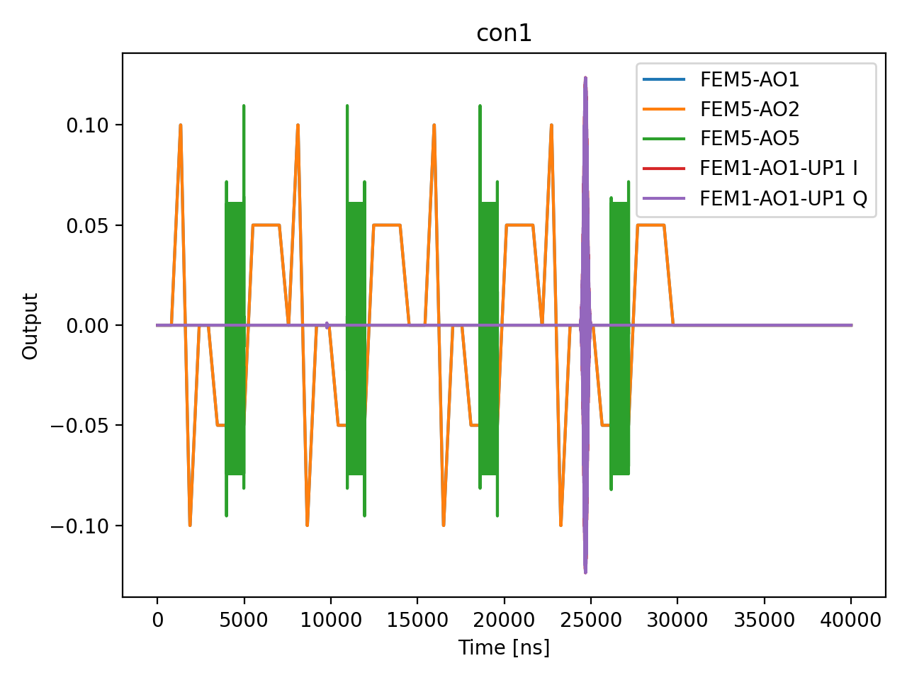

# 10a_time_rabi

## Description

        TIME RABI PARITY DIFFERENCE
This sequence performs a time Rabi measurement with parity difference to characterize qubit coherence and
coupling. The measurement involves sweeping the duration of a qubit control pulse (typically an X180 pulse)
while measuring the parity state before and after the pulse using charge sensing via RF reflectometry or DC
current sensing.

The sequence uses voltage gate sequences to navigate through a triangle in voltage space (empty -
initialization - measurement) using OPX channels on the fast lines of the bias-tees. At each pulse duration,
the parity is measured before (P1) and after (P2) the qubit pulse, and the parity difference (P_diff) is
calculated. When P1 == P2, P_diff = 0; otherwise P_diff = 1.

The parity difference signal reveals Rabi oscillations as a function of pulse duration, which can be used
to extract the qubit coupling strength, coherence time, and optimal pulse parameters.

Prerequisites:
    - Having calibrated the resonators coupled to the SensorDot components.
    - Having calibrated the voltage points (empty - initialization - measurement).
    - Qubit pulse calibration (X180 pulse amplitude and frequency).

State update:
    - The qubit x180 operation duration.

## Parameters

| Parameter | Value | Description |
|-----------|-------|-------------|
| `analysis_signal` | `E_p2_given_p1_0` | Which conditional expectation to use for fitting.
E_p2_given_p1_0: P(second=1 | first=0) — post-select on empty dot.
E_p2_given_p1_1: P(second=1 | first=1) — post-select on loaded dot. |
| `multiplexed` | `False` | Whether to play control pulses, readout pulses and active/thermal reset at the same time for all qubits (True)
or to play the experiment sequentially for each qubit (False). Default is False. |
| `use_state_discrimination` | `False` | Whether to use on-the-fly state discrimination and return the qubit 'state', or simply return the demodulated
quadratures 'I' and 'Q'. Default is False. |
| `reset_wait_time` | `5000` | The wait time for qubit reset. |
| `qubits` | `['q1']` | A list of qubit names which should participate in the execution of the node. Default is None. |
| `num_shots` | `1` | Number of averages to perform. Default is 100. |
| `min_wait_time_in_ns` | `16` | Minimum pulse duration in nanoseconds. Must be larger than 4 clock cycles. Default is 16 ns. |
| `max_wait_time_in_ns` | `1024` | Maximum pulse duration in nanoseconds. Default is 10000 ns (10 us). |
| `time_step_in_ns` | `600` | Step size for the pulse duration sweep in nanoseconds. Default is 52 ns. |
| `operation` | `x180` | Name of the qubit operation to perform. Default is 'x180'. |
| `simulate` | `True` | Simulate the waveforms on the OPX instead of executing the program. Default is False. |
| `simulation_duration_ns` | `40000` | Duration over which the simulation will collect samples (in nanoseconds). Default is 50_000 ns. |
| `use_waveform_report` | `True` | Whether to use the interactive waveform report in simulation. Default is True. |
| `timeout` | `300` | Waiting time for the OPX resources to become available before giving up (in seconds). Default is 120 s. |
| `load_data_id` | `None` | Optional QUAlibrate node run index for loading historical data. Default is None. |

## Simulation Output

---
*Generated by simulation test infrastructure*

## Area Under Curve (Mean Voltage per Channel)

| Controller | Port | Mean Voltage (V) |
|------------|------|------------------|
| con1 | 1-1-1 | -1.814318e-08 |
| con1 | 5-1 | -5.128919e-06 |
| con1 | 5-2 | -5.128919e-06 |
| con1 | 5-3 | 0.000000e+00 |
| con1 | 5-4 | 0.000000e+00 |
| con1 | 5-5 | 2.838063e-16 |
