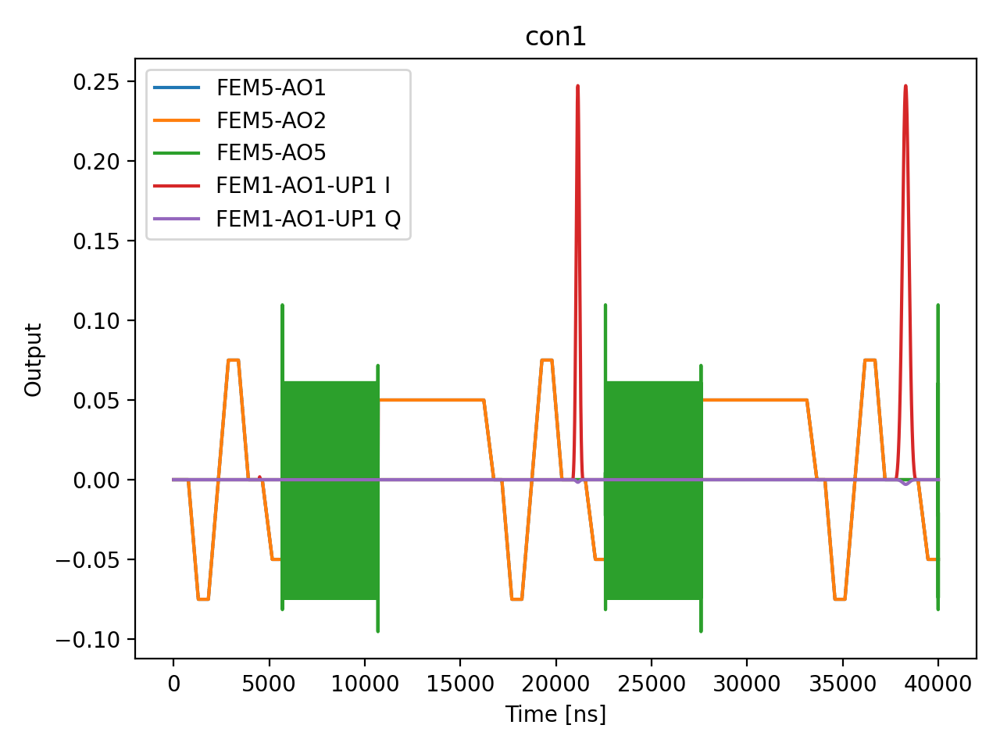

# 10a_time_rabi

## Description

        TIME RABI
After heralded initialization to the target spin state, this sequence optionally records a pre-measurement
outcome (when ``parity_measurement`` is True), applies an XY drive pulse whose duration is swept, and
measures the dot again afterward. Each shot contributes to joint-outcome streams (e.g. ``p0_p0``, ``p1_p0``,
``p0_p1``, ``p1_p1``) that are averaged on the OPX and fetched as ``ds_raw``.

In ``analyse_data``, those streams are converted to conditional expectations. By default the analysis signal is
``E_p1_given_p0_0`` (spin-up probability given the dot was empty before the manipulation window). Rabi
oscillations in that signal versus pulse duration are fitted to extract the π-pulse duration. The node does not form a parity-difference (XOR) scalar from the two measurements.

Prerequisites:
    - Having calibrated the resonators coupled to the sensor dots.
    - Having calibrated the voltage points (empty, initialization, measurement).
    - Having a rough qubit XY drive calibration (frequency and amplitude).

Datasets:
    - ``ds_raw``: untouched joint-outcome streams fetched from the OPX (never modified after acquisition).
    - ``ds_fit``: processed sweeps plus analysis outputs (conditional expectations and fitted traces). Used by
      ``plot_data``.
    - ``fit_results``: compact per-qubit calibration dict (``FitParameters`` serialized with ``asdict``). Used by
      logging, ``node.outcomes``, and ``update_state``.

Results (``node.results["fit_results"][qubit]``):
    - ``success``: whether the fit passed sanity checks and the state update is applied.
    - ``optimal_duration`` [ns]: π-pulse duration extracted from the Rabi oscillation.
    - ``rabi_frequency`` [rad / ns]: fitted Rabi frequency in the time domain.
    - ``decay_rate`` [1 / ns]: fitted decay rate of the Rabi envelope (γ ≈ 1/T₂*).

The default ``analysis_signal`` is ``E_p1_given_p0_0``; set ``E_p1_given_p0_1`` to post-select on a loaded dot.

Figures (``node.results["figures"]``):
    - ``"rabi"``: conditional expectation vs pulse duration with damped-sinusoid fit overlay.
    - ``"fft"``: FFT magnitude spectrum with peak fit per qubit.

State update:
    - The pulse duration of the selected operation (``node.parameters.operation``).

## Parameters

| Parameter | Value | Description |
|-----------|-------|-------------|
| `analysis_signal` | `E_p1_given_p0_0` | Which conditional expectation to use for fitting.
E_p1_given_p0_0: P(second=1 | first=0) — post-select on empty dot.
E_p1_given_p0_1: P(second=1 | first=1) — post-select on loaded dot. |
| `parity_measurement` | `False` | Whether or not to perform parity measurement. |
| `multiplexed` | `False` | Whether to play control pulses, readout pulses and active/thermal reset at the same time for all qubits (True)
or to play the experiment sequentially for each qubit (False). Default is False. |
| `use_state_discrimination` | `False` | Whether to use on-the-fly state discrimination and return the qubit 'state', or simply return the demodulated
quadratures 'I' and 'Q'. Default is False. |
| `reset_type` | `thermal` | The qubit reset method to use. Must be implemented as a method of Quam.qubit. Can be "thermal", "active", or
"active_gef". Default is "thermal". |
| `qubits` | `['q1']` | A list of qubit names which should participate in the execution of the node. Default is None. |
| `target_state` | `None` | The state you want to initialize into for heralded initialization. |
| `max_loops` | `100` | Maximum number of initialization loops for heralded initialization. |
| `return_n_loops` | `False` | Whether to return the number of times it has looped over the initialise sequence to achieve the desired result. |
| `num_shots` | `1` | Number of averages to perform. Default is 100. |
| `min_wait_time_in_ns` | `16` | Minimum pulse duration in nanoseconds. Must be larger than 4 clock cycles. Default is 16 ns. |
| `max_wait_time_in_ns` | `1024` | Maximum pulse duration in nanoseconds. Default is 10000 ns (10 us). |
| `time_step_in_ns` | `600` | Step size for the pulse duration sweep in nanoseconds. Default is 52 ns. |
| `operation` | `x180` | The operation to perform to drive the qubit. |
| `use_simulated_data` | `False` | Whether to generate simulated data instead of measuring via the OPX. Default False. |
| `simulate` | `True` | Simulate the waveforms on the OPX instead of executing the program. Default is False. |
| `simulation_duration_ns` | `40000` | Duration over which the simulation will collect samples (in nanoseconds). Default is 50_000 ns. |
| `use_waveform_report` | `True` | Whether to use the interactive waveform report in simulation. Default is True. |
| `timeout` | `300` | Waiting time for the OPX resources to become available before giving up (in seconds). Default is 120 s. |
| `load_data_id` | `None` | Optional QUAlibrate node run index for loading historical data. Default is None. |

## Simulation Output

---
*Generated by simulation test infrastructure*

## Area Under Curve (Mean Voltage per Channel)

| Controller | Port | Mean Voltage (V) |
|------------|------|------------------|
| con1 | 1-1-1 | 9.418960e-04 |
| con1 | 5-1 | -4.906495e-03 |
| con1 | 5-2 | -4.906495e-03 |
| con1 | 5-3 | 0.000000e+00 |
| con1 | 5-4 | 0.000000e+00 |
| con1 | 5-5 | -1.405704e-06 |
