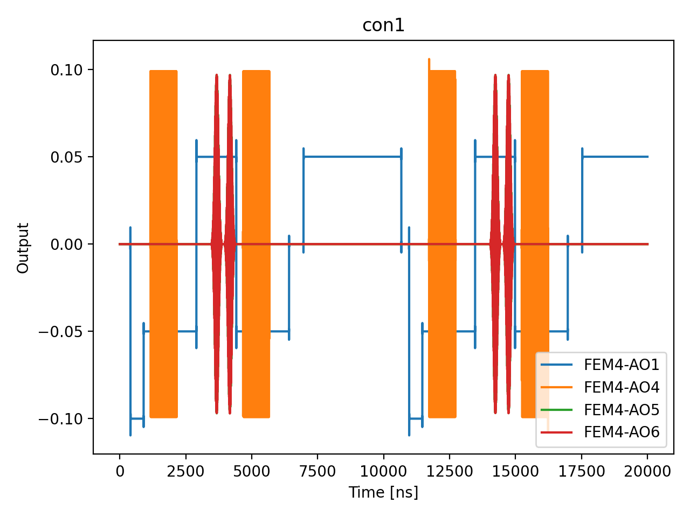

# 10b_ramsey_detuning_parity_diff

## Description

        RAMSEY DETUNING PARITY DIFFERENCE
This sequence performs a Ramsey measurement with parity difference to characterize the qubit detuning.
The measurement involves sweeping the detuning frequency of the qubit and performing a sequence of
two π/2 rotations with a fixed idle time in between. PSB is used to measure the parity of the resulting state.

The sequence uses voltage sequences to navigate through a triangle in voltage space (empty -
initialization - measurement) using OPX channels on the fast lines of the bias-tees. At each pulse duration,
the parity is measured before (P1) and after (P2) the qubit pulse, and the parity difference (P_diff) is
calculated. When P1 == P2, P_diff = 0; otherwise P_diff = 1.

The parity difference signal reveals oscillations as a function of pulse detuning frequency, which can be used
to extract the qubit frequency.

Prerequisites:
    - Having calibrated the resonators coupled to the SensorDot components.
    - Having calibrated the voltage points (empty - initialization - measurement).
    - Qubit pulse calibration (X90 pulse amplitude and frequency).

State update:
    - The qubit Larmor frequency.

## Parameters

| Parameter | Value | Description |
|-----------|-------|-------------|
| `detuning_span_in_mhz` | `2.0` | Frequency detuning span. Default 5MHz. |
| `detuning_step_in_mhz` | `0.5` | Frequency detuning step. Default 0.1MHz |
| `gap_wait_time_in_ns` | `1024` | Wait time between initialization and qubit pulse in nanoseconds. Default is 128 ns. |
| `idle_time_ns` | `100` | Fixed idle time in ns. |
| `load_data_id` | `None` | Optional QUAlibrate node run index for loading historical data. Default is None. |
| `model_computed_fields` | `{}` |  |
| `model_config` | `{'extra': 'forbid', 'use_attribute_docstrings': True}` |  |
| `model_extra` | `None` |  |
| `model_fields` | `{'multiplexed': FieldInfo(annotation=bool, required=False, default=False, description='Whether to play control pulses, readout pulses and active/thermal reset at the same time for all qubits (True)\nor to play the experiment sequentially for each qubit (False). Default is False.'), 'use_state_discrimination': FieldInfo(annotation=bool, required=False, default=False, description="Whether to use on-the-fly state discrimination and return the qubit 'state', or simply return the demodulated\nquadratures 'I' and 'Q'. Default is False."), 'reset_type': FieldInfo(annotation=Literal['thermal', 'active', 'active_gef'], required=False, default='thermal', description='The qubit reset method to use. Must be implemented as a method of Quam.qubit. Can be "thermal", "active", or\n"active_gef". Default is "thermal".'), 'qubits': FieldInfo(annotation=Union[List[str], NoneType], required=False, default=None, description='A list of qubit names which should participate in the execution of the node. Default is None.'), 'num_shots': FieldInfo(annotation=int, required=False, default=100, description='Number of averages to perform. Default is 100.'), 'gap_wait_time_in_ns': FieldInfo(annotation=int, required=False, default=128, description='Wait time between initialization and qubit pulse in nanoseconds. Default is 128 ns.'), 'simulate': FieldInfo(annotation=bool, required=False, default=False, description='Simulate the waveforms on the OPX instead of executing the program. Default is False.'), 'simulation_duration_ns': FieldInfo(annotation=int, required=False, default=50000, description='Duration over which the simulation will collect samples (in nanoseconds). Default is 50_000 ns.'), 'use_waveform_report': FieldInfo(annotation=bool, required=False, default=True, description='Whether to use the interactive waveform report in simulation. Default is True.'), 'timeout': FieldInfo(annotation=int, required=False, default=120, description='Waiting time for the OPX resources to become available before giving up (in seconds). Default is 120 s.'), 'load_data_id': FieldInfo(annotation=Union[int, NoneType], required=False, default=None, description='Optional QUAlibrate node run index for loading historical data. Default is None.'), 'detuning_span_in_mhz': FieldInfo(annotation=float, required=False, default=5.0, description='Frequency detuning span. Default 5MHz.'), 'detuning_step_in_mhz': FieldInfo(annotation=float, required=False, default=0.1, description='Frequency detuning step. Default 0.1MHz'), 'idle_time_ns': FieldInfo(annotation=int, required=False, default=100, description='Fixed idle time in ns.')}` |  |
| `model_fields_set` | `{'gap_wait_time_in_ns', 'use_state_discrimination', 'qubits', 'multiplexed', 'detuning_step_in_mhz', 'reset_type', 'use_waveform_report', 'simulation_duration_ns', 'num_shots', 'load_data_id', 'idle_time_ns', 'timeout', 'detuning_span_in_mhz', 'simulate'}` |  |
| `multiplexed` | `False` | Whether to play control pulses, readout pulses and active/thermal reset at the same time for all qubits (True)
or to play the experiment sequentially for each qubit (False). Default is False. |
| `num_shots` | `10` | Number of averages to perform. Default is 100. |
| `qubits` | `None` | A list of qubit names which should participate in the execution of the node. Default is None. |
| `reset_type` | `thermal` | The qubit reset method to use. Must be implemented as a method of Quam.qubit. Can be "thermal", "active", or
"active_gef". Default is "thermal". |
| `simulate` | `True` | Simulate the waveforms on the OPX instead of executing the program. Default is False. |
| `simulation_duration_ns` | `20000` | Duration over which the simulation will collect samples (in nanoseconds). Default is 50_000 ns. |
| `targets` | `None` |  |
| `targets_name` | `qubits` |  |
| `timeout` | `30` | Waiting time for the OPX resources to become available before giving up (in seconds). Default is 120 s. |
| `use_state_discrimination` | `False` | Whether to use on-the-fly state discrimination and return the qubit 'state', or simply return the demodulated
quadratures 'I' and 'Q'. Default is False. |
| `use_waveform_report` | `True` | Whether to use the interactive waveform report in simulation. Default is True. |

## Simulation Output

---
*Generated by simulation test infrastructure*
