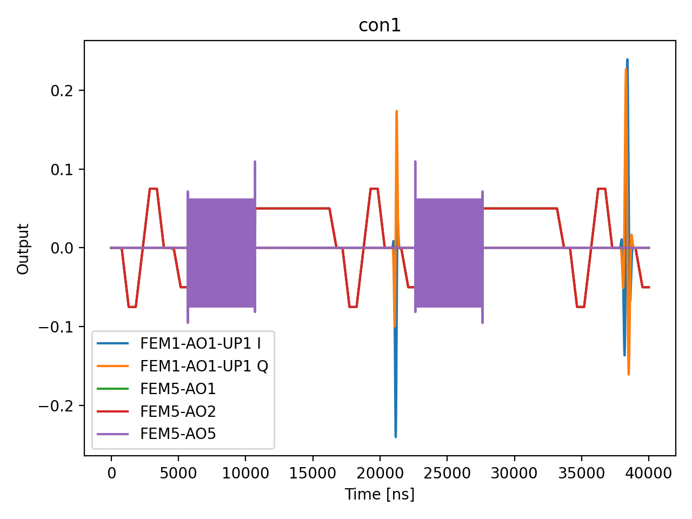

# 10b_time_rabi_chevron

## Description

        TIME RABI CHEVRON
After initialization to the target spin state, this sequence applies an XY drive pulse whose duration and
frequency detuning are swept and measures the spin state with thresholded PSB readout. Averaged state probabilities
versus pulse duration and detuning form a 2D chevron that reveals the resonant drive frequency and π-pulse duration.

Prerequisites:
    - Having calibrated the resonators coupled to the sensor dots.
    - Having calibrated the voltage points (empty, initialization, measurement), including sensor dot bias.
    - Having a rough qubit XY drive calibration (amplitude, frequency, and duration).

Datasets:
    - ``ds_raw``: untouched ``state`` stream fetched from the OPX (never modified after acquisition).
    - ``ds_fit``: processed 2D sweeps plus analysis outputs. Used by ``plot_data``.
    - ``fit_results``: compact per-qubit calibration dict (``FitParameters`` serialized with ``asdict``). Used by
      logging, ``node.outcomes``, and ``update_state``.

Results (``node.results["fit_results"][qubit]``):
    - ``success``: whether the fit passed sanity checks and the state update is applied.
    - ``optimal_frequency`` [Hz]: resonant drive frequency at the chevron crossing.
    - ``optimal_duration`` [ns]: π-pulse duration at resonance.
    - ``rabi_frequency`` [rad / ns]: fitted on-resonance Rabi frequency.
    - ``decay_rate`` [1 / ns]: fitted decay rate of the Rabi envelope (γ ≈ 1/T₂*).

Figures (``node.results["figures"]``):
    - ``"chevron"``: 2D heatmap of state vs pulse duration and drive detuning.
    - ``"fft_2d"``: 2D FFT magnitude map with hyperbolic ridge overlay.
    - ``"diagnostics"``: FFT at resonance and t_π vs detuning with Rabi fit per qubit.

State update:
    - The pulse duration of the selected operation (``node.parameters.operation``).
    - The qubit Larmor frequency, adjusted by the fitted frequency offset from the current XY intermediate frequency.

## Parameters

| Parameter | Value | Description |
|-----------|-------|-------------|
| `multiplexed` | `False` | Whether to play control pulses, readout pulses and active/thermal reset at the same time for all qubits (True)
or to play the experiment sequentially for each qubit (False). Default is False. |
| `use_state_discrimination` | `False` | Whether to use on-the-fly state discrimination and return the qubit 'state', or simply return the demodulated
quadratures 'I' and 'Q'. Default is False. |
| `reset_type` | `thermal` | The qubit reset method to use. Must be implemented as a method of Quam.qubit. Can be "thermal", "active", or
"active_gef". Default is "thermal". |
| `qubits` | `['q1']` | A list of qubit names which should participate in the execution of the node. Default is None. |
| `target_state` | `None` | The state you want to initialize into for heralded initialization. |
| `max_loops` | `100` | Maximum number of initialization loops for heralded initialization. |
| `return_n_loops` | `False` | Whether to return the number of times it has looped over the initialise sequence to achieve the desired result. |
| `num_shots` | `1` | Number of averages to perform. Default is 100. |
| `min_wait_time_in_ns` | `16` | Minimum pulse duration in nanoseconds. Must be larger than 4 clock cycles. Default is 16 ns. |
| `max_wait_time_in_ns` | `1024` | Maximum pulse duration in nanoseconds. Default is 10000 ns (10 us). |
| `time_step_in_ns` | `500` | Step size for the pulse duration sweep in nanoseconds. Default is 52 ns. |
| `frequency_span_in_mhz` | `4.0` | Span of frequencies to sweep in MHz. Default is 5 MHz. |
| `frequency_step_in_mhz` | `2.0` | Step size for the frequency detuning sweep in MHz. Default is 0.05 MHz. |
| `operation` | `x180` | The operation to perform to drive the qubit. |
| `use_simulated_data` | `False` | Whether to generate simulated data instead of measuring via the OPX. Default False. |
| `simulate` | `True` | Simulate the waveforms on the OPX instead of executing the program. Default is False. |
| `simulation_duration_ns` | `40000` | Duration over which the simulation will collect samples (in nanoseconds). Default is 50_000 ns. |
| `use_waveform_report` | `True` | Whether to use the interactive waveform report in simulation. Default is True. |
| `timeout` | `300` | Waiting time for the OPX resources to become available before giving up (in seconds). Default is 120 s. |
| `load_data_id` | `None` | Optional QUAlibrate node run index for loading historical data. Default is None. |

## Simulation Output

---
*Generated by simulation test infrastructure*
