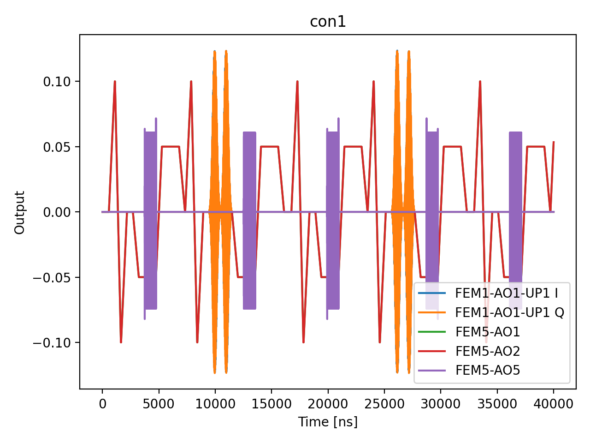

# 11c_ramsey_chevron

## Description

        RAMSEY CHEVRON PARITY DIFFERENCE
This sequence performs a Ramsey measurement with parity difference to characterize the qubit detuning and idle time.
The measurement involves sweeping the detuning frequency of the qubit, and performing a sequence of
two π/2 rotations with a swept idle time in between to create a 2D measurement. PSB is used to measure the
parity of the resulting state.

The sequence uses voltage sequences to navigate through a triangle in voltage space (empty -
initialization - measurement) using OPX channels on the fast lines of the bias-tees. At each pulse duration,
the parity is measured before (P1) and after (P2) the qubit manipulation; joint-outcome streams are
saved and reduced to conditional readout expectations in post-processing.

The analysis signal (default: conditional second parity given first parity) reveals Ramsey oscillations as a function of pulse duration and as a function of
pulse detuning, which can be used to extract the qubit coupling strength, coherence time, and optimal pulse parameters.

Prerequisites:
    - Having calibrated the resonators coupled to the SensorDot components.
    - Having calibrated the voltage points (empty - initialization - measurement).
    - Qubit pulse calibration (X90 pulse amplitude and frequency).

State update:
    - The qubit Larmor frequency.
    - The qubit  T2* (Ramsey) time.

## Parameters

| Parameter | Value | Description |
|-----------|-------|-------------|
| `analysis_signal` | `E_p2_given_p1_0` | Which conditional expectation to use for fitting.
E_p2_given_p1_0: P(second=1 | first=0) — post-select on empty dot.
E_p2_given_p1_1: P(second=1 | first=1) — post-select on loaded dot. |
| `multiplexed` | `False` | Whether to play control pulses, readout pulses and active/thermal reset at the same time for all qubits (True)
or to play the experiment sequentially for each qubit (False). Default is False. |
| `use_state_discrimination` | `False` | Whether to use on-the-fly state discrimination and return the qubit 'state', or simply return the demodulated
quadratures 'I' and 'Q'. Default is False. |
| `reset_type` | `thermal` | The qubit reset method to use. Must be implemented as a method of Quam.qubit. Can be "thermal", "active", or
"active_gef". Default is "thermal". |
| `qubits` | `['q1']` | A list of qubit names which should participate in the execution of the node. Default is None. |
| `num_shots` | `1` | Number of averages to perform. Default is 100. |
| `min_wait_time_in_ns` | `16` | Minimum wait time in nanoseconds. Default is 16. |
| `max_wait_time_in_ns` | `64` | Maximum wait time in nanoseconds. Default is 30000. |
| `wait_time_num_points` | `3` | Number of points for the wait time scan. Default is 500. |
| `log_or_linear_sweep` | `linear` | Type of sweep, either "log" (logarithmic) or "linear". Default is "log". |
| `simulate` | `True` | Simulate the waveforms on the OPX instead of executing the program. Default is False. |
| `simulation_duration_ns` | `40000` | Duration over which the simulation will collect samples (in nanoseconds). Default is 50_000 ns. |
| `use_waveform_report` | `True` | Whether to use the interactive waveform report in simulation. Default is True. |
| `timeout` | `300` | Waiting time for the OPX resources to become available before giving up (in seconds). Default is 120 s. |
| `load_data_id` | `None` | Optional QUAlibrate node run index for loading historical data. Default is None. |
| `detuning_span_in_mhz` | `2.0` | Frequency detuning span. Default 5MHz. |
| `detuning_step_in_mhz` | `1.0` | Frequency detuning step. Default 0.1MHz |

## Simulation Output

---
*Generated by simulation test infrastructure*

## Area Under Curve (Mean Voltage per Channel)

| Controller | Port | Mean Voltage (V) |
|------------|------|------------------|
| con1 | 1-1-1 | -4.726525e-10 |
| con1 | 5-1 | 1.803783e-04 |
| con1 | 5-2 | 1.803783e-04 |
| con1 | 5-3 | 0.000000e+00 |
| con1 | 5-4 | 0.000000e+00 |
| con1 | 5-5 | 1.198736e-16 |
