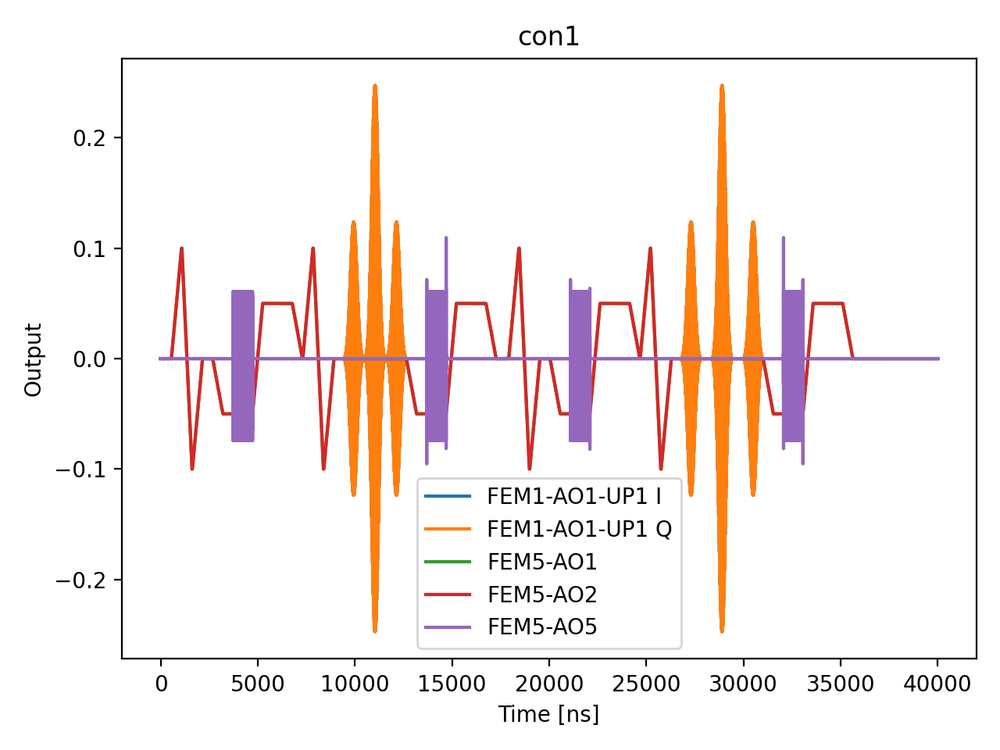

# 12_hahn_echo

## Description

        HAHN ECHO (SPIN ECHO) T2 MEASUREMENT - using standard QUA (pulse > 16ns and 4ns granularity)
The goal of this script is to measure the spin-spin relaxation time T2 using the Hahn echo (spin echo) technique.
Unlike the Ramsey experiment which measures T2* (sensitive to low-frequency noise and inhomogeneous broadening),
the Hahn echo refocuses static dephasing, yielding the intrinsic T2 coherence time which is always >= T2*.

The QUA program is divided into three sections:
    1) step between the initialization point and the operation point using sticky elements.
    2) apply the Hahn echo pulse sequence: pi/2 - tau - pi - tau - pi/2.
    3) measure the state of the qubit using RF reflectometry via parity readout.

The Hahn echo sequence works by:
    - First pi/2 pulse (x90): Creates superposition, placing qubit on Bloch sphere equator.
    - First wait period (tau): Qubit dephases due to noise and field inhomogeneities.
    - Pi pulse (x180): Flips the qubit state, reversing the accumulated phase.
    - Second wait period (tau): Previously accumulated phase is undone (refocused).
    - Final pi/2 pulse (x90): Projects the refocused state for measurement.

The echo amplitude decays as exp(-2*tau/T2), where T2 reflects irreversible dephasing from
high-frequency noise that cannot be refocused. This is the simplest dynamical decoupling sequence
and forms the basis for more advanced sequences (CPMG, XY-n) that extend coherence further.

The measurement sweeps per-arm idle time τ (joint-outcome streams).
The fitting uses profiled differential evolution: a 1-D global search over T2_echo with
the linear parameters (offset, amplitude) solved analytically at each step via least-squares.

Prerequisites:
    - Having run the Ramsey node to calibrate the qubit frequency and T2*, and the corresponding prerequisites.
    - Having calibrated pi and pi/2 pulse parameters from Rabi measurements.

Before proceeding to the next node:
    - Extract T2 from exponential fit of the echo decay curve.
    - Compare T2 to T2* to assess the contribution of low-frequency noise.
    - Consider dynamical decoupling sequences if longer coherence is needed.

State update:
    - T2echo

## Parameters

| Parameter | Value | Description |
|-----------|-------|-------------|
| `analysis_signal` | `E_p2_given_p1_0` | Which conditional expectation to use for fitting.
E_p2_given_p1_0: P(second=1 | first=0) — post-select on empty dot.
E_p2_given_p1_1: P(second=1 | first=1) — post-select on loaded dot. |
| `multiplexed` | `False` | Whether to play control pulses, readout pulses and active/thermal reset at the same time for all qubits (True)
or to play the experiment sequentially for each qubit (False). Default is False. |
| `use_state_discrimination` | `False` | Whether to use on-the-fly state discrimination and return the qubit 'state', or simply return the demodulated
quadratures 'I' and 'Q'. Default is False. |
| `reset_wait_time` | `5000` | The wait time for qubit reset. |
| `qubits` | `['q1']` | A list of qubit names which should participate in the execution of the node. Default is None. |
| `num_shots` | `1` | Number of averages to perform. Default is 100. |
| `tau_min` | `100` | Minimum per-arm idle time in nanoseconds. Must be >= 4 clock cycles. Default is 16 ns. |
| `tau_max` | `1000` | Maximum per-arm idle time in nanoseconds. Default is 10000 ns (10 µs). |
| `tau_step` | `500` | Step size for the per-arm idle time sweep in nanoseconds. Default is 16 ns. |
| `operation` | `x180` | Name of the qubit pi-pulse operation. Default is 'x180'. |
| `simulate` | `True` | Simulate the waveforms on the OPX instead of executing the program. Default is False. |
| `simulation_duration_ns` | `40000` | Duration over which the simulation will collect samples (in nanoseconds). Default is 50_000 ns. |
| `use_waveform_report` | `True` | Whether to use the interactive waveform report in simulation. Default is True. |
| `timeout` | `300` | Waiting time for the OPX resources to become available before giving up (in seconds). Default is 120 s. |
| `load_data_id` | `None` | Optional QUAlibrate node run index for loading historical data. Default is None. |

## Simulation Output

---
*Generated by simulation test infrastructure*

## Area Under Curve (Mean Voltage per Channel)

| Controller | Port | Mean Voltage (V) |
|------------|------|------------------|
| con1 | 1-1-1 | -2.499277e-09 |
| con1 | 5-1 | -6.676116e-06 |
| con1 | 5-2 | -6.676116e-06 |
| con1 | 5-3 | 0.000000e+00 |
| con1 | 5-4 | 0.000000e+00 |
| con1 | 5-5 | 1.380063e-16 |
