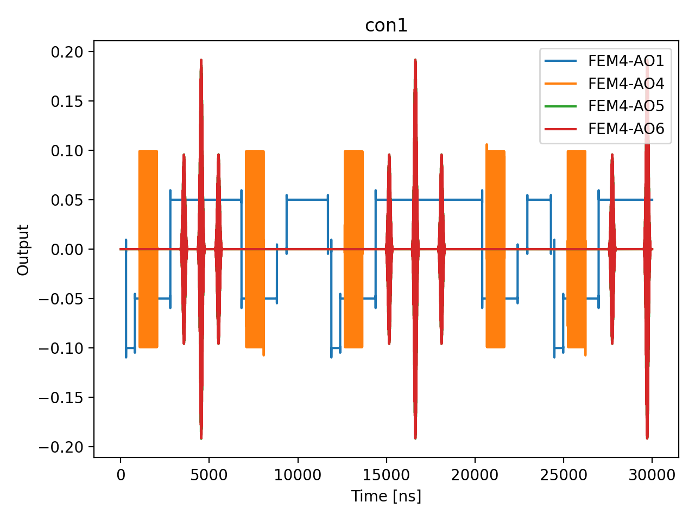

# 12_hahn_echo_parity_diff

## Description

        HAHN ECHO (SPIN ECHO) T2 MEASUREMENT - using standard QUA (pulse > 16ns and 4ns granularity)
The goal of this script is to measure the spin-spin relaxation time T2 using the Hahn echo (spin echo) technique.
Unlike the Ramsey experiment which measures T2* (sensitive to low-frequency noise and inhomogeneous broadening),
the Hahn echo refocuses static dephasing, yielding the intrinsic T2 coherence time which is always >= T2*.

The QUA program is divided into three sections:
    1) step between the initialization point and the operation point using sticky elements.
    2) apply the Hahn echo pulse sequence: pi/2 - tau - pi - tau - pi/2.
    3) measure the state of the qubit using RF reflectometry via parity readout.

The Hahn echo sequence works by:
    - First pi/2 pulse (x90): Creates superposition, placing qubit on Bloch sphere equator.
    - First wait period (tau): Qubit dephases due to noise and field inhomogeneities.
    - Pi pulse (x180): Flips the qubit state, reversing the accumulated phase.
    - Second wait period (tau): Previously accumulated phase is undone (refocused).
    - Final pi/2 pulse (x90): Projects the refocused state for measurement.

The echo amplitude decays as exp(-2*tau/T2), where T2 reflects irreversible dephasing from
high-frequency noise that cannot be refocused. This is the simplest dynamical decoupling sequence
and forms the basis for more advanced sequences (CPMG, XY-n) that extend coherence further.

The fitting uses profiled differential evolution: a 1-D global search over T2_echo with
the linear parameters (offset, amplitude) solved analytically at each step via least-squares.

Prerequisites:
    - Having run the Ramsey node to calibrate the qubit frequency and T2*, and the corresponding prerequisites.
    - Having calibrated pi and pi/2 pulse parameters from Rabi measurements.

Before proceeding to the next node:
    - Extract T2 from exponential fit of the echo decay curve.
    - Compare T2 to T2* to assess the contribution of low-frequency noise.
    - Consider dynamical decoupling sequences if longer coherence is needed.

State update:
    - T2echo

## Parameters

| Parameter | Value | Description |
|-----------|-------|-------------|
| `gap_wait_time_in_ns` | `1056` | Wait time between initialisation and the echo sequence in nanoseconds. Default is 128 ns. |
| `load_data_id` | `None` | Optional QUAlibrate node run index for loading historical data. Default is None. |
| `model_computed_fields` | `{}` |  |
| `model_config` | `{'extra': 'forbid', 'use_attribute_docstrings': True}` |  |
| `model_extra` | `None` |  |
| `model_fields` | `{'multiplexed': FieldInfo(annotation=bool, required=False, default=False, description='Whether to play control pulses, readout pulses and active/thermal reset at the same time for all qubits (True)\nor to play the experiment sequentially for each qubit (False). Default is False.'), 'use_state_discrimination': FieldInfo(annotation=bool, required=False, default=False, description="Whether to use on-the-fly state discrimination and return the qubit 'state', or simply return the demodulated\nquadratures 'I' and 'Q'. Default is False."), 'reset_wait_time': FieldInfo(annotation=int, required=False, default=5000, description='The wait time for qubit reset.'), 'qubits': FieldInfo(annotation=Union[List[str], NoneType], required=False, default=None, description='A list of qubit names which should participate in the execution of the node. Default is None.'), 'num_shots': FieldInfo(annotation=int, required=False, default=100, description='Number of averages to perform. Default is 100.'), 'tau_min': FieldInfo(annotation=int, required=False, default=16, description='Minimum per-arm idle time in nanoseconds. Must be >= 4 clock cycles. Default is 16 ns.'), 'tau_max': FieldInfo(annotation=int, required=False, default=10000, description='Maximum per-arm idle time in nanoseconds. Default is 10000 ns (10 µs).'), 'tau_step': FieldInfo(annotation=int, required=False, default=16, description='Step size for the per-arm idle time sweep in nanoseconds. Default is 16 ns.'), 'gap_wait_time_in_ns': FieldInfo(annotation=int, required=False, default=128, description='Wait time between initialisation and the echo sequence in nanoseconds. Default is 128 ns.'), 'operation': FieldInfo(annotation=str, required=False, default='x180', description="Name of the qubit pi-pulse operation. Default is 'x180'."), 'simulate': FieldInfo(annotation=bool, required=False, default=False, description='Simulate the waveforms on the OPX instead of executing the program. Default is False.'), 'simulation_duration_ns': FieldInfo(annotation=int, required=False, default=50000, description='Duration over which the simulation will collect samples (in nanoseconds). Default is 50_000 ns.'), 'use_waveform_report': FieldInfo(annotation=bool, required=False, default=True, description='Whether to use the interactive waveform report in simulation. Default is True.'), 'timeout': FieldInfo(annotation=int, required=False, default=120, description='Waiting time for the OPX resources to become available before giving up (in seconds). Default is 120 s.'), 'load_data_id': FieldInfo(annotation=Union[int, NoneType], required=False, default=None, description='Optional QUAlibrate node run index for loading historical data. Default is None.')}` |  |
| `model_fields_set` | `{'reset_wait_time', 'simulate', 'timeout', 'load_data_id', 'tau_min', 'operation', 'num_shots', 'gap_wait_time_in_ns', 'use_state_discrimination', 'simulation_duration_ns', 'tau_max', 'multiplexed', 'tau_step', 'use_waveform_report', 'qubits'}` |  |
| `multiplexed` | `False` | Whether to play control pulses, readout pulses and active/thermal reset at the same time for all qubits (True)
or to play the experiment sequentially for each qubit (False). Default is False. |
| `num_shots` | `1` | Number of averages to perform. Default is 100. |
| `operation` | `x180` | Name of the qubit pi-pulse operation. Default is 'x180'. |
| `qubits` | `None` | A list of qubit names which should participate in the execution of the node. Default is None. |
| `reset_wait_time` | `5000` | The wait time for qubit reset. |
| `simulate` | `True` | Simulate the waveforms on the OPX instead of executing the program. Default is False. |
| `simulation_duration_ns` | `30000` | Duration over which the simulation will collect samples (in nanoseconds). Default is 50_000 ns. |
| `targets` | `None` |  |
| `targets_name` | `qubits` |  |
| `tau_max` | `10000` | Maximum per-arm idle time in nanoseconds. Default is 10000 ns (10 µs). |
| `tau_min` | `500` | Minimum per-arm idle time in nanoseconds. Must be >= 4 clock cycles. Default is 16 ns. |
| `tau_step` | `500` | Step size for the per-arm idle time sweep in nanoseconds. Default is 16 ns. |
| `timeout` | `30` | Waiting time for the OPX resources to become available before giving up (in seconds). Default is 120 s. |
| `use_state_discrimination` | `False` | Whether to use on-the-fly state discrimination and return the qubit 'state', or simply return the demodulated
quadratures 'I' and 'Q'. Default is False. |
| `use_waveform_report` | `True` | Whether to use the interactive waveform report in simulation. Default is True. |

## Simulation Output

---
*Generated by simulation test infrastructure*
